# Probability Distributions - Complete Study Notes

## Overview: Random Variables and Their Functions

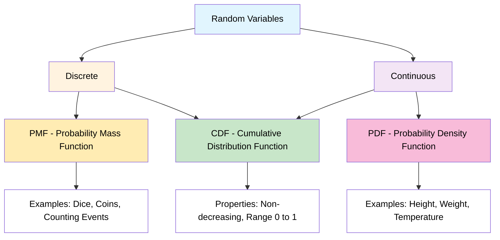

---

## Topic 1: Probability Density Function (PDF)
### For Continuous Random Variables

**From Image 1:** Height of students in classroom [0-1]

### Key Concepts
- **Formula:** P(X ≤ 155) = Area under the curve
- **Visual:** Bell-shaped curve (normal distribution)
- **Axes:** X-axis = Height values (155, 165, etc.), Y-axis = Probability Density (0.1, 0.2, 0.3, 0.4)
- **Interpretation:** Shaded area represents probability

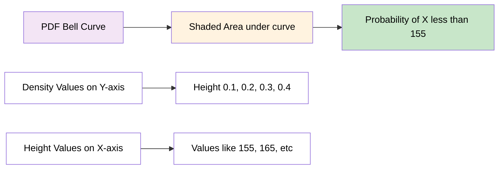

### Properties
- f(x) ≥ 0 for all x
- Total area under curve = 1
- Height represents density, not probability
- Probability = Area under curve between two points

---

## Topic 2: Probability Mass Function (PMF)
### For Discrete Random Variables

**Rolling a dice:** Rolling a dice {1, 2, 3, 4, 5, 6}

### Key Calculations
```
P(1) = 1/6, P(2) = 1/6, P(3) = 1/6
P(4) = 1/6, P(5) = 1/6, P(6) = 1/6
```

### Cumulative Calculation Example
**P(X ≤ 4) = P(X=1) + P(X=2) + P(X=3) + P(X=4)**
```
= 1/6 + 1/6 + 1/6 + 1/6 = 4/6 = 2/3
```

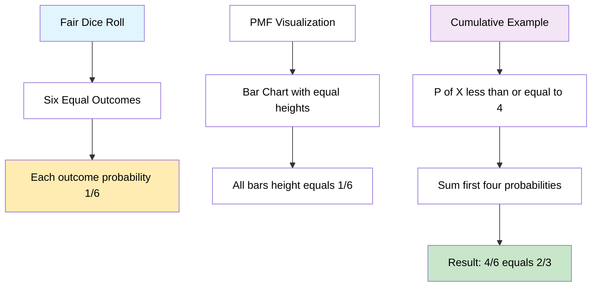

---

## Topic 3: Cumulative Distribution Function (CDF)
### PDF to CDF Relationship: 

**Definition:** F(x) = P(X ≤ x)

### Key Insights
- **Left side:** PDF (bell curve)
- **Right side:** CDF (S-shaped curve)
- **Critical relationship:** "Probability Density = Gradient of Cumulative Curve"

### 3 Values
- At height 155: F(155) ≈ 0.25
- At height 165: F(165) ≈ 0.5
- The gradient (slope) of CDF = PDF value at that point

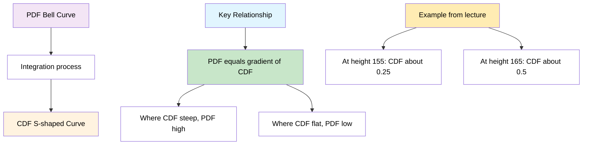

---

## Topic 4: Discrete Random Variable Analysis
### Complete Dice Example: 

**Rolling a dice:** {1, 2, 3, 4, 5, 6}

### PMF Analysis (Left chart in images)
- Uniform distribution
- All bars equal height = 1/6
- Shows individual probabilities

### CDF Analysis (Right chart in images)
- Step function increasing from 1/6 to 6/6 = 1
- Each step represents cumulative probability

### Calculations
```
P(X ≤ 2) = P(X=1) + P(X=2) = 1/6 + 1/6 = 2/6 = 1/3
P(X ≤ 6) = 1 (certainty)
```

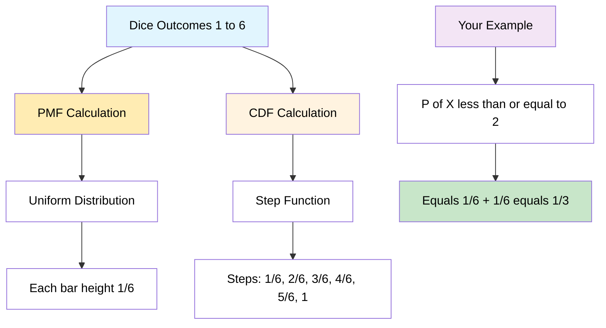

---

## Topic 5: Continuous Random Variable Distribution
### Detailed PDF and CDF Analysis:

**Height Example:** Range 140-180 

### PDF Characteristics 
- Smooth bell-shaped curve
- Peak around 165 (mean)
- Density values: 0.01, 0.02, 0.03, 0.04 on Y-axis
- Shaded areas represent specific probabilities

### CDF Characteristics 
- Smooth S-shaped curve from 0 to 1
- Steepest where PDF is highest (around 165)
- Shows cumulative probabilities

### Critical Insight 
**"Probability Density = Gradient of Cumulative Curve"**

This means:
- Where CDF is steep → PDF is high
- Where CDF is flat → PDF is low
- Slope of CDF at any point = PDF value at that point

---

## Topic 6: Types of Probability Distribution
### Complete Distribution Overview: 

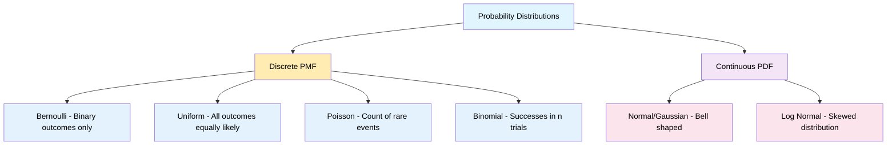

### Distribution Details 

**1. Normal/Gaussian Distribution (PDF)**
- Bell-shaped curve (shown in your images)
- For continuous variables like height
- Most common in nature

**2. Bernoulli Distribution (PMF) - DETAILED ANALYSIS**
- Binary outcomes only: Success/Failure, Yes/No, 1/0
- Single trial with two possible outcomes
- **Coin tossing example {H, T}:** 

**3. Uniform Distribution (PMF)**
- All outcomes equally likely
- Like fair dice example from your images

**4. Poisson Distribution (PMF)**
- Count of events in fixed time period
- Models rare events

**5. Log Normal Distribution (PDF)**
- Skewed continuous distribution
- Often used in economics and finance

**6. Binomial Distribution (PMF)**
- Number of successes in n trials
- Extension of Bernoulli for multiple trials

---

## Topic 7: Bernoulli Distribution - Complete Analysis
### Detailed Bernoulli Study: 

**Definition:** Models any single experiment with yes-no question
**Coin tossing example {H, T}** 

### Parameters
- **0 ≤ p ≤ 1** (probability constraint)
- **q = 1-p** (complement probability)
- **k ∈ {0,1}** → 2 outcomes only

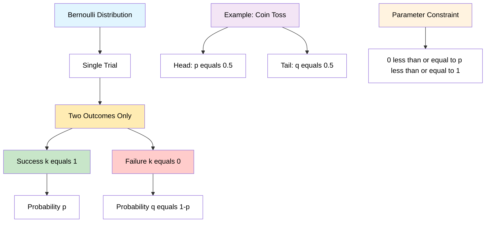

### PMF Formula
**PMF = p^k × (1-p)^(1-k)    k ∈ {0,1}**

#### Case Analysis :
**If k = 1:** P(k=1) = p¹ × (1-p)⁰ = p
**If k = 0:** P(k=0) = p⁰ × (1-p)¹ = (1-p) = q

#### Simplified Form:
```
PMF = { q = 1-p    if k = 0
      { p          if k = 1
```

### Your Coin Toss Example 
```
P(H) = 0.5 = p
P(T) = 0.5 = 1-p = q
```

#### Different Probability Scenarios:
- **P(x=0) = 0.7, P(x=1) = 0.3** (p = 0.3)
- **P(x=0) = 0.4, P(x=1) = 0.6** (p = 0.6)  
- **Whether the person will Pass/Fail**

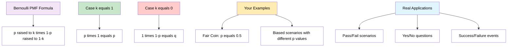

### Mean of Bernoulli Distribution 
**E(k) = Σ k × p(k)** from k=0 to 1

**Calculation:**
```
E(k) = 0×p(0) + 1×p(1)
     = 0×(1-p) + 1×p  
     = 0 + p
     = p
```

**Therefore: Mean = p**

### Median of Bernoulli Distribution
**From your lecture:**
```
Median = { 0      if p < 1/2
         { [0,1]  if p = 1/2  
         { 1      if p > 1/2
```

### Variance and Standard Deviation
**Variance = p × (1-p) = pq**
**Standard Deviation = √(pq)**

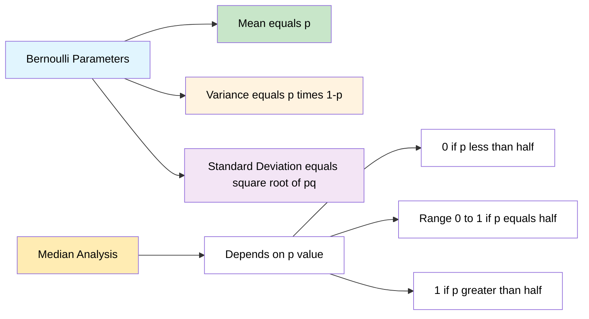

---

## Topic 8: Binomial Distribution - Complete Analysis
### Extension of Bernoulli to Multiple Trials: 

**Definition:** Models the number of successes in n independent Bernoulli trials

**Key Insight:** "For a single trial (n=1), the binomial distribution is a Bernoulli distribution"

### Parameters 
- **n ∈ {0,1,2,...}** → number of trials
- **p ∈ [0,1]** → success probability for each trial  
- **q = 1-p** → failure probability
- **k ∈ {0,1,2,...,n}** → number of successes

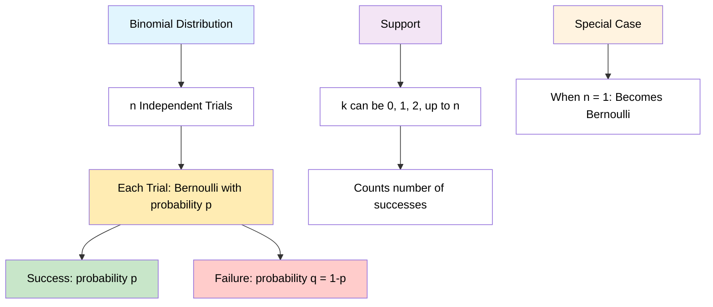

### PMF Formula 
**Pr(K, n, p) = C(n,k) × p^k × (1-p)^(n-k)**

Where C(n,k) is the binomial coefficient:
**C(n,k) = n! / [k!(n-k)!]**

#### Components Breakdown:
- **C(n,k)**: Number of ways to choose k successes from n trials
- **p^k**: Probability of k successes
- **(1-p)^(n-k)**: Probability of (n-k) failures

### Example Applications 
1. **Discrete Random Variable**: Every experiment outcome is binary
2. **Experiment is performed for n trials**
3. **Real Example**: Tossing a coin 10 times 

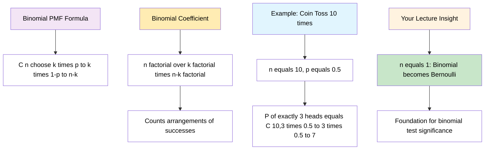

### Statistical Properties 
**Mean = np**
**Variance = npq**  
**Standard Deviation = √(npq)**

#### Derivation Logic:
- Mean: Expected number of successes = n × probability per trial
- Variance: n × variance per trial = n × p(1-p)
- Standard Deviation: Square root of variance

### Connection to Statistical Testing
**The binomial distribution is the basis for the popular binomial test of statistical significance:**

This connects your probability theory to practical hypothesis testing applications.

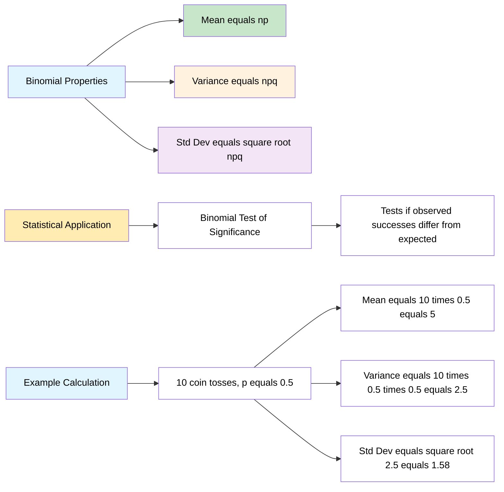
---

## Topic 9: Poisson Distribution - Complete Analysis
### Models Count of Events in Fixed Time Intervals

**Definition:** Models the number of events occurring in a fixed time interval when events happen independently at a constant average rate.

**Discrete Random Variable (PMF) that describes the number of events occurring in a fixed time interval.** 

### Real-World Examples from Your Class
- **Number of people visiting hospital every hour**
- **Number of people visiting banks every hour**  
- **Any counting process in fixed time periods**

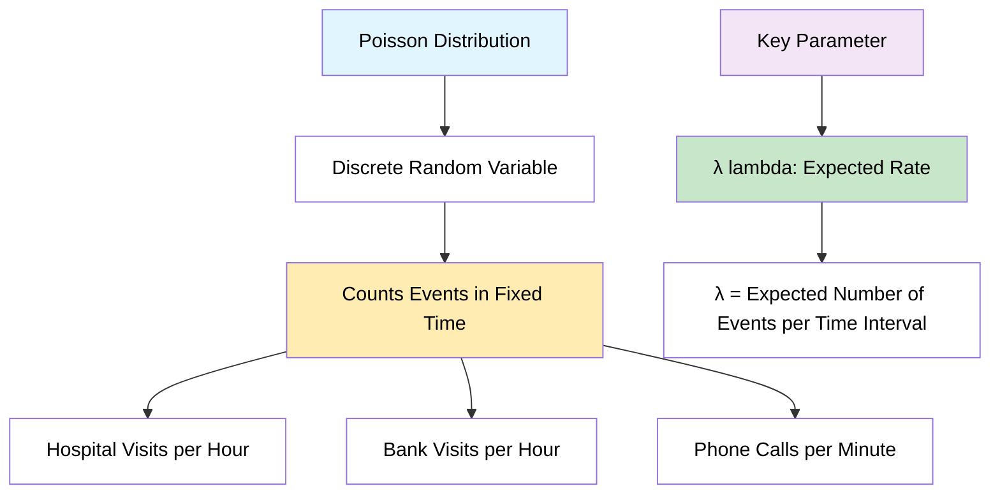

### Parameters and Support
- **λ (lambda) ≥ 0**: Expected number of events in time interval
- **k ∈ {0, 1, 2, 3, ...}**: Actual number of events observed
- **Time interval T**: Fixed period of observation

### PMF Formula
**P(x = k) = (e^(-λ) × λ^k) / k!**

Where:
- **e**: Mathematical constant ≈ 2.718
- **λ**: Expected rate parameter
- **k**: Number of events
- **k!**: Factorial of k

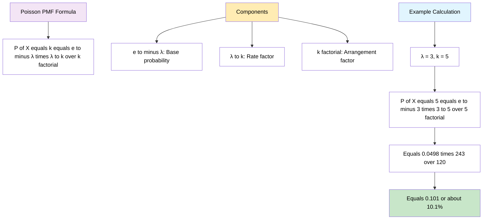

### Worked Example from Your Class
**Given: λ = 3 (expected 3 events per hour)**
**Find: P(X = 5) - probability of exactly 5 events**

**Calculation:**
```
P(X = 5) = (e^(-3) × 3^5) / 5!
         = (e^(-3) × 243) / 120
         = (0.0498 × 243) / 120
         = 12.10 / 120
         = 0.101 = 10.1%
```

### Statistical Properties
**Mean = λ**
**Variance = λ**  
**Standard Deviation = √λ**

**Key Insight:** For Poisson distribution, mean equals variance!

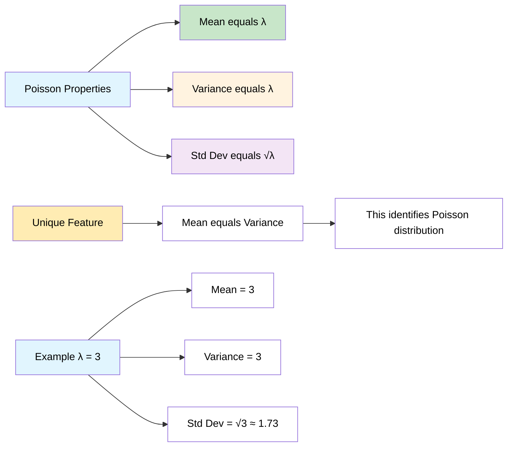

### Conditions for Poisson Distribution
1. **Events occur independently**
2. **Average rate (λ) remains constant**
3. **Two events cannot occur simultaneously**
4. **Events are rare relative to observation period**

### PMF Visualization Characteristics
- **Shape**: Right-skewed for small λ, approaches normal for large λ
- **Support**: Discrete values {0, 1, 2, 3, ...}
- **Peak**: Typically at or near λ
- **Tail**: Long right tail for rare events

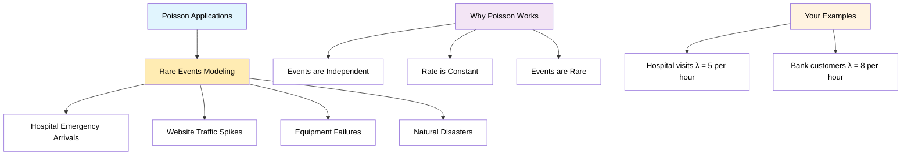
---
## Topic 10: Normal/Gaussian Distribution - Complete Analysis
### The Most Important Continuous Distribution

**Definition:** A continuous probability distribution for real-valued random variables, characterized by its bell-shaped curve.

**From your lecture:** "In statistics, a normal distribution or Gaussian distribution is a type of continuous probability distribution for a real-valued random variable."

### Key Visual Characteristics from Your Class
- **Bell-shaped curve** (symmetric around the mean)
- **μ ≈ median ≈ mode** (all three measures of central tendency are equal)
- **Different curves** based on different μ and σ² parameters

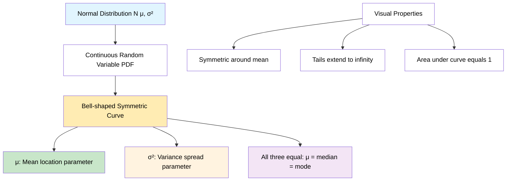

### Parameters and Notation
**Notation:** N(μ, σ²) or N(μ, σ²)
- **μ ∈ ℝ**: Mean (location parameter)
- **σ² ∈ ℝ > 0**: Variance (spread parameter)  
- **σ**: Standard deviation = √σ²
- **x ∈ ℝ**: Support (all real numbers)

### PDF Formula from Your Lecture
**PDF = (1)/(σ√2π) × e^(-1/2 × ((x-μ)/σ)²)**

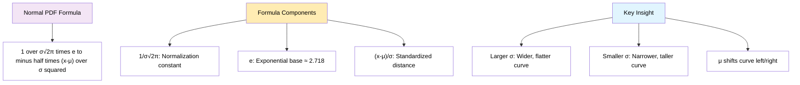

### Statistical Properties from Your Class
**Mean = μ = Average**
**Variance = σ²**
**Standard Deviation = σ = √Variance**

### Empirical Rule of Normal Distribution from Your Lecture
**The 68-95-99.7 Rule:**

**From Image 4:** Your detailed breakdown of probability intervals:
- **Pr(μ-σ ≤ X ≤ μ+σ) ≈ 68%**
- **Pr(μ-2σ ≤ X ≤ μ+2σ) ≈ 95%**  
- **Pr(μ-3σ ≤ X ≤ μ+3σ) ≈ 99.7%**

```mermaid
graph TD
    A["Empirical Rule 68-95-99.7"] --> B["1σ: 68% of data"]
    A --> C["2σ: 95% of data"]
    A --> D["3σ: 99.7% of data"]
    
    E["Probability Breakdown"] --> F["Within 1σ: About 2/3 of data"]
    E --> G["Within 2σ: Nearly all data"]
    E --> H["Within 3σ: Virtually all data"]
    
    I["Practical Meaning"] --> J["Most data near center"]
    I --> K["Very few extreme outliers"]
    I --> L["Predictable spread pattern"]
    
    style A fill:#e1f5fe,color:#000
    style B fill:#c8e6c9,color:#000
    style C fill:#fff3e0,color:#000
    style D fill:#f3e5f5,color:#000
    style E fill:#ffecb3,color:#000
    style F fill:#fff,color:#000
    style G fill:#fff,color:#000
    style H fill:#fff,color:#000
    style I fill:#fff,color:#000
    style J fill:#fff,color:#000
    style K fill:#fff,color:#000
    style L fill:#fff,color:#000
```

### Real-World Examples from Your Class
1. **Weight of students in the class**
2. **Height of students**  
3. **IRIS Dataset** (sepal width)

**From Image 6:** Applications mentioned:
- Student physical measurements
- Biological measurements (IRIS dataset)
- Any naturally occurring continuous measurements

### Standard Normal Distribution
**Special Case:** N(0, 1) where μ = 0 and σ² = 1
- **From Image 1:** The red curve represents the standard normal distribution
- Used as reference for all normal distributions
- Z-scores convert any normal to standard normal

### Probability Calculations from Your Lecture
**From Images 5-6:** Probability interval examples:

```
P(μ-σ ≤ X ≤ μ+σ) ≈ 0.68 = 68%
P(μ-2σ ≤ X ≤ μ+2σ) ≈ 0.95 = 95%
P(μ-3σ ≤ X ≤ μ+3σ) ≈ 0.997 = 99.7%
```

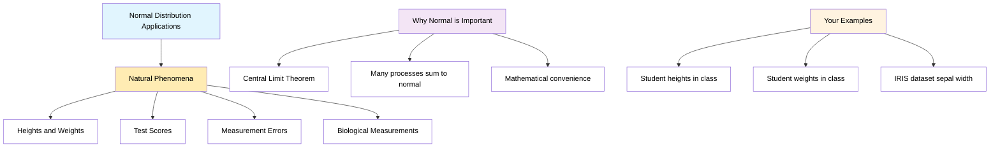

### Q-Q Plot Introduction from Your Class
**From Image 6:** "Q-Q plot [Quantile Quantile Plot]"

- **Purpose:** Check if data follows normal distribution
- **Method:** Compare data quantiles to theoretical normal quantiles
- **Interpretation:** Points on straight line = normally distributed data

---

## Summary

The Normal Distribution is fundamental to statistics because:

1. **Mathematical Properties**: Completely defined by two parameters (μ, σ²)
2. **Empirical Rule**: Provides predictable data distribution patterns
3. **Real-World Applications**: Models many natural phenomena
4. **Statistical Foundation**: Basis for many statistical tests and procedures
5. **Central Limit Theorem**: Many sample means approach normal distribution

This distribution serves as the cornerstone for statistical inference and hypothesis testing in your coursework.
---
## Topic 11: Uniform Distribution - Complete Analysis

### Definition and Types

The uniform distribution is a family of symmetric probability distributions where all outcomes in a given range are equally likely.

#### Two Types:
1. **Continuous Uniform Distribution (PDF)**
2. **Discrete Uniform Distribution (PMF)**

## Continuous Uniform Distribution

### Definition
A continuous probability distribution where every value between two bounds has equal probability density.

**Notation:** U(a,b)

**Parameters:** 
- **-∞ < a < b < ∞** (where a = minimum, b = maximum)

### PDF Formula
```
PDF = { 1/(b-a)    for x ∈ [a,b]
      { 0          otherwise
```

### CDF Formula
```
CDF = { 0          for x < a
      { (x-a)/(b-a) for x ∈ [a,b]  
      { 1          for x > b
```

```mermaid
graph TD
    A["Continuous Uniform U(a,b)"] --> B["Rectangular PDF"]
    B --> C["Height = 1/(b-a)"]
    B --> D["Width = b-a"]
    B --> E["Area = 1"]
    
    F["Key Properties"] --> G["All intervals same length have same probability"]
    F --> H["Symmetric around midpoint"]
    F --> I["Mean = Median = (a+b)/2"]
    
    style A fill:#e1f5fe,color:#000
    style B fill:#ffecb3,color:#000
    style C fill:#fff,color:#000
    style D fill:#fff,color:#000
    style E fill:#fff,color:#000
    style F fill:#f3e5f5,color:#000
    style G fill:#fff,color:#000
    style H fill:#fff,color:#000
    style I fill:#fff,color:#000
```

### Statistical Properties

**Mean = (a + b)/2**

**Median = (a + b)/2**

**Variance = (b - a)²/12**

**Standard Deviation = (b - a)/√12**

### Example from Lecture
**Problem:** Number of candies sold daily at a shop is uniformly distributed with maximum 40 and minimum 10.

**Given:** U(10, 40)
- a = 10, b = 40
- Mean = (10 + 40)/2 = 25
- Variance = (40 - 10)²/12 = 900/12 = 75

**Probability Calculations:**

1. **P(15 ≤ x ≤ 30)**
   ```
   P(15 ≤ x ≤ 30) = (x₂ - x₁) × 1/(b-a)
                   = (30 - 15) × 1/30
                   = 15 × 1/30 = 0.5 = 50%
   ```

2. **P(x > 20)**
   ```
   P(x > 20) = (40 - 20) × 1/30
             = 20 × 1/30
             = 0.667 = 66.7%
   ```

```mermaid
flowchart TD
    A["Uniform Distribution Example"] --> B["Candy Sales U(10,40)"]
    B --> C["Daily sales between 10-40 candies"]
    
    D["Calculations"] --> E["Mean = 25 candies/day"]
    D --> F["P(15 ≤ x ≤ 30) = 50%"]
    D --> G["P(x > 20) = 66.7%"]
    
    H["Visual Representation"] --> I["Flat rectangular shape"]
    H --> J["Height = 1/30"]
    H --> K["Equal probability density everywhere"]
    
    style A fill:#e1f5fe,color:#000
    style B fill:#ffecb3,color:#000
    style C fill:#fff,color:#000
    style D fill:#f3e5f5,color:#000
    style E fill:#c8e6c9,color:#000
    style F fill:#fff3e0,color:#000
    style G fill:#fff3e0,color:#000
    style H fill:#fff,color:#000
    style I fill:#fff,color:#000
    style J fill:#fff,color:#000
    style K fill:#fff,color:#000
```

## Discrete Uniform Distribution

### Definition
Every outcome has equal probability in a finite set of discrete values.

**Example:** Rolling a dice - outcomes {1, 2, 3, 4, 5, 6}

**Notation:** U(a,b) where a,b are integers

### Key Properties
- **n = b - a + 1** (total number of outcomes)
- **Parameters:** a,b with b ≥ a
- **PMF = 1/n** for each outcome
- **Mean = (a + b)/2**

### Dice Example from Lecture
**Rolling a dice:** {1, 2, 3, 4, 5, 6}
- a = 1, b = 6
- n = 6 - 1 + 1 = 6
- Pr(1) = 1/6, Pr(2) = 1/6, ..., Pr(6) = 1/6
- Mean = (1 + 6)/2 = 3.5

```mermaid
graph TD
    A["Discrete Uniform Distribution"] --> B["Finite set of outcomes"]
    B --> C["Each outcome equally likely"]
    
    D["Dice Example"] --> E["Outcomes: 1,2,3,4,5,6"]
    D --> F["Each has probability 1/6"]
    D --> G["Mean = 3.5"]
    
    H["General Formula"] --> I["PMF = 1/n"]
    H --> J["n = b - a + 1"]
    H --> K["Mean = (a+b)/2"]
    
    L["Key Insight"] --> M["Equal probability principle"]
    L --> N["Finite vs infinite outcomes"]
    
    style A fill:#e1f5fe,color:#000
    style B fill:#ffecb3,color:#000
    style C fill:#fff,color:#000
    style D fill:#f3e5f5,color:#000
    style E fill:#c8e6c9,color:#000
    style F fill:#fff3e0,color:#000
    style G fill:#fff3e0,color:#000
    style H fill:#fff,color:#000
    style I fill:#fff,color:#000
    style J fill:#fff,color:#000
    style K fill:#fff,color:#000
    style L fill:#ffecb3,color:#000
    style M fill:#fff,color:#000
    style N fill:#fff,color:#000
```

## Visual Characteristics

### Continuous Uniform
- **Shape:** Perfect rectangle
- **Height:** 1/(b-a)
- **Base:** (b-a)
- **Area:** Always equals 1

### Discrete Uniform  
- **Shape:** Equal-height bars
- **Height:** 1/n for each outcome
- **Spacing:** Equal intervals
- **Total Probability:** Sums to 1

## Key Applications

1. **Random number generation**
2. **Modeling waiting times** (when no preferred time)
3. **Quality control** (when all measurements equally likely)
4. **Gaming and lottery systems**
5. **Baseline models** in statistics

## Important Notes

**Continuous vs Discrete:**
- **Continuous:** Infinite values in interval [a,b]
- **Discrete:** Finite countable outcomes

**Memory Property:**
- Uniform distribution is "memoryless" in the sense that knowing you're in the distribution doesn't give information about specific location

**Relationship to Other Distributions:**
- **Beta(1,1)** = U(0,1) 
- Uniform is a special case of Beta distribution
- Can transform any uniform to U(0,1) using: Z = (X-a)/(b-a)

## Summary

```mermaid
flowchart TD
    A["Uniform Distribution Summary"] --> B["Equal Probability Principle"]
    
    C["Two Main Types"] --> D["Continuous U(a,b)"]
    C --> E["Discrete U{1,2,...,n}"]
    
    D --> F["PDF = 1/(b-a)"]
    D --> G["Rectangular shape"]
    
    E --> H["PMF = 1/n"]
    E --> I["Equal-height bars"]
    
    J["Common Applications"] --> K["Random number generation"]
    J --> L["Gaming systems"]
    J --> M["Baseline statistical models"]
    
    N["Key Formulas"] --> O["Mean = (a+b)/2"]
    N --> P["Variance = (b-a)²/12"]
    
    style A fill:#e1f5fe,color:#000
    style B fill:#ffecb3,color:#000
    style C fill:#f3e5f5,color:#000
    style D fill:#c8e6c9,color:#000
    style E fill:#c8e6c9,color:#000
    style F fill:#fff,color:#000
    style G fill:#fff,color:#000
    style H fill:#fff,color:#000
    style I fill:#fff,color:#000
    style J fill:#fff3e0,color:#000
    style K fill:#fff,color:#000
    style L fill:#fff,color:#000
    style M fill:#fff,color:#000
    style N fill:#ffecb3,color:#000
    style O fill:#fff,color:#000
    style P fill:#fff,color:#000
```

The uniform distribution serves as a fundamental building block in probability theory, representing scenarios where "fairness" or "equal likelihood" is the governing principle.
---
## Topic 11:Standard Normal Distribution and Z-Score - Complete Analysis

## What is Standard Normal Distribution?

The Standard Normal Distribution is a **special case** of the normal distribution with specific parameters:

**Notation:** N(0,1) or Z ~ N(0,1)

**Parameters:**
- **μ = 0** (mean = 0)
- **σ = 1** (standard deviation = 1)
- **σ² = 1** (variance = 1)

```mermaid
graph TD
    A["Standard Normal Distribution"] --> B["Special Case: N(0,1)"]
    B --> C["Mean μ = 0"]
    B --> D["Standard Deviation σ = 1"]
    B --> E["Variance σ² = 1"]
    
    F["Key Properties"] --> G["Bell-shaped curve centered at 0"]
    F --> H["Symmetric around mean"]
    F --> I["Area under curve = 1"]
    F --> J["Range: -∞ to +∞"]
    
    K["Standard Scale"] --> L["Values typically range -3 to +3"]
    K --> M["68% within ±1"]
    K --> N["95% within ±2"]
    K --> O["99.7% within ±3"]
    
    style A fill:#e1f5fe,color:#000
    style B fill:#ffecb3,color:#000
    style C fill:#c8e6c9,color:#000
    style D fill:#fff3e0,color:#000
    style E fill:#f3e5f5,color:#000
    style F fill:#fff,color:#000
    style G fill:#fff,color:#000
    style H fill:#fff,color:#000
    style I fill:#fff,color:#000
    style J fill:#fff,color:#000
    style K fill:#ffecb3,color:#000
    style L fill:#fff,color:#000
    style M fill:#fff,color:#000
    style N fill:#fff,color:#000
    style O fill:#fff,color:#000
```

## Z-Score: The Standardization Process

### Definition
A **Z-score** measures how many standard deviations a data point is away from the mean.

### Z-Score Formula
```
Z = (Xi - μ) / σ
```

Where:
- **Xi** = individual data point
- **μ** = population mean  
- **σ** = population standard deviation

### Interpretation
- **Z = 0**: Data point equals the mean
- **Z > 0**: Data point is above the mean
- **Z < 0**: Data point is below the mean
- **|Z| = 1**: Data point is 1 standard deviation from mean
- **|Z| = 2**: Data point is 2 standard deviations from mean

```mermaid
flowchart TD
    A["Z-Score Transformation"] --> B["Any Normal Distribution"]
    B --> C["N(μ, σ²)"]
    
    D["Standardization Process"] --> E["Z = (X - μ)/σ"]
    
    F["Result"] --> G["Standard Normal N(0,1)"]
    
    H["Example Transformation"] --> I["X: {1,2,3,4,5} with μ=3, σ≈1.414"]
    I --> J["Z-scores: {-1.41, -0.71, 0, 0.71, 1.41}"]
    
    K["Benefits"] --> L["Easy probability calculations"]
    K --> M["Compare different distributions"]
    K --> N["Use standard normal tables"]
    
    style A fill:#e1f5fe,color:#000
    style B fill:#fff,color:#000
    style C fill:#ffecb3,color:#000
    style D fill:#f3e5f5,color:#000
    style E fill:#c8e6c9,color:#000
    style F fill:#fff3e0,color:#000
    style G fill:#c8e6c9,color:#000
    style H fill:#fff,color:#000
    style I fill:#fff,color:#000
    style J fill:#fff,color:#000
    style K fill:#ffecb3,color:#000
    style L fill:#fff,color:#000
    style M fill:#fff,color:#000
    style N fill:#fff,color:#000
```

## Worked Examples from Your Lecture

### Example 1: Basic Z-Score Calculation
**Given:** Data set X = {1, 2, 3, 4, 5}
- **μ = 3**
- **σ ≈ 1.414 ≈ 1** (approximated in lecture)

**Z-Score Calculations:**
- For X₁ = 1: Z = (1-3)/1 = -2
- For X₂ = 2: Z = (2-3)/1 = -1  
- For X₃ = 3: Z = (3-3)/1 = 0
- For X₄ = 4: Z = (4-3)/1 = 1
- For X₅ = 5: Z = (5-3)/1 = 2

### Example 2: Standard Deviation Distance
**Question:** How many standard deviations is 4.5 away from the mean?

**Given:** μ = 4, σ = 1, Xi = 4.5

**Solution:**
```
Z_score = (4.5 - 4)/1 = 0.5
```
**Answer:** 4.5 is **0.5 standard deviations** above the mean.

### Example 3: Probability Calculation
**Question:** What percentage of data is falling above 4.5?

**Given:** μ = 4, σ = 1

**Step 1:** Calculate Z-score
```
Z_score = (4.5 - 4)/1 = 0.5
```

**Step 2:** Find area under curve (Z > 0.5)
From standard normal table: **P(Z > 0.5) ≈ 0.3085 = 30.85%**

**Answer:** Approximately **30.85%** of data falls above 4.5.

### Example 4: Below Threshold Calculation
**Question:** What percentage of data is falling below 2.5?

**Given:** μ = 4, σ = 1

**Step 1:** Calculate Z-score
```
Z_score = (2.5 - 4)/1 = -1.5
```

**Step 2:** Find area under curve (Z < -1.5)
**Answer:** This requires standard normal table lookup.

```mermaid
graph TD
    A["Lecture Examples Summary"] --> B["Dataset: {1,2,3,4,5}"]
    
    C["Basic Calculations"] --> D["μ = 3, σ ≈ 1"]
    C --> E["Z-scores: {-2,-1,0,1,2}"]
    
    F["Distance Example"] --> G["4.5 from mean μ=4"]
    F --> H["Z = 0.5 std dev above"]
    
    I["Probability Questions"] --> J["P(X > 4.5) ≈ 30.85%"]
    I --> K["P(X < 2.5) = P(Z < -1.5)"]
    
    L["Key Learning"] --> M["Z-score standardizes any normal"]
    L --> N["Enables probability calculations"]
    L --> O["Compares different scales"]
    
    style A fill:#e1f5fe,color:#000
    style B fill:#ffecb3,color:#000
    style C fill:#f3e5f5,color:#000
    style D fill:#c8e6c9,color:#000
    style E fill:#fff3e0,color:#000
    style F fill:#fff,color:#000
    style G fill:#fff,color:#000
    style H fill:#fff,color:#000
    style I fill:#ffecb3,color:#000
    style J fill:#c8e6c9,color:#000
    style K fill:#fff3e0,color:#000
    style L fill:#f3e5f5,color:#000
    style M fill:#fff,color:#000
    style N fill:#fff,color:#000
    style O fill:#fff,color:#000
```

## Visual Representation

The transformation process converts any normal distribution to the standard normal:

```mermaid
graph LR
    A["Original Distribution<br/>N(μ=3, σ²≈2)<br/>X: {1,2,3,4,5}"] --> B["Z-Score Formula<br/>Z = (X-μ)/σ"]
    B --> C["Standard Normal<br/>N(0,1)<br/>Z: {-2,-1,0,1,2}"]
    
    D["Benefits of Standardization"] --> E["Universal comparison"]
    D --> F["Standard probability tables"]
    D --> G["Simplified calculations"]
    
    style A fill:#ffecb3,color:#000
    style B fill:#f3e5f5,color:#000
    style C fill:#c8e6c9,color:#000
    style D fill:#e1f5fe,color:#000
    style E fill:#fff,color:#000
    style F fill:#fff,color:#000
    style G fill:#fff,color:#000
```

## Properties of Z-Scores

### Important Characteristics:
1. **Mean of Z-scores = 0**
2. **Standard deviation of Z-scores = 1**
3. **Shape preserved**: Bell curve remains bell curve
4. **Relative positions maintained**: Order of data points unchanged

### Standard Normal Probabilities:
- **P(Z < 0) = 0.5** (50% below mean)
- **P(Z > 0) = 0.5** (50% above mean)  
- **P(-1 < Z < 1) ≈ 0.68** (68% within 1 std dev)
- **P(-2 < Z < 2) ≈ 0.95** (95% within 2 std dev)
- **P(-3 < Z < 3) ≈ 0.997** (99.7% within 3 std dev)

## Practical Applications

### 1. **Quality Control**
- Identify defective products (typically |Z| > 2)
- Monitor process variations

### 2. **Academic Performance**  
- Compare test scores across different exams
- Standardize grades from different classes

### 3. **Medical Diagnostics**
- Compare patient measurements to population norms
- Identify outliers in medical data

### 4. **Finance**
- Risk assessment using standardized returns
- Portfolio performance comparison

```mermaid
flowchart TD
    A["Z-Score Applications"] --> B["Quality Control"]
    A --> C["Education"]  
    A --> D["Healthcare"]
    A --> E["Finance"]
    
    B --> F["Defect identification"]
    B --> G["Process monitoring"]
    
    C --> H["Grade standardization"]
    C --> I["Performance comparison"]
    
    D --> J["Medical diagnostics"]
    D --> K["Population comparisons"]
    
    E --> L["Risk assessment"]
    E --> M["Portfolio analysis"]
    
    style A fill:#e1f5fe,color:#000
    style B fill:#ffecb3,color:#000
    style C fill:#f3e5f5,color:#000
    style D fill:#c8e6c9,color:#000
    style E fill:#fff3e0,color:#000
    style F fill:#fff,color:#000
    style G fill:#fff,color:#000
    style H fill:#fff,color:#000
    style I fill:#fff,color:#000
    style J fill:#fff,color:#000
    style K fill:#fff,color:#000
    style L fill:#fff,color:#000
    style M fill:#fff,color:#000
```

## Step-by-Step Problem Solving Process

### For any Z-score problem:

1. **Identify given information**
   - Original distribution parameters (μ, σ)
   - Data point(s) of interest (Xi)

2. **Apply Z-score formula**
   - Z = (Xi - μ) / σ

3. **Interpret the result**
   - Positive Z: above mean
   - Negative Z: below mean  
   - Magnitude: distance from mean

4. **For probability questions**
   - Use standard normal table
   - Apply appropriate probability rules

## Key Formulas Summary

| Formula | Purpose | Example |
|---------|---------|---------|
| **Z = (X - μ)/σ** | Standardization | Z = (4.5-4)/1 = 0.5 |
| **X = μ + Z×σ** | Reverse calculation | X = 4 + 0.5×1 = 4.5 |
| **P(Z < z)** | Left tail probability | P(Z < 0.5) ≈ 0.691 |
| **P(Z > z)** | Right tail probability | P(Z > 0.5) ≈ 0.309 |

# Central Limit Theorem and Statistical Estimation - Complete Analysis

## Central Limit Theorem (CLT)

### Definition
The Central Limit Theorem states that **the sampling distribution of the sample mean will always be normally distributed, as long as the sample size is large enough**. This holds regardless of whether the population has a normal, Poisson, binomial, or any other distribution.

### Key Statement from Your Lecture
> "The central limit theorem says that the sampling distribution of the mean will always be normally distributed, as long as the sample size is large enough. Regardless of whether the population has a normal, Poisson, binomial, or any other distribution, the sampling distribution of the mean will be normal."

```mermaid
graph TD
    A["Central Limit Theorem"] --> B["Any Population Distribution"]
    B --> C["Normal"]
    B --> D["Poisson"]
    B --> E["Binomial"]
    B --> F["Skewed"]
    B --> G["Uniform"]
    
    H["Large Sample Size n≥30"] --> I["Sample Means X̄"]
    I --> J["Normally Distributed"]
    
    K["CLT Properties"] --> L["X̄ ~ N(μ, σ²/n)"]
    K --> M["Mean of X̄ = μ"]
    K --> N["Variance of X̄ = σ²/n"]
    K --> O["Standard Error = σ/√n"]
    
    style A fill:#e1f5fe,color:#000
    style B fill:#ffecb3,color:#000
    style C fill:#fff,color:#000
    style D fill:#fff,color:#000
    style E fill:#fff,color:#000
    style F fill:#fff,color:#000
    style G fill:#fff,color:#000
    style H fill:#f3e5f5,color:#000
    style I fill:#c8e6c9,color:#000
    style J fill:#c8e6c9,color:#000
    style K fill:#fff3e0,color:#000
    style L fill:#fff,color:#000
    style M fill:#fff,color:#000
    style N fill:#fff,color:#000
    style O fill:#fff,color:#000
```

## Sampling Process

### From Your Lecture:
**Population:** X ~ N(μ, σ²)

**Sample Size:** n = 20

**Multiple Samples:**
- S₁ = {x₁, x₂, x₃, ..., x₂₀} → X̄₁
- S₂ = {x₂, x₃, ..., x₂₀} → X̄₂
- S₃ = {...} → X̄₃
- ...
- Sₘ = {...} → X̄ₘ

**Collection of Sample Means:** X̄ = {X̄₁, X̄₂, X̄₃, ..., X̄ₘ}

### Visual Transformation

```mermaid
flowchart TD
    A["Population Distribution<br/>Any Shape<br/>X ~ (μ, σ²)"] --> B["Take Multiple Samples<br/>Size n ≥ 30"]
    
    B --> C["Calculate Sample Means<br/>X̄₁, X̄₂, X̄₃, ..."]
    
    C --> D["Distribution of Sample Means<br/>Normal Distribution<br/>X̄ ~ N(μ, σ²/n)"]
    
    E["Non-Gaussian Population"] --> F["→ Gaussian Sample Means"]
    
    G["CLT Magic"] --> H["Shape doesn't matter"]
    G --> I["Sample size matters"]
    G --> J["Larger n = More normal"]
    
    style A fill:#ffecb3,color:#000
    style B fill:#f3e5f5,color:#000
    style C fill:#fff3e0,color:#000
    style D fill:#c8e6c9,color:#000
    style E fill:#ffecb3,color:#000
    style F fill:#c8e6c9,color:#000
    style G fill:#e1f5fe,color:#000
    style H fill:#fff,color:#000
    style I fill:#fff,color:#000
    style J fill:#fff,color:#000
```

## Case Studies from Lecture

### Case 1: Normal Population
**Population:** X ~ N(μ, σ²) *(bell-shaped)*
**Result:** Sample means X̄ ~ N(μ, σ²/n) *(still bell-shaped, but narrower)*

### Case 2: Non-Gaussian Population  
**Population:** X ~ Non-Normal *(skewed, any shape)*
**Sample Size:** n ≥ 30
**Result:** Sample means X̄ ~ N(μ, σ²/n) *(becomes bell-shaped!)*

**Key Insight:** The original distribution shape doesn't matter - CLT always produces normal distribution of sample means.

## Statistical Estimation

### What is an Estimate?

From your lecture definition:
> "Estimate: It is an observed numerical value used to estimate an unknown population parameter"

```mermaid
graph TD
    A["Statistical Estimation"] --> B["Population Parameter<br/>(Unknown)"]
    A --> C["Sample Statistic<br/>(Known)"]
    
    D["Population Parameters"] --> E["μ (population mean)"]
    D --> F["σ² (population variance)"]
    D --> G["p (population proportion)"]
    
    H["Sample Statistics"] --> I["X̄ (sample mean)"]
    H --> J["s² (sample variance)"]
    H --> K["p̂ (sample proportion)"]
    
    L["Estimation Process"] --> M["X̄ estimates μ"]
    L --> N["s² estimates σ²"]
    L --> O["p̂ estimates p"]
    
    style A fill:#e1f5fe,color:#000
    style B fill:#ffecb3,color:#000
    style C fill:#f3e5f5,color:#000
    style D fill:#fff3e0,color:#000
    style E fill:#fff,color:#000
    style F fill:#fff,color:#000
    style G fill:#fff,color:#000
    style H fill:#c8e6c9,color:#000
    style I fill:#fff,color:#000
    style J fill:#fff,color:#000
    style K fill:#fff,color:#000
    style L fill:#fff,color:#000
    style M fill:#fff,color:#000
    style N fill:#fff,color:#000
    style O fill:#fff,color:#000
```

## Types of Estimates

### 1. Point Estimate
**Definition:** Single numerical value used to estimate the unknown population parameter

**Example:** Sample mean is a point estimate of population mean
- **μ ← X̄** (population mean estimated by sample mean)

**From your lecture:** "Sample mean is a point estimate of a population mean"

### 2. Interval Estimate  
**Definition:** Range of values used to estimate the unknown population parameters

**Also called:** Confidence Intervals

**Example:** [55 - 65] might be a 95% confidence interval for population mean

**Visual representation:** Point estimate sits within an interval range

```mermaid
flowchart LR
    A["Types of Estimates"] --> B["Point Estimate"]
    A --> C["Interval Estimate"]
    
    B --> D["Single Value<br/>X̄ = 60"]
    B --> E["Best guess"]
    B --> F["No uncertainty measure"]
    
    C --> G["Range of Values<br/>[55, 65]"]
    C --> H["Confidence level"]
    C --> I["Accounts for uncertainty"]
    
    J["Example"] --> K["Point: X̄ = 60"]
    J --> L["Interval: [55, 65]<br/>95% Confidence"]
    
    style A fill:#e1f5fe,color:#000
    style B fill:#ffecb3,color:#000
    style C fill:#f3e5f5,color:#000
    style D fill:#c8e6c9,color:#000
    style E fill:#fff,color:#000
    style F fill:#fff,color:#000
    style G fill:#c8e6c9,color:#000
    style H fill:#fff,color:#000
    style I fill:#fff,color:#000
    style J fill:#fff3e0,color:#000
    style K fill:#fff,color:#000
    style L fill:#fff,color:#000
```

## Key Properties of Sample Mean Distribution

### When Population is Normal: X ~ N(μ, σ²)
- **Sample Mean:** X̄ ~ N(μ, σ²/n)
- **Standard Error:** SE = σ/√n
- **Shape:** Normal for any sample size

### When Population is Non-Normal
- **Sample Mean:** X̄ ~ N(μ, σ²/n) *(approximately, when n ≥ 30)*
- **Standard Error:** SE = σ/√n  
- **Shape:** Approaches normal as n increases

### Important Formulas
```
E(X̄) = μ                    (Expected value of sample mean)
Var(X̄) = σ²/n              (Variance of sample mean)
SD(X̄) = σ/√n               (Standard deviation of sample mean)
```

## Practical Applications

### 1. Quality Control
- Monitor manufacturing processes
- Detect when process goes out of control
- Use sample means to estimate population mean

### 2. Market Research
- Estimate population preferences from sample surveys
- Calculate confidence intervals for market share

### 3. Medical Studies
- Estimate treatment effects from clinical trials
- Compare drug efficacy using sample statistics

### 4. Educational Assessment
- Estimate student population performance from sample tests
- Compare school/district performance

```mermaid
graph TD
    A["CLT Applications"] --> B["Quality Control"]
    A --> C["Market Research"]
    A --> D["Medical Studies"]
    A --> E["Education"]
    
    B --> F["Process monitoring"]
    B --> G["Defect rate estimation"]
    
    C --> H["Survey analysis"]
    C --> I["Consumer preference"]
    
    D --> J["Clinical trials"]
    D --> K["Drug effectiveness"]
    
    E --> L["Test score analysis"]
    E --> M["Educational outcomes"]
    
    N["Why CLT Matters"] --> O["Makes inference possible"]
    N --> P["Enables confidence intervals"]
    N --> Q["Supports hypothesis testing"]
    
    style A fill:#e1f5fe,color:#000
    style B fill:#ffecb3,color:#000
    style C fill:#f3e5f5,color:#000
    style D fill:#c8e6c9,color:#000
    style E fill:#fff3e0,color:#000
    style F fill:#fff,color:#000
    style G fill:#fff,color:#000
    style H fill:#fff,color:#000
    style I fill:#fff,color:#000
    style J fill:#fff,color:#000
    style K fill:#fff,color:#000
    style L fill:#fff,color:#000
    style M fill:#fff,color:#000
    style N fill:#ffecb3,color:#000
    style O fill:#fff,color:#000
    style P fill:#fff,color:#000
    style Q fill:#fff,color:#000
```

## Sample Size Considerations

### Rule of Thumb: n ≥ 30
- **n < 30:** CLT may not apply well (unless population is normal)
- **n ≥ 30:** CLT works well for most populations
- **n ≥ 100:** CLT works excellently for almost all populations

### Effect of Sample Size on Standard Error
- **Larger n → Smaller SE → More precise estimates**
- **SE = σ/√n** decreases as n increases
- **Sample mean gets closer to population mean**

## Connection to Normal Distribution

The CLT explains why the normal distribution is so important in statistics:

1. **Foundation for Inference:** Most statistical procedures assume normally distributed sample statistics
2. **Justifies Normal Approximation:** Even with non-normal populations, we can use normal distribution methods
3. **Enables Probability Calculations:** We can calculate probabilities and create confidence intervals
4. **Supports Hypothesis Testing:** Forms the basis for t-tests, z-tests, and other procedures

## Summary

```mermaid
flowchart TD
    A["Central Limit Theorem<br/>Key Concepts"] --> B["Any population shape"]
    A --> C["Large sample size n≥30"]
    A --> D["Sample means are normal"]
    
    E["Statistical Estimation"] --> F["Point estimates"]
    E --> G["Interval estimates"]
    E --> H["Population parameter inference"]
    
    I["Practical Impact"] --> J["Makes statistics possible"]
    I --> K["Enables confidence intervals"]
    I --> L["Supports hypothesis testing"]
    I --> M["Justifies normal methods"]
    
    style A fill:#e1f5fe,color:#000
    style B fill:#c8e6c9,color:#000
    style C fill:#c8e6c9,color:#000
    style D fill:#c8e6c9,color:#000
    style E fill:#ffecb3,color:#000
    style F fill:#fff3e0,color:#000
    style G fill:#fff3e0,color:#000
    style H fill:#fff3e0,color:#000
    style I fill:#f3e5f5,color:#000
    style J fill:#fff,color:#000
    style K fill:#fff,color:#000
    style L fill:#fff,color:#000
    style M fill:#fff,color:#000
```

The Central Limit Theorem is one of the most important results in statistics because it allows us to make inferences about populations using sample data, regardless of the population's original distribution shape. Combined with estimation theory, it forms the foundation for virtually all statistical inference procedures.

__
# Hypothesis Testing - Complete Analysis

## Definition and Core Concepts

Hypothesis testing is a statistical method used to make inferences about population parameters based on sample data. It provides a systematic framework for testing claims or assumptions about populations using sample evidence.

### Key Components:
1. **Inferential Statistics**: Drawing conclusions or inferences about populations from sample data
2. **Hypothesis Testing Mechanism**: A formal procedure to evaluate claims
3. **Statistical Decision Making**: Accept or reject hypotheses based on evidence

## Hypothesis Testing Framework

### Definition
A statistical procedure that uses sample data to evaluate the likelihood of a specific claim about a population parameter.

**Process Flow:** Sample Data → Conclusions → Population Data

```mermaid
graph TD
    A["Hypothesis Testing Process"] --> B["Sample Data Collection"]
    B --> C["Statistical Analysis"]
    C --> D["Population Inference"]
    
    E["Key Elements"] --> F["Null Hypothesis (H₀)"]
    E --> G["Alternative Hypothesis (H₁)"]
    E --> H["Test Statistic"]
    E --> I["P-value"]
    
    style A fill:#e1f5fe,color:#000
    style B fill:#ffecb3,color:#000
    style C fill:#fff,color:#000
    style D fill:#fff,color:#000
    style E fill:#f3e5f5,color:#000
    style F fill:#fff,color:#000
    style G fill:#fff,color:#000
    style H fill:#fff,color:#000
    style I fill:#fff,color:#000
```

## Hypothesis Types

### 1. Null Hypothesis (H₀)
**Definition:** The assumption you are beginning with - typically states "no effect" or "no difference"

**Characteristics:**
- Default position or status quo
- What we assume to be true initially
- Contains equality (=, ≤, ≥)

### 2. Alternative Hypothesis (H₁)
**Definition:** The opposite of the null hypothesis - what we want to prove

**Characteristics:**  
- The claim we're testing for
- Contains inequality (≠, <, >)
- What we conclude if we reject H₀

```mermaid
flowchart TD
    A["Court Case Example: Person Crime → Court"] --> B["Hypothesis Testing Analogy"]
    
    C["Null Hypothesis (H₀)"] --> D["The Person is not Guilty"]
    C --> E["Assumption you are beginning with"]
    
    F["Alternative Hypothesis (H₁)"] --> G["The Person is guilty"]
    F --> H["Opposite of Null Hypothesis"]
    
    I["Legal Principle"] --> J["Innocent until proven guilty"]
    I --> K["Burden of proof on prosecution"]
    
    L["Statistical Principle"] --> M["Assume H₀ true until evidence suggests otherwise"]
    L --> N["Burden of proof on alternative"]
    
    style A fill:#e1f5fe,color:#000
    style B fill:#ffecb3,color:#000
    style C fill:#f3e5f5,color:#000
    style D fill:#c8e6c9,color:#000
    style E fill:#fff,color:#000
    style F fill:#f3e5f5,color:#000
    style G fill:#ffab91,color:#000
    style H fill:#fff,color:#000
    style I fill:#fff3e0,color:#000
    style J fill:#fff,color:#000
    style K fill:#fff,color:#000
    style L fill:#fff3e0,color:#000
    style M fill:#fff,color:#000
    style N fill:#fff,color:#000
```

## The Four Steps of Hypothesis Testing

### Step 1: State the Hypotheses
- **H₀ (Null):** Statement of no effect/difference
- **H₁ (Alternative):** Statement of effect/difference

### Step 2: Set Significance Level (α)
- Common values: α = 0.05, 0.01, 0.10
- Determines rejection regions

### Step 3: Conduct Experiment
- Collect data through proper sampling
- Calculate test statistic
- Determine p-value

### Step 4: Make Decision
- **Accept the Null Hypothesis**, or
- **Reject the Null Hypothesis**

## Practical Example from Screenshots

### College Pass Rate Analysis

**Scenario:** Colleges in District A have an average pass percentage of 85%. A new college opened in the district, and a sample of 100 students showed a pass percentage of 90% with a standard deviation of 4%.

**Question:** Does this school have a different pass percentage?

**Step 1: Hypotheses**
- **H₀:** μ = 85% (School has same pass rate as district average)
- **H₁:** μ ≠ 85% (School has different pass rate)

**Step 2: Given Information**
- Population mean (μ₀) = 85%
- Sample mean (x̄) = 90%  
- Sample size (n) = 100
- Standard deviation (s) = 4%
- Significance level: α = 0.05

```mermaid
graph TD
    A["College Example Analysis"] --> B["District A Average = 85%"]
    B --> C["New College Sample: n=100, x̄=90%, s=4%"]
    
    D["Hypothesis Setup"] --> E["H₀: μ = 85%"]
    D --> F["H₁: μ ≠ 85%"]
    
    G["Test Details"] --> H["Two-tailed test"]
    G --> I["α = 0.05"]
    G --> J["Need to calculate test statistic"]
    
    style A fill:#e1f5fe,color:#000
    style B fill:#ffecb3,color:#000
    style C fill:#fff,color:#000
    style D fill:#f3e5f5,color:#000
    style E fill:#c8e6c9,color:#000
    style F fill:#ffab91,color:#000
    style G fill:#fff3e0,color:#000
    style H fill:#fff,color:#000
    style I fill:#fff,color:#000
    style J fill:#fff,color:#000
```

## P-Value Concept

### Definition
**P-value:** A number calculated from a statistical test that describes how likely you are to have found a particular set of observations if the null hypothesis were true.

### Key Properties
- Used in hypothesis testing to help decide whether to reject the null hypothesis
- Probability of obtaining test results at least as extreme as observed, assuming H₀ is true
- Lower p-values provide stronger evidence against H₀

### P-Value Interpretation

**From Screenshot Example: Coin Fairness Test**

**Scenario:** Testing if a coin is fair or not
- **H₀:** Coin is fair (P(H) = 0.5, P(T) = 0.5)
- **H₁:** Coin is not fair

**Experiment Results:**
- Out of 100 tosses
- P(H) = 0.6, P(T) = 0.4
- This gives us P(H) = 0.7, P(T) = 0.3

```mermaid
flowchart TD
    A["P-Value Visualization"] --> B["Normal Distribution Curve"]
    
    C["Critical Regions"] --> D["Left Rejection Region"]
    C --> E["Acceptance Region (Fail to reject H₀)"]  
    C --> F["Right Rejection Region"]
    
    G["Decision Rules"] --> H["If p-value < α: Reject H₀"]
    G --> I["If p-value ≥ α: Fail to reject H₀"]
    
    J["Significance Level"] --> K["α = 0.05"]
    J --> L["95% Confidence Level"]
    
    style A fill:#e1f5fe,color:#000
    style B fill:#ffecb3,color:#000
    style C fill:#f3e5f5,color:#000
    style D fill:#ffab91,color:#000
    style E fill:#c8e6c9,color:#000
    style F fill:#ffab91,color:#000
    style G fill:#fff3e0,color:#000
    style H fill:#fff,color:#000
    style I fill:#fff,color:#000
    style J fill:#fff,color:#000
    style K fill:#fff,color:#000
    style L fill:#fff,color:#000
```

## Critical Regions and Decision Making

### Rejection Regions
Based on the normal distribution curve:
- **Left tail:** Values significantly below expected
- **Right tail:** Values significantly above expected
- **Two-tailed test:** Both tails are rejection regions

### Decision Process
1. **Calculate test statistic**
2. **Find corresponding p-value**
3. **Compare with significance level (α)**
4. **Make decision:**
   - If p-value ≤ α: **Reject the null hypothesis**
   - If p-value > α: **Fail to reject the null hypothesis**

### Significance Levels
- **α = 0.05:** 95% confidence level
- **α = 0.01:** 99% confidence level  
- **α = 0.10:** 90% confidence level

## Key Statistical Concepts

### Test Statistics
- **Z-test:** When population standard deviation is known
- **T-test:** When population standard deviation is unknown
- **Chi-square test:** For categorical data
- **F-test:** For comparing variances

### Types of Errors
- **Type I Error (α):** Rejecting true null hypothesis (False positive)
- **Type II Error (β):** Accepting false null hypothesis (False negative)

### Confidence Intervals
- Range of values likely to contain population parameter
- Related to significance level: CI = 1 - α
- 95% CI corresponds to α = 0.05

```mermaid
graph TD
    A["Hypothesis Testing Summary"] --> B["Two-Stage Process"]
    
    C["Stage 1: Setup"] --> D["Define H₀ and H₁"]
    C --> E["Choose significance level α"]
    C --> F["Select appropriate test"]
    
    G["Stage 2: Analysis"] --> H["Collect sample data"]
    G --> I["Calculate test statistic"]
    G --> J["Determine p-value"]
    G --> K["Make statistical decision"]
    
    L["Final Outcomes"] --> M["Reject H₀: Accept H₁"]
    L --> N["Fail to reject H₀: Insufficient evidence"]
    
    O["Real-world Applications"] --> P["Quality control"]
    O --> Q["Medical research"]
    O --> R["A/B testing"]
    O --> S["Academic research"]
    
    style A fill:#e1f5fe,color:#000
    style B fill:#ffecb3,color:#000
    style C fill:#f3e5f5,color:#000
    style D fill:#fff,color:#000
    style E fill:#fff,color:#000
    style F fill:#fff,color:#000
    style G fill:#f3e5f5,color:#000
    style H fill:#fff,color:#000
    style I fill:#fff,color:#000
    style J fill:#fff,color:#000
    style K fill:#fff,color:#000
    style L fill:#c8e6c9,color:#000
    style M fill:#ffab91,color:#000
    style N fill:#fff3e0,color:#000
    style O fill:#fff,color:#000
    style P fill:#fff,color:#000
    style Q fill:#fff,color:#000
    style R fill:#fff,color:#000
    style S fill:#fff,color:#000
```

## Practical Applications

### Common Use Cases
1. **Quality Control:** Testing if products meet specifications
2. **Medical Research:** Evaluating treatment effectiveness  
3. **Marketing:** A/B testing for campaign effectiveness
4. **Education:** Comparing teaching methods
5. **Economics:** Testing economic theories

### Decision Framework
- **Business Context:** Risk vs. benefit analysis
- **Scientific Research:** Reproducibility and peer review
- **Policy Making:** Evidence-based decisions
- **Quality Assurance:** Process improvement

## Important Reminders

### Statistical vs Practical Significance
- **Statistical significance:** Result unlikely due to chance
- **Practical significance:** Result meaningful in real-world context
- Large samples can detect tiny differences that may not matter practically

### Assumptions and Limitations
- **Sample representativeness:** Must represent population
- **Distribution assumptions:** Many tests assume normality
- **Independence:** Observations should be independent
- **Sample size:** Adequate size needed for reliable results

Hypothesis testing provides a rigorous framework for making data-driven decisions while acknowledging uncertainty. It's a fundamental tool that bridges the gap between sample observations and population-level conclusions, enabling informed decision-making across numerous fields and applications.
__
_________________
# Statistical Analysis and Hypothesis Testing - Complete Guide

## Statistical Tests Overview

Statistical analysis involves choosing appropriate tests based on the nature of your data and research question.

### Four Main Categories of Statistical Tests:

1. **Z Test** → Z table → Z score and p value
2. **t Test** → t table → t score and p value  
3. **Chi Square** → Categorical Data
4. **ANOVA** → Variance analysis

### When to Use Each Test:

**Z Test:** 
- Population standard deviation is known
- Sample size n ≥ 30

**t Test:**
- Population standard deviation is unknown
- Generally smaller sample sizes

```mermaid
graph TD
    A["Statistical Analysis Framework"] --> B["Choose Appropriate Test"]
    
    C["Test Selection Criteria"] --> D["Z Test: σ known, n≥30"]
    C --> E["t Test: σ unknown"]
    C --> F["Chi-Square: Categorical data"]
    C --> G["ANOVA: Variance comparison"]
    
    H["Output"] --> I["Test statistic (Z or t score)"]
    H --> J["P-value"]
    H --> K["Statistical decision"]
    
    style A fill:#e1f5fe,color:#000
    style B fill:#ffecb3,color:#000
    style C fill:#f3e5f5,color:#000
    style D fill:#c8e6c9,color:#000
    style E fill:#c8e6c9,color:#000
    style F fill:#c8e6c9,color:#000
    style G fill:#c8e6c9,color:#000
    style H fill:#fff3e0,color:#000
    style I fill:#fff,color:#000
    style J fill:#fff,color:#000
    style K fill:#fff,color:#000
```

## Worked Example 1: Height Analysis (Z Test)

### Problem Statement
The average height of all residents in a city is 168cm with σ = 3.9. A doctor believes the mean to be different. He measured the height of 36 individuals and found the average height to be 169.5 cm.

**(a) State null and alternate hypothesis**
**(b) At a 95% confidence level, is there enough evidence to reject the null hypothesis?**

### Given Information
- Population mean (μ) = 168cm
- Population standard deviation (σ) = 3.9  
- Sample size (n) = 36
- Sample mean (x̄) = 169.5cm
- Confidence level = 95% → α = 1 - 0.95 = 0.05

### Step-by-Step Solution

**Step 1: State Hypotheses**
- **H₀:** μ = 168cm (null hypothesis)  
- **H₁:** μ ≠ 168cm (alternative hypothesis - two-tail test)

**Step 2: Significance Level**
- **C.I = 0.95**
- **α = 1 - 0.95 = 0.05**

**Step 3: Decision Boundary**
Using the normal distribution with α = 0.05 (two-tailed):
- Critical values: ±1.96
- If Z-stat value is less than -1.96 or greater than +1.96 → **We Reject the Null Hypothesis**
- Otherwise → **We Accept Null Hypothesis**

```mermaid
flowchart TD
    A["Height Analysis Example"] --> B["Population: μ=168cm, σ=3.9"]
    B --> C["Sample: n=36, x̄=169.5cm"]
    
    D["Hypotheses"] --> E["H₀: μ = 168cm"]
    D --> F["H₁: μ ≠ 168cm (Two-tailed)"]
    
    G["Test Setup"] --> H["95% Confidence Level"]
    G --> I["α = 0.05"]
    G --> J["Critical values: ±1.96"]
    
    K["Decision Rule"] --> L["If |Z| > 1.96: Reject H₀"]
    K --> M["If |Z| ≤ 1.96: Accept H₀"]
    
    style A fill:#e1f5fe,color:#000
    style B fill:#ffecb3,color:#000
    style C fill:#fff,color:#000
    style D fill:#f3e5f5,color:#000
    style E fill:#c8e6c9,color:#000
    style F fill:#ffab91,color:#000
    style G fill:#fff3e0,color:#000
    style H fill:#fff,color:#000
    style I fill:#fff,color:#000
    style J fill:#fff,color:#000
    style K fill:#fff,color:#000
    style L fill:#ffab91,color:#000
    style M fill:#c8e6c9,color:#000
```

**Step 4: Statistical Analysis**

**Z-test formula:**
```
Z-test = (x̄ - μ)/(σ/√n)
```

**Calculation:**
```
Z-test = (169.5 - 168)/(3.9/√36)
       = 1.5/(3.9/6)
       = 1.5/0.65
       = 2.31
```

**Decision:**
Since Z = 2.31 > +1.96, we **reject the null hypothesis**.

**Step 5: P-Value Analysis**

For Z = 2.31 in a two-tailed test:
- Area under the curve from Z = 2.31 to right tail
- From Z-table: Area = 0.01044
- Two-tailed p-value = 2 × 0.01044 = 0.02088

**P-value Decision Rule:**
- If p-value < significance level: Reject H₀
- 0.02088 < 0.05 → **Reject the Null Hypothesis**

```mermaid
graph TD
    A["Z-Test Calculation"] --> B["Formula: Z = (x̄-μ)/(σ/√n)"]
    
    C["Given Values"] --> D["x̄ = 169.5, μ = 168"]
    C --> E["σ = 3.9, n = 36"]
    
    F["Calculation Steps"] --> G["Z = (169.5-168)/(3.9/√36)"]
    F --> H["Z = 1.5/0.65 = 2.31"]
    
    I["Decision"] --> J["Z = 2.31 > 1.96"]
    I --> K["Reject H₀"]
    
    L["P-Value"] --> M["p = 2 × 0.01044 = 0.02088"]
    L --> N["0.02088 < 0.05: Reject H₀"]
    
    style A fill:#e1f5fe,color:#000
    style B fill:#ffecb3,color:#000
    style C fill:#f3e5f5,color:#000
    style D fill:#fff,color:#000
    style E fill:#fff,color:#000
    style F fill:#fff3e0,color:#000
    style G fill:#fff,color:#000
    style H fill:#c8e6c9,color:#000
    style I fill:#ffab91,color:#000
    style J fill:#fff,color:#000
    style K fill:#fff,color:#000
    style L fill:#fff,color:#000
    style M fill:#fff,color:#000
    style N fill:#ffab91,color:#000
```

## Worked Example 2: Light Bulb Warranty (t Test)

### Problem Statement
A factory manufactures bulbs with an average warranty of 5 years with standard deviation of 0.50. A worker believes that the bulb will malfunction in less than 5 years. He tests a sample of 40 bulbs and finds the average time to be 4.8 years.

**(a) State null and alternate hypothesis**
**(b) At a 2% significance level, is there enough evidence to support the idea that the warranty should be revised?**

### Given Information
- Population mean (μ) = 5 years
- Population standard deviation (σ) = 0.50
- Sample size (n) = 40  
- Sample mean (x̄) = 4.8 years
- Significance level = 2% → α = 0.02

### Step-by-Step Solution

**Step 1: State Hypotheses**
- **H₀:** μ = 5 (null hypothesis)
- **H₁:** μ < 5 (alternative hypothesis - one-tail test)

**Step 2: Significance Level**  
- **α = 0.02**
- **C.I = 0.98**

**Step 3: Decision Boundary**
For a one-tailed test with α = 0.02:
- Critical value at left tail = -2.05 (approximately)
- If t-stat < -2.05: Reject H₀
- Otherwise: Accept H₀

```mermaid
flowchart TD
    A["Light Bulb Warranty Analysis"] --> B["Population: μ=5 years, σ=0.50"]
    B --> C["Sample: n=40, x̄=4.8 years"]
    
    D["Hypotheses"] --> E["H₀: μ = 5 years"]
    D --> F["H₁: μ < 5 years (One-tailed)"]
    
    G["Test Setup"] --> H["α = 0.02 (2% significance)"]
    G --> I["98% Confidence Level"]
    G --> J["Critical value ≈ -2.05"]
    
    K["Decision Rule"] --> L["If t < -2.05: Reject H₀"]
    K --> M["If t ≥ -2.05: Accept H₀"]
    
    style A fill:#e1f5fe,color:#000
    style B fill:#ffecb3,color:#000
    style C fill:#fff,color:#000
    style D fill:#f3e5f5,color:#000
    style E fill:#c8e6c9,color:#000
    style F fill:#ffab91,color:#000
    style G fill:#fff3e0,color:#000
    style H fill:#fff,color:#000
    style I fill:#fff,color:#000
    style J fill:#fff,color:#000
    style K fill:#fff,color:#000
    style L fill:#ffab91,color:#000
    style M fill:#c8e6c9,color:#000
```

**Step 4: Statistical Analysis**

**t-test formula:**
```
t-test = (x̄ - μ)/(σ/√n)
```

**Calculation:**
```
t-test = (4.8 - 5)/(0.50/√40)
       = -0.2/(0.50/6.32)
       = -0.2/0.079
       = -2.53
```

**Step 5: P-Value Analysis**

For t = -2.53 in a one-tailed test:
- Area under the curve to the left of t = -2.53
- From t-table: p-value = 0.0070

**Decision:**
- t-stat = -2.53 < -2.05 → **Reject H₀**
- p-value = 0.0070 < 0.02 → **Reject H₀**

**Conclusion:** There is sufficient evidence to support the idea that the warranty should be revised.

```mermaid
graph TD
    A["t-Test Results"] --> B["t-statistic = -2.53"]
    
    C["Critical Comparison"] --> D["t = -2.53 < -2.05"]
    C --> E["Reject H₀"]
    
    F["P-Value Analysis"] --> G["p-value = 0.0070"]
    F --> H["0.0070 < 0.02"]
    F --> I["Reject H₀"]
    
    J["Final Decision"] --> K["Warranty should be revised"]
    J --> L["Statistical evidence supports worker's claim"]
    
    style A fill:#e1f5fe,color:#000
    style B fill:#ffecb3,color:#000
    style C fill:#f3e5f5,color:#000
    style D fill:#fff,color:#000
    style E fill:#ffab91,color:#000
    style F fill:#fff3e0,color:#000
    style G fill:#fff,color:#000
    style H fill:#fff,color:#000
    style I fill:#ffab91,color:#000
    style J fill:#c8e6c9,color:#000
    style K fill:#fff,color:#000
    style L fill:#fff,color:#000
```

## Key Formulas and Concepts

### Test Statistic Formulas

**Z-Test (Population σ known):**
```
Z = (x̄ - μ)/(σ/√n)
```

**t-Test (Population σ unknown):**
```
t = (x̄ - μ)/(s/√n)
```

Where:
- x̄ = sample mean
- μ = population mean  
- σ = population standard deviation
- s = sample standard deviation
- n = sample size

### Decision Rules

**Using Critical Values:**
- **Two-tailed test:** Reject H₀ if |test statistic| > critical value
- **One-tailed test:** Reject H₀ if test statistic > critical value (right tail) or < -critical value (left tail)

**Using P-Values:**
- **Rule:** If p-value < α, reject H₀
- **Rule:** If p-value ≥ α, fail to reject H₀

### Types of Tests

**One-Tailed Tests:**
- **Left-tailed:** H₁: μ < μ₀
- **Right-tailed:** H₁: μ > μ₀

**Two-Tailed Test:**
- **Two-sided:** H₁: μ ≠ μ₀

```mermaid
flowchart TD
    A["Hypothesis Testing Summary"] --> B["Select Appropriate Test"]
    
    C["Test Selection"] --> D["Z-test: σ known, n≥30"]
    C --> E["t-test: σ unknown"]
    
    F["Critical Steps"] --> G["1. State hypotheses"]
    F --> H["2. Set significance level"]
    F --> I["3. Calculate test statistic"]
    F --> J["4. Find p-value"]
    F --> K["5. Make decision"]
    
    L["Decision Methods"] --> M["Critical value approach"]
    L --> N["P-value approach"]
    
    O["Common Significance Levels"] --> P["α = 0.01 (99% confidence)"]
    O --> Q["α = 0.05 (95% confidence)"]
    O --> R["α = 0.10 (90% confidence)"]
    
    style A fill:#e1f5fe,color:#000
    style B fill:#ffecb3,color:#000
    style C fill:#f3e5f5,color:#000
    style D fill:#c8e6c9,color:#000
    style E fill:#c8e6c9,color:#000
    style F fill:#fff3e0,color:#000
    style G fill:#fff,color:#000
    style H fill:#fff,color:#000
    style I fill:#fff,color:#000
    style J fill:#fff,color:#000
    style K fill:#fff,color:#000
    style L fill:#fff,color:#000
    style M fill:#fff,color:#000
    style N fill:#fff,color:#000
    style O fill:#ffecb3,color:#000
    style P fill:#fff,color:#000
    style Q fill:#fff,color:#000
    style R fill:#fff,color:#000
```

## Practical Applications

### When to Use Z-Test vs t-Test

**Use Z-Test when:**
- Population standard deviation (σ) is known
- Large sample size (n ≥ 30)
- Population is normally distributed

**Use t-Test when:**
- Population standard deviation (σ) is unknown
- Small to moderate sample sizes
- Sample standard deviation (s) is used as estimate

### Common Scenarios

**Z-Test Applications:**
- Quality control with known process variation
- Standardized test scores
- Large population surveys

**t-Test Applications:**
- Medical research with limited samples
- Product testing with unknown variation
- Educational research studies

### Critical Value Tables

**Z-Distribution (Standard Normal):**
- α = 0.05 (two-tailed): ±1.96
- α = 0.01 (two-tailed): ±2.576
- α = 0.05 (one-tailed): ±1.645

**t-Distribution (depends on degrees of freedom):**
- Use t-table with df = n-1
- Critical values increase as df decreases

## Statistical Interpretation

### P-Value Meaning
The p-value represents the probability of observing the test results (or more extreme) assuming the null hypothesis is true.

**Interpretation Guidelines:**
- **p < 0.01:** Very strong evidence against H₀
- **0.01 ≤ p < 0.05:** Strong evidence against H₀  
- **0.05 ≤ p < 0.10:** Weak evidence against H₀
- **p ≥ 0.10:** Little to no evidence against H₀

### Confidence Intervals
Confidence intervals provide a range of plausible values for the population parameter.

**Relationship with Hypothesis Testing:**
- If hypothesized value falls outside confidence interval → Reject H₀
- If hypothesized value falls inside confidence interval → Fail to reject H₀

This comprehensive framework provides the foundation for conducting proper statistical hypothesis testing using both Z-tests and t-tests, with clear decision-making criteria based on both critical values and p-value approaches.
_________________
________________
# Student t-Distribution - Complete Analysis

## Definition and Core Purpose

The Student t-distribution is a probability distribution used for statistical analysis when the population standard deviation is unknown. It provides the solution for performing hypothesis testing when we don't know the population standard deviation (σ).

### Key Question Addressed:
**"How do we perform an analysis when we don't know the population standard deviation?"**

**Solution:** Student t-distribution

## Formula Comparison

### Z-Test vs t-Test Formulas

**Z-Test Formula (when σ is known):**
```
Z = (x̄ - μ)/(σ/√n)
```

**t-Test Formula (when σ is unknown):**
```
t = (x̄ - μ)/(s/√n)
```

Where:
- **s = Sample Standard Deviation**
- **σ = Population Standard Deviation (unknown)**

```mermaid
graph TD
    A["Statistical Analysis Decision"] --> B["Do you know the Population Std σ?"]
    
    B --> C["YES"]
    B --> D["NO"]
    
    C --> E["Is Sample Size above 30?"]
    D --> F["Use t-test"]
    
    E --> G["YES: Use Z-test"]
    E --> H["NO: Use t-test"]
    
    I["Test Outputs"] --> J["Z table → Z score"]
    I --> K["t table dof → t score"]
    
    style A fill:#e1f5fe,color:#000
    style B fill:#ffecb3,color:#000
    style C fill:#c8e6c9,color:#000
    style D fill:#ffab91,color:#000
    style E fill:#fff3e0,color:#000
    style F fill:#ffab91,color:#000
    style G fill:#c8e6c9,color:#000
    style H fill:#ffab91,color:#000
    style I fill:#f3e5f5,color:#000
    style J fill:#fff,color:#000
    style K fill:#fff,color:#000
```

## Degrees of Freedom

### Definition and Calculation
**Degrees of Freedom (dof) = n - 1**

Where n = Sample Size

### Example Illustration
For **3 People** sample:
- Sample size (n) = 3
- Degrees of freedom = 3 - 1 = 2

**Visual representation:** [X] □ [X] 
- Two constraints (X marks)
- One free choice (empty square)

```mermaid
flowchart TD
    A["Degrees of Freedom Concept"] --> B["dof = n - 1"]
    
    C["Sample Size Examples"] --> D["n = 3 → dof = 2"]
    C --> E["n = 30 → dof = 29"]
    C --> F["n = 100 → dof = 99"]
    
    G["Why n-1?"] --> H["One parameter estimated from sample"]
    G --> I["Reduces available freedom by 1"]
    
    J["Impact on Distribution"] --> K["Smaller dof → Wider distribution"]
    J --> L["Larger dof → Approaches normal distribution"]
    
    style A fill:#e1f5fe,color:#000
    style B fill:#ffecb3,color:#000
    style C fill:#f3e5f5,color:#000
    style D fill:#fff,color:#000
    style E fill:#fff,color:#000
    style F fill:#fff,color:#000
    style G fill:#fff3e0,color:#000
    style H fill:#fff,color:#000
    style I fill:#fff,color:#000
    style J fill:#c8e6c9,color:#000
    style K fill:#fff,color:#000
    style L fill:#fff,color:#000
```

## Worked Example: IQ Medication Study

### Problem Statement
In the population, the average IQ is 100. A team of researchers wants to test a new medication to see if it has either a positive or negative effect on intelligence, or no effect at all. A sample of 30 participants who have taken the medication has a mean of 140 with a standard deviation of 20. Did the medication affect intelligence? (C.I = 95%)

### Given Information
- Population mean (μ) = 100
- Sample size (n) = 30
- Sample mean (x̄) = 140
- Sample standard deviation (s) = 20
- Confidence interval = 95%
- Significance level (α) = 0.05

### Step-by-Step Solution

**Step 1: State Hypotheses**
- **H₀:** μ = 100 (null hypothesis - no effect)
- **H₁:** μ ≠ 100 (alternative hypothesis - two-tail test, medication has effect)

**Step 2: Significance Level**
- **α = 0.05**

**Step 3: Degrees of Freedom**
- **dof = n - 1 = 30 - 1 = 29**

```mermaid
flowchart TD
    A["IQ Medication Study Setup"] --> B["Population IQ: μ = 100"]
    B --> C["Sample: n = 30, x̄ = 140, s = 20"]
    
    D["Hypothesis Framework"] --> E["H₀: μ = 100 (no effect)"]
    D --> F["H₁: μ ≠ 100 (has effect)"]
    
    G["Test Parameters"] --> H["Two-tailed test"]
    G --> I["α = 0.05, dof = 29"]
    G --> J["Critical values: ±2.045"]
    
    style A fill:#e1f5fe,color:#000
    style B fill:#ffecb3,color:#000
    style C fill:#fff,color:#000
    style D fill:#f3e5f5,color:#000
    style E fill:#c8e6c9,color:#000
    style F fill:#ffab91,color:#000
    style G fill:#fff3e0,color:#000
    style H fill:#fff,color:#000
    style I fill:#fff,color:#000
    style J fill:#fff,color:#000
```

**Step 4: Decision Rule**
For α = 0.05 with dof = 29 (two-tailed test):
- **Critical values:** ±2.045
- **Decision Rule:** If t-stat is less than -2.045 or greater than +2.045, reject the null hypothesis

**Visual Decision Boundary:**
```
        2.5%      95%      2.5%
    |-------|-----------|-------|
   -2.045    0        +2.045
```

**Step 5: Calculate t-test Statistic**

**t-test Formula:**
```
t = (x̄ - μ)/(s/√n)
```

**Calculation:**
```
t = (140 - 100)/(20/√30)
t = 40/(20/5.48)
t = 40/3.65
t = 10.96
```

**Step 6: Conclusion**

**Decision Rule:** If t is less than -2.045 and greater than 2.045, reject the null hypothesis

**Result:** t = 10.96 > 2.045 → **Rejecting the Null Hypothesis**

**Conclusion:** The medication significantly affects intelligence (increases IQ).

```mermaid
graph TD
    A["t-Test Calculation Results"] --> B["t-statistic = 10.96"]
    
    C["Critical Value Comparison"] --> D["10.96 > 2.045"]
    C --> E["Reject H₀"]
    
    F["Statistical Decision"] --> G["Medication has significant effect"]
    F --> H["IQ significantly increased"]
    
    I["Interpretation"] --> J["Strong evidence against null hypothesis"]
    I --> K["Medication improves intelligence"]
    
    style A fill:#e1f5fe,color:#000
    style B fill:#ffecb3,color:#000
    style C fill:#f3e5f5,color:#000
    style D fill:#c8e6c9,color:#000
    style E fill:#ffab91,color:#000
    style F fill:#fff3e0,color:#000
    style G fill:#fff,color:#000
    style H fill:#fff,color:#000
    style I fill:#c8e6c9,color:#000
    style J fill:#fff,color:#000
    style K fill:#fff,color:#000
```

## Decision Tree: Z-Test vs t-Test

### When to Use Each Test

The decision tree for choosing between Z-test and t-test:

**Step 1:** Do you know the population standard deviation (σ)?
- **YES** → Continue to Step 2
- **NO** → Use t-test

**Step 2:** Is the sample size above 30?
- **YES** → Use Z-test
- **NO** → Use t-test

### Test Outputs
- **Z-test** → Z table → Z score and p-value
- **t-test** → t table with degrees of freedom → t score and p-value

```mermaid
flowchart TD
    A["Statistical Test Selection"] --> B["Population σ Known?"]
    
    B --> C["Yes"] 
    B --> D["No → Use t-test"]
    
    C --> E["Sample Size ≥ 30?"]
    
    E --> F["Yes → Use Z-test"] 
    E --> G["No → Use t-test"]
    
    H["Reference Tables"] --> I["Z-test uses Z-table"]
    H --> J["t-test uses t-table with dof"]
    
    K["Key Differences"] --> L["Z-test: σ known, large samples"]
    K --> M["t-test: σ unknown, any sample size"]
    
    style A fill:#e1f5fe,color:#000
    style B fill:#ffecb3,color:#000
    style C fill:#c8e6c9,color:#000
    style D fill:#ffab91,color:#000
    style E fill:#fff3e0,color:#000
    style F fill:#c8e6c9,color:#000
    style G fill:#ffab91,color:#000
    style H fill:#f3e5f5,color:#000
    style I fill:#fff,color:#000
    style J fill:#fff,color:#000
    style K fill:#fff,color:#000
    style L fill:#fff,color:#000
    style M fill:#fff,color:#000
```

## Key Characteristics of t-Distribution

### Distribution Properties

1. **Bell-shaped and symmetric** (like normal distribution)
2. **Wider spread** than normal distribution
3. **Heavier tails** than normal distribution
4. **Approaches normal distribution** as degrees of freedom increase

### Relationship with Sample Size
- **Small samples (low dof):** More spread out, heavier tails
- **Large samples (high dof):** Approaches standard normal distribution
- **Rule of thumb:** When dof > 30, t-distribution ≈ normal distribution

### Critical Values
- **Depend on degrees of freedom**
- **Always larger than Z-values** for same significance level
- **Decrease as degrees of freedom increase**

## Practical Applications

### When t-Test is Preferred

1. **Medical research** with limited sample sizes
2. **Quality control** when population parameters unknown
3. **Educational studies** with small classroom sizes
4. **Market research** with pilot studies
5. **Scientific experiments** with expensive or time-consuming data collection

### Advantages of t-Test
- **More realistic assumption:** Population σ usually unknown
- **Works with small samples:** No minimum sample size requirement
- **Robust method:** Accounts for additional uncertainty from estimating σ

## Summary Table

| Aspect | Z-Test | t-Test |
|--------|--------|--------|
| **Population σ** | Known | Unknown |
| **Sample Size** | Typically ≥ 30 | Any size |
| **Distribution** | Standard Normal | t-Distribution |
| **Critical Values** | From Z-table | From t-table (depends on dof) |
| **Formula** | Z = (x̄-μ)/(σ/√n) | t = (x̄-μ)/(s/√n) |
| **Degrees of Freedom** | Not applicable | n - 1 |

```mermaid
graph TD
    A["t-Distribution Summary"] --> B["Used when σ unknown"]
    
    C["Key Formula"] --> D["t = (x̄-μ)/(s/√n)"]
    
    E["Critical Concept"] --> F["Degrees of Freedom = n-1"]
    
    G["Distribution Shape"] --> H["Bell-shaped, wider than normal"]
    G --> I["Approaches normal as dof increases"]
    
    J["Decision Process"] --> K["Calculate t-statistic"]
    J --> L["Compare with critical values"]
    J --> M["Make statistical decision"]
    
    N["Applications"] --> O["Small sample research"]
    N --> P["Unknown population parameters"]
    N --> Q["Real-world statistical analysis"]
    
    style A fill:#e1f5fe,color:#000
    style B fill:#ffecb3,color:#000
    style C fill:#f3e5f5,color:#000
    style D fill:#fff,color:#000
    style E fill:#fff3e0,color:#000
    style F fill:#c8e6c9,color:#000
    style G fill:#fff,color:#000
    style H fill:#fff,color:#000
    style I fill:#fff,color:#000
    style J fill:#ffecb3,color:#000
    style K fill:#fff,color:#000
    style L fill:#fff,color:#000
    style M fill:#fff,color:#000
    style N fill:#f3e5f5,color:#000
    style O fill:#fff,color:#000
    style P fill:#fff,color:#000
    style Q fill:#fff,color:#000
```

The Student t-distribution provides a robust framework for hypothesis testing in real-world scenarios where population parameters are typically unknown, making it one of the most practically useful statistical tools for researchers and analysts.
________________
________________
# Type I & Type II Errors and Confidence Intervals - Complete Analysis

## Type I and Type II Errors

### Definition Framework

In hypothesis testing, there are two fundamental realities and two possible decisions, creating four possible outcomes.

**Reality:**
- **Null Hypothesis is True** OR **Null Hypothesis is False**

**Decision:** 
- **Null Hypothesis is True** OR **Null Hypothesis is False**

### The Four Outcomes

**Outcome 1:** We reject the Null Hypothesis when in reality it is False → **Good** ✓

**Outcome 2:** We reject the Null Hypothesis when in reality it is True → **Type I Error** ✗

**Outcome 3:** We retain the Null Hypothesis when in reality it is False → **Type II Error** ✗

**Outcome 4:** We retain the Null Hypothesis when in reality it is True → **Good** ✓

```mermaid
graph TD
    A["Hypothesis Testing Outcomes"] --> B["Four Possible Scenarios"]
    
    C["Reality vs Decision Matrix"] --> D["H₀ True, Reject H₀ → Type I Error"]
    C --> E["H₀ True, Accept H₀ → Correct Decision"]
    C --> F["H₀ False, Reject H₀ → Correct Decision"]
    C --> G["H₀ False, Accept H₀ → Type II Error"]
    
    H["Error Types"] --> I["Type I: False Positive (α)"]
    H --> J["Type II: False Negative (β)"]
    
    K["Correct Decisions"] --> L["True Positive: Correctly reject false H₀"]
    K --> M["True Negative: Correctly accept true H₀"]
    
    style A fill:#e1f5fe,color:#000
    style B fill:#ffecb3,color:#000
    style C fill:#f3e5f5,color:#000
    style D fill:#ffab91,color:#000
    style E fill:#c8e6c9,color:#000
    style F fill:#c8e6c9,color:#000
    style G fill:#ffab91,color:#000
    style H fill:#fff3e0,color:#000
    style I fill:#fff,color:#000
    style J fill:#fff,color:#000
    style K fill:#c8e6c9,color:#000
    style L fill:#fff,color:#000
    style M fill:#fff,color:#000
```

## Error Types Detailed Analysis

### Type I Error (α - Alpha)
- **Definition:** Rejecting a true null hypothesis
- **Also called:** False Positive
- **Probability:** α (significance level)
- **Example:** Concluding a drug is effective when it actually isn't

### Type II Error (β - Beta) 
- **Definition:** Accepting a false null hypothesis
- **Also called:** False Negative  
- **Probability:** β (varies with effect size and sample size)
- **Example:** Concluding a drug is ineffective when it actually works

### Relationship Between Errors
- **Trade-off exists:** Reducing α increases β, and vice versa
- **Sample size impact:** Larger samples reduce both α and β
- **Effect size impact:** Larger effects reduce β for fixed α

```mermaid
flowchart TD
    A["Statistical Errors Relationship"] --> B["Type I Error (α)"]
    A --> C["Type II Error (β)"]
    
    B --> D["Significance Level"]
    B --> E["False Positive Rate"]
    B --> F["Researcher Controls"]
    
    C --> G["Depends on Effect Size"]
    C --> H["False Negative Rate"]
    C --> I["Power = 1 - β"]
    
    J["Error Control"] --> K["Increase Sample Size"]
    J --> L["Choose Appropriate α"]
    J --> M["Consider Effect Size"]
    
    style A fill:#e1f5fe,color:#000
    style B fill:#ffab91,color:#000
    style C fill:#ffab91,color:#000
    style D fill:#fff,color:#000
    style E fill:#fff,color:#000
    style F fill:#fff,color:#000
    style G fill:#fff,color:#000
    style H fill:#fff,color:#000
    style I fill:#c8e6c9,color:#000
    style J fill:#fff3e0,color:#000
    style K fill:#fff,color:#000
    style L fill:#fff,color:#000
    style M fill:#fff,color:#000
```

## Confidence Intervals and Margin of Error

### Definition and Purpose

**Point Estimate:** A value of any statistic that estimates the value of an unknown population parameter is called Point Estimate.

**Example:** x̄ → μ (sample mean estimates population mean)
- x̄ = 2.15, μ = 3

### Confidence Interval Formula

We construct a confidence interval to help estimate what the actual value of the unknown population mean is.

**Confidence Interval = Point Estimate ± Margin of Error**

### Z-Test Confidence Interval

**Formula:**
```
x̄ ± Z_{α/2} × (σ/√n)
```

Where:
- x̄ = sample mean
- Z_{α/2} = critical Z-value
- σ = population standard deviation  
- n = sample size
- α = significance level

**For α = 0.05:**
- Z_{0.05/2} = Z_{0.025} = 1.96

```mermaid
graph TD
    A["Confidence Interval Components"] --> B["Point Estimate (x̄)"]
    A --> C["Margin of Error"]
    
    D["Margin of Error Formula"] --> E["Z_{α/2} × (σ/√n)"]
    
    F["Confidence Level Examples"] --> G["90% CI: Z = 1.645"]
    F --> H["95% CI: Z = 1.96"] 
    F --> I["99% CI: Z = 2.576"]
    
    J["Interval Interpretation"] --> K["Range of plausible values"]
    J --> L["Level of certainty about estimate"]
    
    style A fill:#e1f5fe,color:#000
    style B fill:#ffecb3,color:#000
    style C fill:#f3e5f5,color:#000
    style D fill:#fff3e0,color:#000
    style E fill:#fff,color:#000
    style F fill:#c8e6c9,color:#000
    style G fill:#fff,color:#000
    style H fill:#fff,color:#000
    style I fill:#fff,color:#000
    style J fill:#fff,color:#000
    style K fill:#fff,color:#000
    style L fill:#fff,color:#000
```

## Worked Example: CAT Exam Scores

### Problem Statement
In the verbal section of CAT exam, the standard deviation is known to be 100. A sample of 25 test takers has a mean of 520. Construct a 95% C.I about the mean.

### Given Information
- Population standard deviation (σ) = 100
- Sample size (n) = 25  
- Sample mean (x̄) = 520
- Confidence level = 95%
- α = 0.05

### Step-by-Step Solution

**Step 1: Identify the Formula**
```
x̄ ± Z_{α/2} × (σ/√n)
```

**Step 2: Find Critical Value**
For 95% confidence level:
- α = 0.05
- α/2 = 0.025
- Z_{0.025} = 1.96

**Step 3: Calculate Margin of Error**
```
Margin of Error = Z_{α/2} × (σ/√n)
                = 1.96 × (100/√25)
                = 1.96 × (100/5)
                = 1.96 × 20
                = 39.2
```

**Step 4: Construct Confidence Interval**
```
Lower C.I = x̄ - Margin of Error = 520 - 39.2 = 480.8
Upper C.I = x̄ + Margin of Error = 520 + 39.2 = 559.2
```

**Step 5: Final Answer**
**95% Confidence Interval: [480.8, 559.2]**

**Interpretation:** I am 95% confident that the mean CAT score lies between 480.8 and 559.2.

```mermaid
flowchart TD
    A["CAT Exam Example"] --> B["Given: σ=100, n=25, x̄=520"]
    B --> C["95% Confidence Level"]
    
    D["Calculation Steps"] --> E["Find Z_{α/2} = 1.96"]
    D --> F["Calculate Margin of Error = 39.2"]
    D --> G["Construct Interval: 520 ± 39.2"]
    
    H["Result"] --> I["Lower Bound: 480.8"]
    H --> J["Upper Bound: 559.2"]
    H --> K["Interval: [480.8, 559.2]"]
    
    L["Interpretation"] --> M["95% confident μ ∈ [480.8, 559.2]"]
    
    style A fill:#e1f5fe,color:#000
    style B fill:#ffecb3,color:#000
    style C fill:#fff,color:#000
    style D fill:#f3e5f5,color:#000
    style E fill:#c8e6c9,color:#000
    style F fill:#fff3e0,color:#000
    style G fill:#fff,color:#000
    style H fill:#c8e6c9,color:#000
    style I fill:#fff,color:#000
    style J fill:#fff,color:#000
    style K fill:#fff,color:#000
    style L fill:#ffab91,color:#000
    style M fill:#fff,color:#000
```

## Visual Representation of Confidence Intervals

### Normal Distribution with 95% Confidence Interval

The confidence interval captures the middle 95% of the distribution, with 2.5% in each tail.

**Distribution characteristics:**
- Center at μ = 160 (example)
- 95% of area between critical values
- Critical values at ±1.96 standard errors from mean

```mermaid
graph TD
    A["95% Confidence Interval Visualization"] --> B["Normal Distribution"]
    
    C["Central Area"] --> D["95% of distribution"]
    C --> E["Between μ ± 1.96σ/√n"]
    
    F["Tail Areas"] --> G["2.5% in each tail"]
    F --> H["Beyond ±1.96 from center"]
    
    I["Confidence Interpretation"] --> J["95% chance interval contains μ"]
    I --> K["Not: 95% chance μ is in this interval"]
    
    style A fill:#e1f5fe,color:#000
    style B fill:#ffecb3,color:#000
    style C fill:#c8e6c9,color:#000
    style D fill:#fff,color:#000
    style E fill:#fff,color:#000
    style F fill:#ffab91,color:#000
    style G fill:#fff,color:#000
    style H fill:#fff,color:#000
    style I fill:#f3e5f5,color:#000
    style J fill:#fff,color:#000
    style K fill:#fff,color:#000
```

## Key Relationships and Concepts

### Confidence Level vs Significance Level
- **Confidence Level = 1 - α**
- **95% Confidence = 0.05 Significance Level**
- **99% Confidence = 0.01 Significance Level**

### Factors Affecting Interval Width
1. **Confidence Level:** Higher confidence → Wider interval
2. **Sample Size:** Larger sample → Narrower interval  
3. **Population Variability:** Higher σ → Wider interval

### Common Critical Values
| Confidence Level | α | α/2 | Z_{α/2} |
|------------------|---|-----|---------|
| 90% | 0.10 | 0.05 | 1.645 |
| 95% | 0.05 | 0.025 | 1.96 |
| 99% | 0.01 | 0.005 | 2.576 |

## Practical Applications

### When to Use Confidence Intervals
1. **Parameter estimation:** Estimating population means, proportions
2. **Quality control:** Manufacturing tolerance limits  
3. **Medical research:** Treatment effect estimation
4. **Market research:** Consumer behavior metrics
5. **Opinion polling:** Political preference estimation

### Advantages of Confidence Intervals
- **Provides range of plausible values**
- **Shows precision of estimate**
- **More informative than point estimates alone**
- **Directly related to hypothesis testing**

### Common Misinterpretations
1. **Incorrect:** "95% probability μ is in this interval"
2. **Correct:** "95% confidence this method captures μ"
3. **Incorrect:** "95% of sample values in this interval"
4. **Correct:** "Interval estimates population parameter"

```mermaid
graph TD
    A["Confidence Intervals Summary"] --> B["Estimation Tool"]
    
    C["Formula Structure"] --> D["Point Estimate ± Margin of Error"]
    
    E["Key Components"] --> F["Critical Value (Z_{α/2})"]
    E --> G["Standard Error (σ/√n)"]
    E --> H["Sample Statistic (x̄)"]
    
    I["Interpretation"] --> J["Range of plausible parameter values"]
    I --> K["Confidence in estimation method"]
    
    L["Applications"] --> M["Parameter estimation"]
    L --> N["Hypothesis testing complement"]
    L --> O["Quality control limits"]
    
    style A fill:#e1f5fe,color:#000
    style B fill:#ffecb3,color:#000
    style C fill:#f3e5f5,color:#000
    style D fill:#fff,color:#000
    style E fill:#fff3e0,color:#000
    style F fill:#fff,color:#000
    style G fill:#fff,color:#000
    style H fill:#fff,color:#000
    style I fill:#c8e6c9,color:#000
    style J fill:#fff,color:#000
    style K fill:#fff,color:#000
    style L fill:#ffab91,color:#000
    style M fill:#fff,color:#000
    style N fill:#fff,color:#000
    style O fill:#fff,color:#000
```

## Integration with Hypothesis Testing

### Relationship to Hypothesis Testing
- **If hypothesized value falls outside CI → Reject H₀**
- **If hypothesized value falls inside CI → Fail to reject H₀**
- **95% CI corresponds to α = 0.05 test**

### Complementary Information
- **Hypothesis testing:** Yes/No decision about parameter value
- **Confidence intervals:** Range of plausible parameter values
- **Together:** Complete picture of statistical inference

Type I and Type II errors represent the fundamental risks in statistical decision-making, while confidence intervals provide a framework for parameter estimation with quantified uncertainty. Understanding both concepts is essential for proper statistical inference and decision-making in research and practical applications.
________________
________________
# Bayes Statistics (Bayes Theorem) - Complete Analysis

## Definition and Core Concept

**Bayesian statistics** is an approach to data analysis and parameter estimation based on **Bayes' theorem**.

Bayes' theorem deals with **probability** in two fundamental categories:
- **Independent Events**
- **Dependent Events**

```mermaid
graph TD
    A["Bayes Statistics"] --> B["Based on Bayes' Theorem"]
    
    C["Probability Types"] --> D["Independent Events"]
    C --> E["Dependent Events"]
    
    F["Key Applications"] --> G["Parameter estimation"]
    F --> H["Data analysis"]
    F --> I["Conditional probability"]
    
    J["Core Philosophy"] --> K["Update beliefs with new evidence"]
    J --> L["Prior knowledge + New data = Posterior"]
    
    style A fill:#e1f5fe,color:#000
    style B fill:#ffecb3,color:#000
    style C fill:#f3e5f5,color:#000
    style D fill:#c8e6c9,color:#000
    style E fill:#ffab91,color:#000
    style F fill:#fff3e0,color:#000
    style G fill:#fff,color:#000
    style H fill:#fff,color:#000
    style I fill:#fff,color:#000
    style J fill:#fff,color:#000
    style K fill:#fff,color:#000
    style L fill:#fff,color:#000
```

## Independent Events

### Definition
Events where the occurrence of one event does not affect the probability of the other event.

### Example 1: Rolling a Dice
**Sample Space:** {1, 2, 3, 4, 5, 6}
**Probabilities:** P(1) = 1/6, P(2) = 1/6, ... (all equal)

### Example 2: Tossing a Coin
**Probabilities:** P(H) = 0.5, P(T) = 0.5

**Key Characteristic:** Each outcome is independent of previous outcomes.

```mermaid
flowchart TD
    A["Independent Events"] --> B["Rolling Dice"]
    A --> C["Tossing Coin"]
    
    D["Dice Characteristics"] --> E["6 equally likely outcomes"]
    D --> F["Each roll independent"]
    D --> G["P(any number) = 1/6"]
    
    H["Coin Characteristics"] --> I["2 equally likely outcomes"]
    H --> J["Each toss independent"]
    H --> K["P(H) = P(T) = 0.5"]
    
    style A fill:#e1f5fe,color:#000
    style B fill:#c8e6c9,color:#000
    style C fill:#c8e6c9,color:#000
    style D fill:#fff3e0,color:#000
    style E fill:#fff,color:#000
    style F fill:#fff,color:#000
    style G fill:#fff,color:#000
    style H fill:#fff3e0,color:#000
    style I fill:#fff,color:#000
    style J fill:#fff,color:#000
    style K fill:#fff,color:#000
```

## Dependent Events

### Definition
Events where the occurrence of one event affects the probability of the other event.

### Visual Example: Colored Balls
**Container with:**
- **3 Yellow balls**
- **2 Red balls**

**Probabilities:**
- **P(Red) = 2/5**
- **P(Yellow) = 3/4**

**Key Insight:** Drawing one ball affects the probability of drawing the next ball (if not replaced).

```mermaid
graph TD
    A["Dependent Events Example"] --> B["Container with Colored Balls"]
    
    C["Initial State"] --> D["3 Yellow balls"]
    C --> E["2 Red balls"]
    C --> F["Total = 5 balls"]
    
    G["Initial Probabilities"] --> H["P(Red) = 2/5"]
    G --> I["P(Yellow) = 3/5"]
    
    J["Dependency"] --> K["First draw affects second draw"]
    J --> L["Probabilities change after each draw"]
    
    style A fill:#e1f5fe,color:#000
    style B fill:#ffecb3,color:#000
    style C fill:#f3e5f5,color:#000
    style D fill:#fff9c4,color:#000
    style E fill:#ffab91,color:#000
    style F fill:#fff,color:#000
    style G fill:#fff3e0,color:#000
    style H fill:#ffab91,color:#000
    style I fill:#fff9c4,color:#000
    style J fill:#c8e6c9,color:#000
    style K fill:#fff,color:#000
    style L fill:#fff,color:#000
```

## Bayes' Theorem Formula

### Basic Probability Relationships

**For Independent Events:**
```
Pr(A and B) = Pr(B and A)
Pr(A) × P(G/A) = Pr(B) × Pr(A/B)
```

### Joint Probability Example
**From the colored balls example:**
```
Pr(R and Y) = P(R) × P(Y/R) = 2/5 × 3/4 = 6/20
```

### The Complete Bayes' Theorem

**Forward Conditional Probability:**
```
P(B/A) = [Pr(B) × Pr(A/B)] / Pr(A)
```

**Reverse Conditional Probability:**
```
Pr(A/B) = [Pr(A) × Pr(B/A)] / Pr(B)
```

**Where:**
- **A, B = events**
- **P(A|B) = probability of A given B is true**  
- **P(B|A) = probability of B given A is true**
- **P(A), P(B) = the independent probability of A and B**

```mermaid
flowchart TD
    A["Bayes' Theorem Structure"] --> B["P(B/A) = [P(B) × P(A/B)] / P(A)"]
    
    C["Components"] --> D["P(B/A): Conditional Probability"]
    C --> E["P(B): Prior Probability"]
    C --> F["P(A/B): Likelihood"]
    C --> G["P(A): Marginal Probability"]
    
    H["Key Insight"] --> I["Updates prior beliefs with new evidence"]
    H --> J["Reverses conditional probabilities"]
    
    style A fill:#e1f5fe,color:#000
    style B fill:#ffecb3,color:#000
    style C fill:#f3e5f5,color:#000
    style D fill:#c8e6c9,color:#000
    style E fill:#fff3e0,color:#000
    style F fill:#ffab91,color:#000
    style G fill:#fff9c4,color:#000
    style H fill:#fff,color:#000
    style I fill:#fff,color:#000
    style J fill:#fff,color:#000
```

## Dataset Application

### Real-World Context
Bayes' theorem is particularly powerful when applied to datasets with multiple variables.

**Example Dataset Structure:**
| Size of House | No of Room | Location | Price |
|---------------|------------|----------|-------|
| x₁ | x₂ | x₃ | Y |

### Bayesian Prediction Formula
```
Pr(Y/x₁,x₂,x₃) = [Pr(Y) × Pr(x₁,x₂,x₃/Y)] / Pr(x₁,x₂,x₃)
```

**Where:**
- **Y** = target variable (Price)
- **x₁, x₂, x₃** = feature variables (Size, Rooms, Location)
- **Pr(Y/x₁,x₂,x₃)** = probability of Y given the features

```mermaid
graph TD
    A["Bayesian Dataset Analysis"] --> B["Multiple Feature Variables"]
    
    C["Dataset Structure"] --> D["x₁: Size of House"]
    C --> E["x₂: Number of Rooms"]
    C --> F["x₃: Location"]
    C --> G["Y: Price (Target)"]
    
    H["Prediction Formula"] --> I["P(Y|x₁,x₂,x₃)"]
    H --> J["Uses all features simultaneously"]
    
    K["Applications"] --> L["House price prediction"]
    K --> M["Medical diagnosis"]
    K --> N["Classification problems"]
    
    style A fill:#e1f5fe,color:#000
    style B fill:#ffecb3,color:#000
    style C fill:#f3e5f5,color:#000
    style D fill:#c8e6c9,color:#000
    style E fill:#c8e6c9,color:#000
    style F fill:#c8e6c9,color:#000
    style G fill:#ffab91,color:#000
    style H fill:#fff3e0,color:#000
    style I fill:#fff,color:#000
    style J fill:#fff,color:#000
    style K fill:#fff,color:#000
    style L fill:#fff,color:#000
    style M fill:#fff,color:#000
    style N fill:#fff,color:#000
```

## Key Terminology and Definitions

### Conditional Probability Components
- **P(A|B):** Probability of A given B is true
- **P(B|A):** Probability of B given A is true  
- **Prior Probability:** Initial belief before new evidence
- **Posterior Probability:** Updated belief after new evidence
- **Likelihood:** Probability of observing evidence given hypothesis

### Event Independence
- **Independent Events:** P(A|B) = P(A) - knowing B doesn't change probability of A
- **Dependent Events:** P(A|B) ≠ P(A) - knowing B changes probability of A

```mermaid
flowchart TD
    A["Bayesian Terminology"] --> B["Prior Probability"]
    A --> C["Posterior Probability"]
    A --> D["Likelihood"]
    A --> E["Marginal Probability"]
    
    F["Event Types"] --> G["Independent: P(A|B) = P(A)"]
    F --> H["Dependent: P(A|B) ≠ P(A)"]
    
    I["Practical Meaning"] --> J["Prior: What we believed before"]
    I --> K["Posterior: What we believe after evidence"]
    I --> L["Likelihood: How well evidence fits hypothesis"]
    
    style A fill:#e1f5fe,color:#000
    style B fill:#c8e6c9,color:#000
    style C fill:#ffab91,color:#000
    style D fill:#fff3e0,color:#000
    style E fill:#fff9c4,color:#000
    style F fill:#f3e5f5,color:#000
    style G fill:#fff,color:#000
    style H fill:#fff,color:#000
    style I fill:#fff,color:#000
    style J fill:#fff,color:#000
    style K fill:#fff,color:#000
    style L fill:#fff,color:#000
```

## Practical Applications

### Machine Learning and AI
1. **Naive Bayes Classifier:** Text classification, spam detection
2. **Bayesian Networks:** Medical diagnosis, risk assessment
3. **Bayesian Optimization:** Hyperparameter tuning
4. **A/B Testing:** Marketing campaign effectiveness

### Statistical Inference
1. **Parameter Estimation:** Updating beliefs about population parameters
2. **Hypothesis Testing:** Bayesian alternative to frequentist methods
3. **Predictive Modeling:** Incorporating prior knowledge into predictions

### Real-World Examples
1. **Medical Diagnosis:** P(Disease|Symptoms)
2. **Financial Risk:** P(Default|Credit History)  
3. **Quality Control:** P(Defective|Test Results)
4. **Weather Forecasting:** P(Rain|Cloud Conditions)

## Advantages of Bayesian Approach

### Conceptual Benefits
1. **Intuitive Interpretation:** Probabilities represent degrees of belief
2. **Incorporates Prior Knowledge:** Uses existing information effectively
3. **Uncertainty Quantification:** Provides full probability distributions
4. **Sequential Learning:** Updates beliefs as new data arrives

### Practical Benefits
1. **Works with Small Samples:** Prior information compensates for limited data
2. **Handles Missing Data:** Robust to incomplete information
3. **Flexible Modeling:** Can incorporate complex relationships
4. **Decision Making:** Provides framework for optimal decisions under uncertainty

```mermaid
graph TD
    A["Bayes Statistics Summary"] --> B["Theorem Foundation"]
    
    C["Core Formula"] --> D["P(B|A) = P(B) × P(A|B) / P(A)"]
    
    E["Event Types"] --> F["Independent Events"]
    E --> G["Dependent Events"]
    
    H["Applications"] --> I["Machine Learning"]
    H --> J["Medical Diagnosis"]
    H --> K["Predictive Modeling"]
    
    L["Key Benefits"] --> M["Incorporates prior knowledge"]
    L --> N["Updates beliefs with evidence"]
    L --> O["Quantifies uncertainty"]
    
    style A fill:#e1f5fe,color:#000
    style B fill:#ffecb3,color:#000
    style C fill:#f3e5f5,color:#000
    style D fill:#fff,color:#000
    style E fill:#fff3e0,color:#000
    style F fill:#c8e6c9,color:#000
    style G fill:#ffab91,color:#000
    style H fill:#c8e6c9,color:#000
    style I fill:#fff,color:#000
    style J fill:#fff,color:#000
    style K fill:#fff,color:#000
    style L fill:#ffab91,color:#000
    style M fill:#fff,color:#000
    style N fill:#fff,color:#000
    style O fill:#fff,color:#000
```

Bayes' theorem provides a mathematically rigorous framework for updating beliefs and making decisions under uncertainty, making it a cornerstone of modern statistical analysis and machine learning applications.
________________
________________
# Chi-Square Test - Complete Analysis

## Definition and Core Purpose

**The Chi-Square Test for Goodness of Fit** tests claims about population proportions involving **categorical variables**.

It is a **non-parametric test** that is performed on **categorical [ordinal, nominal] data**.

### Example Application
Testing whether there is a population of males who likes different color of bikes.

```mermaid
graph TD
    A["Chi-Square Test"] --> B["Tests population proportions"]
    A --> C["Uses categorical variables"]
    
    D["Test Characteristics"] --> E["Non-parametric"]
    D --> F["Categorical data only"]
    D --> G["Ordinal or nominal variables"]
    
    H["Purpose"] --> I["Goodness of fit testing"]
    H --> J["Compare observed vs expected"]
    
    style A fill:#e1f5fe,color:#000
    style B fill:#ffecb3,color:#000
    style C fill:#ffab91,color:#000
    style D fill:#f3e5f5,color:#000
    style E fill:#c8e6c9,color:#000
    style F fill:#fff3e0,color:#000
    style G fill:#fff,color:#000
    style H fill:#fff,color:#000
    style I fill:#fff,color:#000
    style J fill:#fff,color:#000
```

## Initial Example: Bike Color Preferences

### Sample Data vs Theory
From the screenshots, we can see an example with bike color preferences:

| Color | Theory | Sample |
|-------|--------|--------|
| Yellow Bike | 1/3 | 22 |
| Orange Bike | 1/3 | 17 |
| Red Bike | 1/3 | 59 |

**Theory:** Categorical distribution - each color should be equally preferred (1/3 each)
**Sample:** Observed categorical distribution shows different preferences

```mermaid
flowchart TD
    A["Bike Color Example"] --> B["Three Categories"]
    
    C["Theoretical Distribution"] --> D["Yellow: 1/3"]
    C --> E["Orange: 1/3"] 
    C --> F["Red: 1/3"]
    
    G["Sample Observations"] --> H["Yellow: 22"]
    G --> I["Orange: 17"]
    G --> J["Red: 59"]
    
    K["Question"] --> L["Does sample match theory?"]
    K --> M["Are preferences equally distributed?"]
    
    style A fill:#e1f5fe,color:#000
    style B fill:#ffecb3,color:#000
    style C fill:#f3e5f5,color:#000
    style D fill:#fff9c4,color:#000
    style E fill:#ffab91,color:#000
    style F fill:#ffab91,color:#000
    style G fill:#fff3e0,color:#000
    style H fill:#fff9c4,color:#000
    style I fill:#ffab91,color:#000
    style J fill:#ffab91,color:#000
    style K fill:#c8e6c9,color:#000
    style L fill:#fff,color:#000
    style M fill:#fff,color:#000
```

## Worked Example: Student Handedness Study

### Problem Statement
In a student class of 100 students, 30 are right-handed. Does this class fit the theory that 12% of people are right-handed?

### Given Information
- Total students = 100
- Right-handed students = 30  
- Theory: 12% of people are right-handed
- Expected right-handed = 12% × 100 = 12

### Data Setup

**Observed vs Expected:**

| Category | Observed (O) | Expected (E) |
|----------|--------------|--------------|
| Right-handed | 30 | 12 |
| Left-handed | 70 | 88 |
| **Total** | 100 | 100 |

### Theory: Categorical Distribution
The theoretical distribution assumes 12% right-handed, 88% left-handed.

```mermaid
graph TD
    A["Handedness Study Setup"] --> B["Sample: 100 students"]
    
    C["Observations"] --> D["Right-handed: 30"]
    C --> E["Left-handed: 70"]
    
    F["Theory (12% right-handed)"] --> G["Expected right-handed: 12"]
    F --> H["Expected left-handed: 88"]
    
    I["Question"] --> J["Does 30% match theoretical 12%?"]
    I --> K["Significant difference?"]
    
    style A fill:#e1f5fe,color:#000
    style B fill:#ffecb3,color:#000
    style C fill:#f3e5f5,color:#000
    style D fill:#fff3e0,color:#000
    style E fill:#c8e6c9,color:#000
    style F fill:#fff9c4,color:#000
    style G fill:#fff3e0,color:#000
    style H fill:#c8e6c9,color:#000
    style I fill:#ffab91,color:#000
    style J fill:#fff,color:#000
    style K fill:#fff,color:#000
```

## Complete Chi-Square Fitness of Good Example

### Problem Setup
**In 2010 Census** of the city, the weight of individuals in a small city were found to be the following:

| Weight Category | 2010 Percentage |
|----------------|-----------------|
| <50kg | 20% |
| 50-75kg | 30% |
| >75kg | 50% |

**In 2020, a sample of n=500 individuals were sampled. Below are the results:**

| Weight Category | 2020 Observed |
|----------------|---------------|
| <50kg | 140 |
| 50-75kg | 160 |
| >75kg | 200 |

**Question:** Using α=0.05, would you conclude the population distribution of weights has changed in the last 10 years?

### Step-by-Step Solution

**Step 1: State Hypotheses**
- **H₀:** The data meets the expectation (distribution unchanged)
- **H₁:** The data does not meet the expectation (distribution changed)

**Step 2: Significance Level**
- **α = 0.05**
- **C.I = 95%**

**Step 3: Degrees of Freedom**
- **df = k - 1 = 3 - 1 = 2** (where k = number of categories)

**Step 4: Calculate Expected Values**

| Weight Category | 2010% | Expected (2020) |
|----------------|--------|-----------------|
| <50kg | 20% | 0.2×500 = 100 |
| 50-75kg | 30% | 0.3×500 = 150 |
| >75kg | 50% | 0.5×500 = 250 |

```mermaid
flowchart TD
    A["Census Weight Study"] --> B["2010 vs 2020 Comparison"]
    
    C["2010 Census Distribution"] --> D["<50kg: 20%"]
    C --> E["50-75kg: 30%"]
    C --> F[">75kg: 50%"]
    
    G["2020 Sample (n=500)"] --> H["<50kg: 140 observed"]
    G --> I["50-75kg: 160 observed"]
    G --> J[">75kg: 200 observed"]
    
    K["Expected Values"] --> L["<50kg: 100 expected"]
    K --> M["50-75kg: 150 expected"]
    K --> N[">75kg: 250 expected"]
    
    style A fill:#e1f5fe,color:#000
    style B fill:#ffecb3,color:#000
    style C fill:#f3e5f5,color:#000
    style D fill:#c8e6c9,color:#000
    style E fill:#fff3e0,color:#000
    style F fill:#ffab91,color:#000
    style G fill:#fff9c4,color:#000
    style H fill:#c8e6c9,color:#000
    style I fill:#fff3e0,color:#000
    style J fill:#ffab91,color:#000
    style K fill:#fff,color:#000
    style L fill:#c8e6c9,color:#000
    style M fill:#fff3e0,color:#000
    style N fill:#ffab91,color:#000
```

**Step 5: Calculate Chi-Square Test Statistic**

**Formula:**
```
χ² = Σ (O - E)²/E
```

**Calculations:**
```
χ² = (140-100)²/100 + (160-150)²/150 + (200-250)²/250

χ² = (40)²/100 + (10)²/150 + (-50)²/250

χ² = 1600/100 + 100/150 + 2500/250

χ² = 16 + 0.66 + 10

χ² = 26.66
```

**Step 6: Decision Boundary**
Using Chi-Square table with df = 2 and α = 0.05:
- **Critical value = 5.99**
- **Rejection area:** If χ² > 5.99, reject H₀
- **Decision rule:** If χ² is greater than 5.99, reject H₀; else, we fail to reject the null hypothesis

**Step 7: Final Decision**
- **χ² = 26.66 > 5.99**
- **Decision: Reject the Null Hypothesis**

**Conclusion:** The weights of 2020 population are different from those expected on the 2010 population.

```mermaid
graph TD
    A["Chi-Square Calculation Results"] --> B["χ² = 26.66"]
    
    C["Critical Value"] --> D["5.99 (df=2, α=0.05)"]
    
    E["Decision Rule"] --> F["26.66 > 5.99"]
    E --> G["Reject H₀"]
    
    H["Conclusion"] --> I["Population distribution changed"]
    H --> J["Significant difference from 2010"]
    
    K["Statistical Evidence"] --> L["Strong evidence against H₀"]
    K --> M["Population weights shifted significantly"]
    
    style A fill:#e1f5fe,color:#000
    style B fill:#ffecb3,color:#000
    style C fill:#f3e5f5,color:#000
    style D fill:#fff3e0,color:#000
    style E fill:#ffab91,color:#000
    style F fill:#c8e6c9,color:#000
    style G fill:#ffab91,color:#000
    style H fill:#fff9c4,color:#000
    style I fill:#fff,color:#000
    style J fill:#fff,color:#000
    style K fill:#fff,color:#000
    style L fill:#fff,color:#000
    style M fill:#fff,color:#000
```

## Chi-Square Test Formula and Components

### Test Statistic Formula
```
χ² = Σ (O - E)²/E
```

**Where:**
- **O = Observed frequency**
- **E = Expected frequency**
- **Σ = Sum across all categories**

### Key Requirements
1. **Categories must be mutually exclusive**
2. **Expected frequency ≥ 5 for each category**
3. **Data must be counts/frequencies, not percentages**
4. **Sample must be random**

### Degrees of Freedom
- **df = k - 1** (where k = number of categories)
- **For goodness of fit test**

## Decision Process Summary

### Four-Step Hypothesis Testing Process

**Step 1: Hypotheses**
- H₀: Observed distribution matches expected distribution
- H₁: Observed distribution does not match expected distribution

**Step 2: Significance Level**
- Choose α (commonly 0.05)

**Step 3: Test Statistic and Degrees of Freedom**
- Calculate χ² = Σ(O-E)²/E
- df = k - 1

**Step 4: Decision**
- Compare χ² with critical value from Chi-Square table
- If χ² > critical value: Reject H₀
- If χ² ≤ critical value: Fail to reject H₀

```mermaid
flowchart TD
    A["Chi-Square Test Summary"] --> B["Tests categorical data"]
    
    C["Formula"] --> D["χ² = Σ(O-E)²/E"]
    
    E["Requirements"] --> F["Expected frequency ≥ 5"]
    E --> G["Categories mutually exclusive"]
    E --> H["Random sampling"]
    
    I["Decision Process"] --> J["Compare with critical value"]
    I --> K["Use Chi-Square distribution"]
    I --> L["Consider degrees of freedom"]
    
    M["Applications"] --> N["Goodness of fit testing"]
    M --> O["Distribution comparison"]
    M --> P["Categorical data analysis"]
    
    style A fill:#e1f5fe,color:#000
    style B fill:#ffecb3,color:#000
    style C fill:#f3e5f5,color:#000
    style D fill:#fff,color:#000
    style E fill:#fff3e0,color:#000
    style F fill:#c8e6c9,color:#000
    style G fill:#fff,color:#000
    style H fill:#fff,color:#000
    style I fill:#ffab91,color:#000
    style J fill:#fff,color:#000
    style K fill:#fff,color:#000
    style L fill:#fff,color:#000
    style M fill:#fff9c4,color:#000
    style N fill:#fff,color:#000
    style O fill:#fff,color:#000
    style P fill:#fff,color:#000
```

## Practical Applications

### Common Use Cases
1. **Market Research:** Testing consumer preference distributions
2. **Quality Control:** Checking if defect rates match specifications
3. **Genetics:** Testing inheritance patterns against expected ratios
4. **Social Sciences:** Comparing demographic distributions over time
5. **Medicine:** Testing treatment effectiveness across categories

### When to Use Chi-Square Test
- **Categorical data** (nominal or ordinal)
- **Testing goodness of fit** to a theoretical distribution
- **Comparing observed vs expected frequencies**
- **Non-parametric testing** (no distribution assumptions)

The Chi-Square test provides a powerful method for testing whether observed categorical data matches theoretical expectations, making it essential for validating models and theories across many fields of study.
________________
---

## Programming Implementation

### Python Visualization Code

```python
import numpy as np
import matplotlib.pyplot as plt
from scipy.stats import norm, uniform, bernoulli

# Recreating your lecture examples
def create_lecture_visualizations():
    fig, ((ax1, ax2), (ax3, ax4), (ax5, ax6)) = plt.subplots(3, 2, figsize=(15, 15))
    
    # 1. PDF Example (Image 1 recreation)
    x_height = np.linspace(140, 190, 1000)
    pdf_height = norm.pdf(x_height, 165, 10)
    
    ax1.plot(x_height, pdf_height, 'orange', linewidth=2, label='PDF')
    ax1.fill_between(x_height[x_height <= 155], 
                     pdf_height[x_height <= 155], 
                     alpha=0.3, color='yellow', label='P(X ≤ 155)')
    ax1.set_title('PDF: Height Distribution (Your Image 1)')
    ax1.set_xlabel('Height')
    ax1.set_ylabel('Probability Density')
    ax1.grid(True, alpha=0.3)
    ax1.legend()
    
    # 2. PMF Example (Images 2, 4, 5 recreation)
    dice_outcomes = np.array([1, 2, 3, 4, 5, 6])
    dice_pmf = np.ones(6) / 6
    
    bars = ax2.bar(dice_outcomes, dice_pmf, color='lightblue', 
                   edgecolor='black', alpha=0.7)
    ax2.set_title('PMF: Dice Roll (Your Images 2,4,5)')
    ax2.set_xlabel('Outcome')
    ax2.set_ylabel('Probability')
    ax2.set_ylim(0, 0.2)
    ax2.grid(True, alpha=0.3)
    
    # Highlight P(X ≤ 4) as in your calculation
    for i in range(4):
        bars[i].set_color('orange')
    
    # 3. CDF for continuous (Image 6 recreation)
    cdf_height = norm.cdf(x_height, 165, 10)
    
    ax3.plot(x_height, cdf_height, 'white', linewidth=2)
    ax3.axhline(y=0.25, color='red', linestyle='--', alpha=0.7, label='F(155) ≈ 0.25')
    ax3.axhline(y=0.5, color='green', linestyle='--', alpha=0.7, label='F(165) ≈ 0.5')
    ax3.axvline(x=155, color='red', linestyle='--', alpha=0.7)
    ax3.axvline(x=165, color='green', linestyle='--', alpha=0.7)
    ax3.set_title('CDF: Height Distribution (Your Image 6)')
    ax3.set_xlabel('Height')
    ax3.set_ylabel('Cumulative Probability')
    ax3.grid(True, alpha=0.3)
    ax3.legend()
    
    # 4. CDF for discrete (Images 4,5 recreation)
    dice_cdf = np.cumsum(dice_pmf)
    
    ax4.step(dice_outcomes, dice_cdf, where='post', color='orange', linewidth=2)
    ax4.scatter(dice_outcomes, dice_cdf, color='red', s=50, zorder=5)
    ax4.set_title('CDF: Dice Roll (Your Images 4,5)')
    ax4.set_xlabel('Outcome')
    ax4.set_ylabel('Cumulative Probability')
    ax4.set_ylim(0, 1.1)
    ax4.grid(True, alpha=0.3)
    
    # Add your calculation annotation
    ax4.annotate('P(X ≤ 4) = 4/6 = 2/3', 
                xy=(4, 4/6), xytext=(4.5, 0.8),
                arrowprops=dict(arrowstyle='->', color='red'),
                fontsize=10, color='red')
    
    # 5. Bernoulli PMF (New from Images 1-6)
    outcomes = [0, 1]
    
    # Three scenarios from your lecture
    p_values = [0.3, 0.5, 0.7]
    colors = ['red', 'blue', 'green']
    
    width = 0.25
    for i, (p, color) in enumerate(zip(p_values, colors)):
        probs = [1-p, p]
        x_pos = [x + i*width for x in outcomes]
        ax5.bar(x_pos, probs, width, alpha=0.7, color=color, 
                label=f'p = {p}')
    
    ax5.set_title('Bernoulli PMF: Different p values (Your Images)')
    ax5.set_xlabel('Outcome (0=Failure, 1=Success)')
    ax5.set_ylabel('Probability')
    ax5.set_xticks([x + width for x in outcomes])
    ax5.set_xticklabels(['0', '1'])
    ax5.legend()
    ax5.grid(True, alpha=0.3)
    
    # 6. Bernoulli Statistics Visualization
    p_range = np.linspace(0.01, 0.99, 100)
    means = p_range
    variances = p_range * (1 - p_range)
    std_devs = np.sqrt(variances)
    
    ax6.plot(p_range, means, 'blue', linewidth=2, label='Mean = p')
    ax6.plot(p_range, variances, 'red', linewidth=2, label='Variance = p(1-p)')
    ax6.plot(p_range, std_devs, 'green', linewidth=2, label='Std Dev = √[p(1-p)]')
    ax6.set_title('Bernoulli Distribution Statistics')
    ax6.set_xlabel('Parameter p')
    ax6.set_ylabel('Value')
    ax6.legend()
    ax6.grid(True, alpha=0.3)
    
    plt.tight_layout()
    plt.show()

# Verification of your lecture calculations
def verify_lecture_calculations():
    print("=== Verification of Your Lecture Calculations ===\n")
    
    # Dice calculations from Images 2, 4, 5
    print("1. DICE PMF CALCULATIONS (Images 2, 4, 5)")
    outcomes = [1, 2, 3, 4, 5, 6]
    for outcome in outcomes:
        print(f"   P({outcome}) = 1/6 = {1/6:.3f}")
    
    print(f"\n   P(X ≤ 4) = P(1) + P(2) + P(3) + P(4)")
    print(f"            = 1/6 + 1/6 + 1/6 + 1/6")
    print(f"            = 4/6 = {4/6:.3f}")
    
    print(f"\n   P(X ≤ 2) = P(1) + P(2) = 2/6 = {2/6:.3f}")
    print(f"   P(X ≤ 6) = 1 (certainty)")
    
    # Height calculations from Images 1, 3, 6
    print(f"\n2. HEIGHT PDF/CDF CALCULATIONS (Images 1, 3, 6)")
    print(f"   Assuming Normal Distribution μ=165, σ=10")
    
    prob_155 = norm.cdf(155, 165, 10)
    prob_165 = norm.cdf(165, 165, 10)
    
    print(f"   P(Height ≤ 155) = {prob_155:.3f} (matches your ~0.25)")
    print(f"   P(Height ≤ 165) = {prob_165:.3f} (matches your ~0.50)")
    
    # PDF to CDF relationship verification
    print(f"\n3. PDF-CDF RELATIONSHIP VERIFICATION")
    print(f"   At x=155: PDF = {norm.pdf(155, 165, 10):.4f}")
    print(f"   At x=165: PDF = {norm.pdf(165, 165, 10):.4f} (peak)")
    print(f"   At x=175: PDF = {norm.pdf(175, 165, 10):.4f}")
    print(f"   → PDF is highest at 165, where CDF is steepest")
    
    # Bernoulli calculations from new images
    print(f"\n4. BERNOULLI DISTRIBUTION CALCULATIONS")
    
    # Coin toss example (p = 0.5)
    p = 0.5
    print(f"   FAIR COIN (p = {p}):")
    print(f"   P(H) = P(k=1) = p = {p}")
    print(f"   P(T) = P(k=0) = 1-p = {1-p}")
    print(f"   Mean = p = {p}")
    print(f"   Variance = p(1-p) = {p*(1-p)}")
    print(f"   Std Dev = √[p(1-p)] = {np.sqrt(p*(1-p)):.3f}")
    
    # Different p values from your examples
    print(f"\n   BIASED SCENARIOS:")
    p_values = [0.3, 0.6, 0.7]
    for p in p_values:
        print(f"   p = {p}: P(0) = {1-p}, P(1) = {p}, Mean = {p}, Var = {p*(1-p):.3f}")
    
    # Median calculation
    print(f"\n   MEDIAN CALCULATION:")
    test_p = [0.3, 0.5, 0.8]
    for p in test_p:
        if p < 0.5:
            median = 0
        elif p == 0.5:
            median = "[0,1]"
        else:
            median = 1
        print(f"   p = {p}: Median = {median}")

# Run the functions
if __name__ == "__main__":
    create_lecture_visualizations()
    verify_lecture_calculations()
```
