# Probability Distributions - Complete Study Notes

## Overview: Random Variables and Their Functions

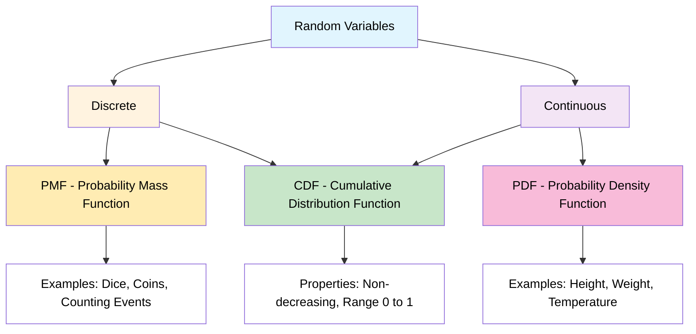

---

## Topic 1: Probability Density Function (PDF)
### For Continuous Random Variables

**From Image 1:** Height of students in classroom [0-1]

### Key Concepts
- **Formula:** P(X ≤ 155) = Area under the curve
- **Visual:** Bell-shaped curve (normal distribution)
- **Axes:** X-axis = Height values (155, 165, etc.), Y-axis = Probability Density (0.1, 0.2, 0.3, 0.4)
- **Interpretation:** Shaded area represents probability

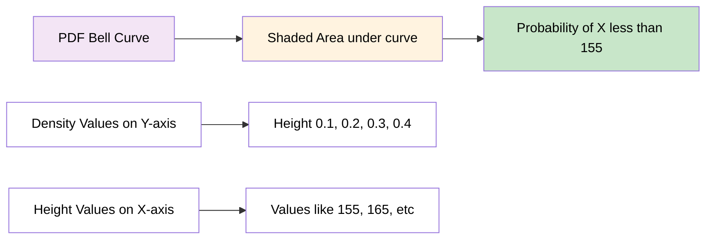

### Properties
- f(x) ≥ 0 for all x
- Total area under curve = 1
- Height represents density, not probability
- Probability = Area under curve between two points

---

## Topic 2: Probability Mass Function (PMF)
### For Discrete Random Variables

**Rolling a dice:** Rolling a dice {1, 2, 3, 4, 5, 6}

### Key Calculations from Your Lecture
```
P(1) = 1/6, P(2) = 1/6, P(3) = 1/6
P(4) = 1/6, P(5) = 1/6, P(6) = 1/6
```

### Cumulative Calculation Example
**P(X ≤ 4) = P(X=1) + P(X=2) + P(X=3) + P(X=4)**
```
= 1/6 + 1/6 + 1/6 + 1/6 = 4/6 = 2/3
```

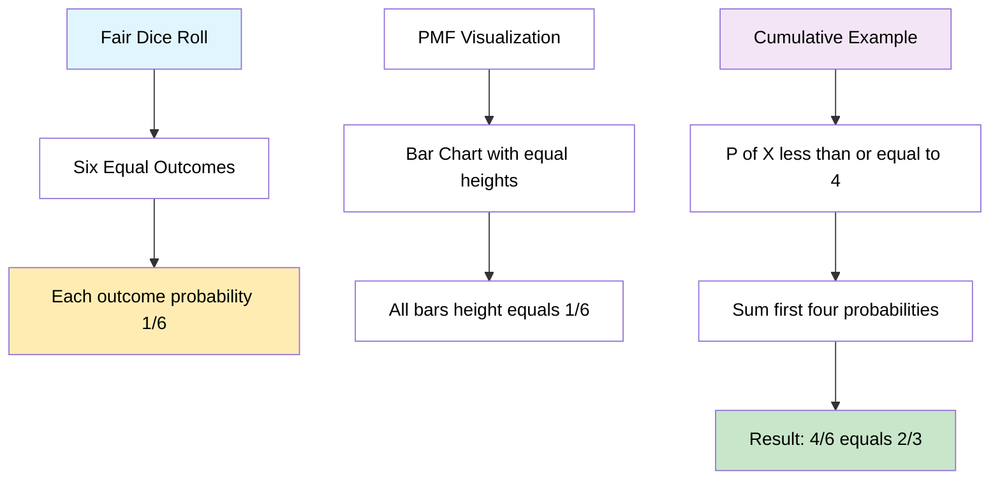

---

## Topic 3: Cumulative Distribution Function (CDF)
### PDF to CDF Relationship: 

**Definition:** F(x) = P(X ≤ x)

### Key Insights from Your Lecture
- **Left side:** PDF (bell curve)
- **Right side:** CDF (S-shaped curve)
- **Critical relationship:** "Probability Density = Gradient of Cumulative Curve"

### 3 Values
- At height 155: F(155) ≈ 0.25
- At height 165: F(165) ≈ 0.5
- The gradient (slope) of CDF = PDF value at that point

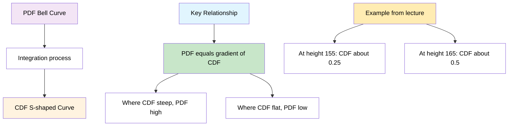

---

## Topic 4: Discrete Random Variable Analysis
### Complete Dice Example: 

**Rolling a dice:** {1, 2, 3, 4, 5, 6}

### PMF Analysis (Left chart in images)
- Uniform distribution
- All bars equal height = 1/6
- Shows individual probabilities

### CDF Analysis (Right chart in images)
- Step function increasing from 1/6 to 6/6 = 1
- Each step represents cumulative probability

### Calculations
```
P(X ≤ 2) = P(X=1) + P(X=2) = 1/6 + 1/6 = 2/6 = 1/3
P(X ≤ 6) = 1 (certainty)
```

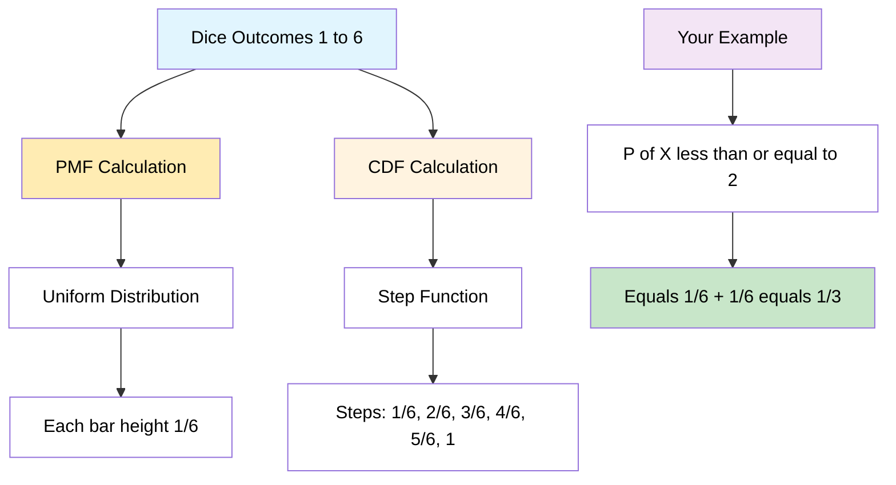

---

## Topic 5: Continuous Random Variable Distribution
### Detailed PDF and CDF Analysis:

**Height Example:** Range 140-180 

### PDF Characteristics 
- Smooth bell-shaped curve
- Peak around 165 (mean)
- Density values: 0.01, 0.02, 0.03, 0.04 on Y-axis
- Shaded areas represent specific probabilities

### CDF Characteristics 
- Smooth S-shaped curve from 0 to 1
- Steepest where PDF is highest (around 165)
- Shows cumulative probabilities

### Critical Insight 
**"Probability Density = Gradient of Cumulative Curve"**

This means:
- Where CDF is steep → PDF is high
- Where CDF is flat → PDF is low
- Slope of CDF at any point = PDF value at that point

---

## Topic 6: Types of Probability Distribution
### Complete Distribution Overview: 

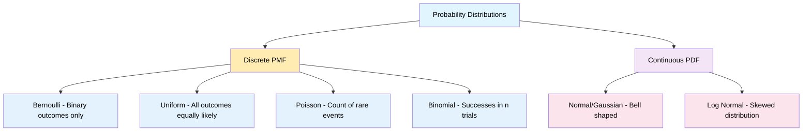

### Distribution Details from Your Lecture

**1. Normal/Gaussian Distribution (PDF)**
- Bell-shaped curve (shown in your images)
- For continuous variables like height
- Most common in nature

**2. Bernoulli Distribution (PMF) - DETAILED ANALYSIS**
- Binary outcomes only: Success/Failure, Yes/No, 1/0
- Single trial with two possible outcomes
- **From your lecture images:** Coin tossing example {H, T}

**3. Uniform Distribution (PMF)**
- All outcomes equally likely
- Like fair dice example from your images

**4. Poisson Distribution (PMF)**
- Count of events in fixed time period
- Models rare events

**5. Log Normal Distribution (PDF)**
- Skewed continuous distribution
- Often used in economics and finance

**6. Binomial Distribution (PMF)**
- Number of successes in n trials
- Extension of Bernoulli for multiple trials

---

## Topic 7: Bernoulli Distribution - Complete Analysis
### Detailed Bernoulli Study: 

**Definition:** Models any single experiment with yes-no question
**From your lecture:** Coin tossing example {H, T}

### Parameters
- **0 ≤ p ≤ 1** (probability constraint)
- **q = 1-p** (complement probability)
- **k ∈ {0,1}** → 2 outcomes only

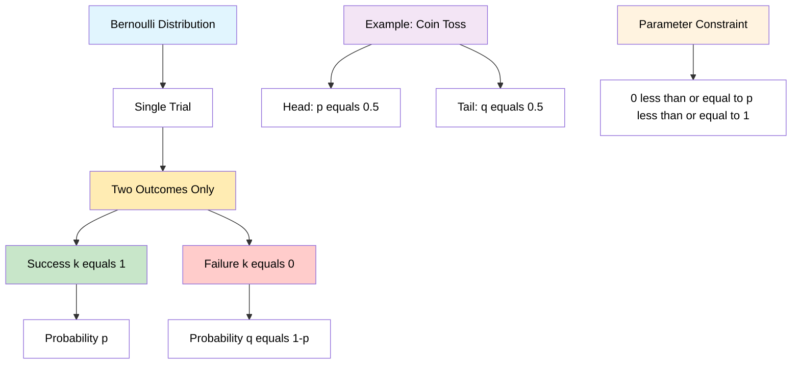

### PMF Formula
**PMF = p^k × (1-p)^(1-k)    k ∈ {0,1}**

#### Case Analysis :
**If k = 1:** P(k=1) = p¹ × (1-p)⁰ = p
**If k = 0:** P(k=0) = p⁰ × (1-p)¹ = (1-p) = q

#### Simplified Form:
```
PMF = { q = 1-p    if k = 0
      { p          if k = 1
```

### Your Coin Toss Example 
```
P(H) = 0.5 = p
P(T) = 0.5 = 1-p = q
```

#### Different Probability Scenarios:
- **P(x=0) = 0.7, P(x=1) = 0.3** (p = 0.3)
- **P(x=0) = 0.4, P(x=1) = 0.6** (p = 0.6)  
- **Whether the person will Pass/Fail**

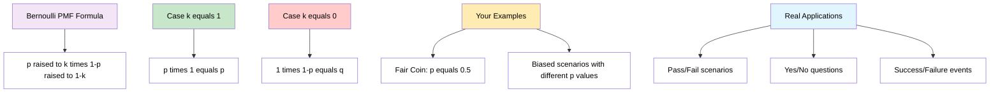

### Mean of Bernoulli Distribution 
**E(k) = Σ k × p(k)** from k=0 to 1

**Calculation:**
```
E(k) = 0×p(0) + 1×p(1)
     = 0×(1-p) + 1×p  
     = 0 + p
     = p
```

**Therefore: Mean = p**

### Median of Bernoulli Distribution
**From your lecture:**
```
Median = { 0      if p < 1/2
         { [0,1]  if p = 1/2  
         { 1      if p > 1/2
```

### Variance and Standard Deviation
**Variance = p × (1-p) = pq**
**Standard Deviation = √(pq)**

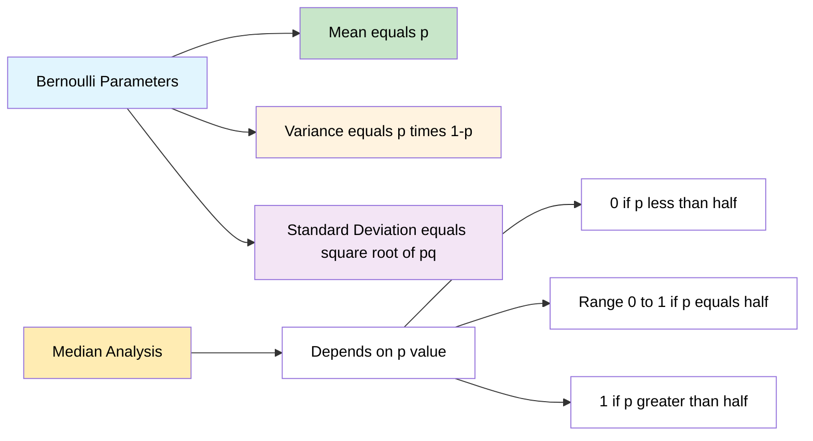

---

## Topic 8: Binomial Distribution - Complete Analysis
### Extension of Bernoulli to Multiple Trials: 

**Definition:** Models the number of successes in n independent Bernoulli trials

**Key Insight:** "For a single trial (n=1), the binomial distribution is a Bernoulli distribution"

### Parameters 
- **n ∈ {0,1,2,...}** → number of trials
- **p ∈ [0,1]** → success probability for each trial  
- **q = 1-p** → failure probability
- **k ∈ {0,1,2,...,n}** → number of successes

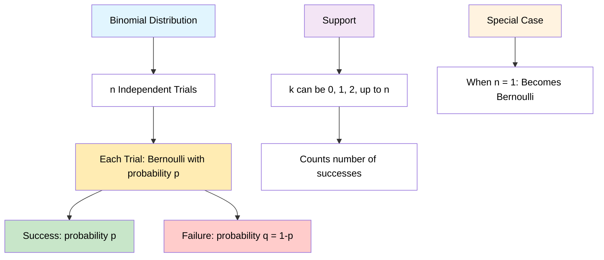

### PMF Formula 
**Pr(K, n, p) = C(n,k) × p^k × (1-p)^(n-k)**

Where C(n,k) is the binomial coefficient:
**C(n,k) = n! / [k!(n-k)!]**

#### Components Breakdown:
- **C(n,k)**: Number of ways to choose k successes from n trials
- **p^k**: Probability of k successes
- **(1-p)^(n-k)**: Probability of (n-k) failures

### Example Applications from Your Lecture
1. **Discrete Random Variable**: Every experiment outcome is binary
2. **Experiment is performed for n trials**
3. **Real Example**: Tossing a coin 10 times 

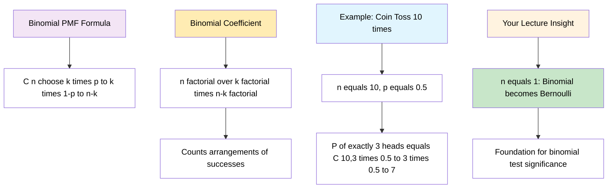

### Statistical Properties 
**Mean = np**
**Variance = npq**  
**Standard Deviation = √(npq)**

#### Derivation Logic:
- Mean: Expected number of successes = n × probability per trial
- Variance: n × variance per trial = n × p(1-p)
- Standard Deviation: Square root of variance

### Connection to Statistical Testing
**The binomial distribution is the basis for the popular binomial test of statistical significance:**

This connects your probability theory to practical hypothesis testing applications.

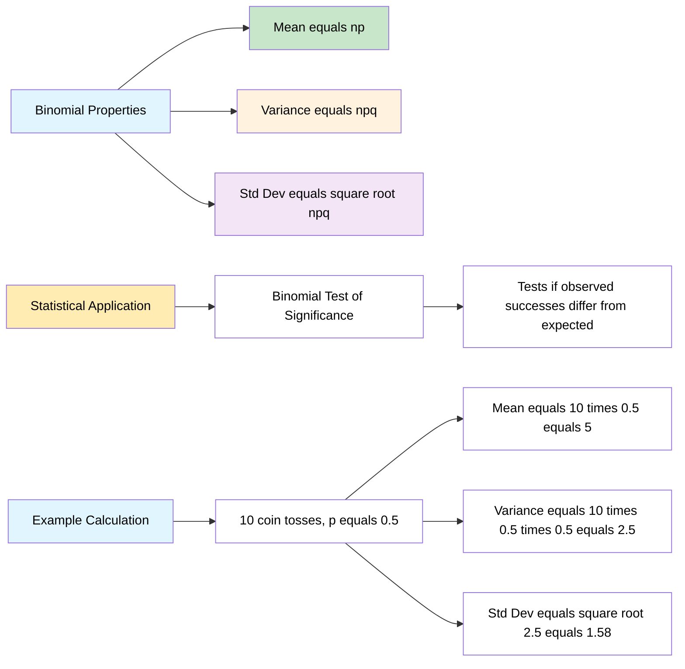
---

## Topic 9: Poisson Distribution - Complete Analysis
### Models Count of Events in Fixed Time Intervals

**Definition:** Models the number of events occurring in a fixed time interval when events happen independently at a constant average rate.

**From your lecture:** Discrete Random Variable (PMF) that describes the number of events occurring in a fixed time interval.

### Real-World Examples from Your Class
- **Number of people visiting hospital every hour**
- **Number of people visiting banks every hour**  
- **Any counting process in fixed time periods**

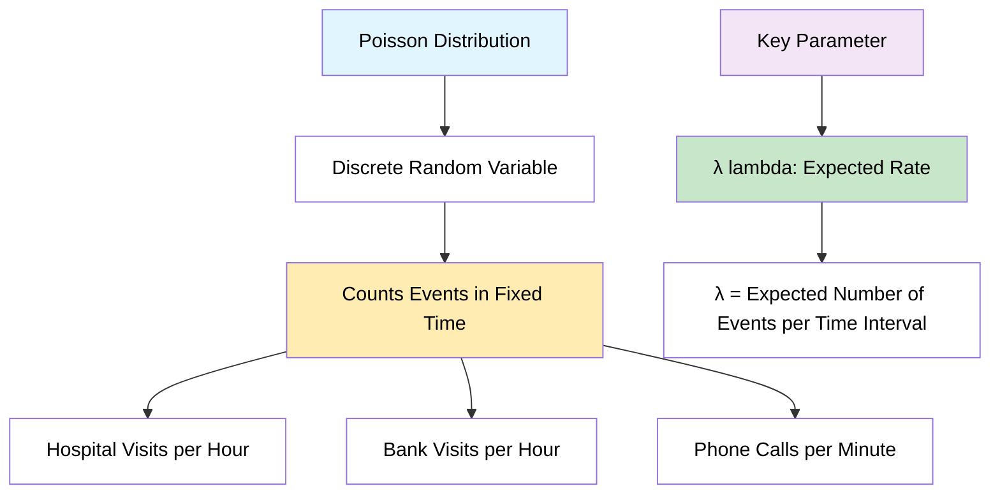

### Parameters and Support
- **λ (lambda) ≥ 0**: Expected number of events in time interval
- **k ∈ {0, 1, 2, 3, ...}**: Actual number of events observed
- **Time interval T**: Fixed period of observation

### PMF Formula from Your Lecture
**P(x = k) = (e^(-λ) × λ^k) / k!**

Where:
- **e**: Mathematical constant ≈ 2.718
- **λ**: Expected rate parameter
- **k**: Number of events
- **k!**: Factorial of k

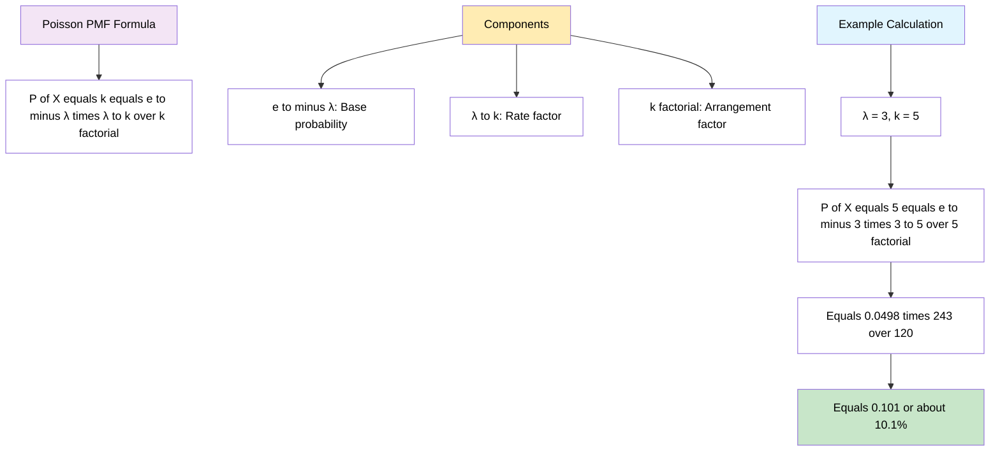

### Worked Example from Your Class
**Given: λ = 3 (expected 3 events per hour)**
**Find: P(X = 5) - probability of exactly 5 events**

**Calculation:**
```
P(X = 5) = (e^(-3) × 3^5) / 5!
         = (e^(-3) × 243) / 120
         = (0.0498 × 243) / 120
         = 12.10 / 120
         = 0.101 = 10.1%
```

### Statistical Properties
**Mean = λ**
**Variance = λ**  
**Standard Deviation = √λ**

**Key Insight:** For Poisson distribution, mean equals variance!

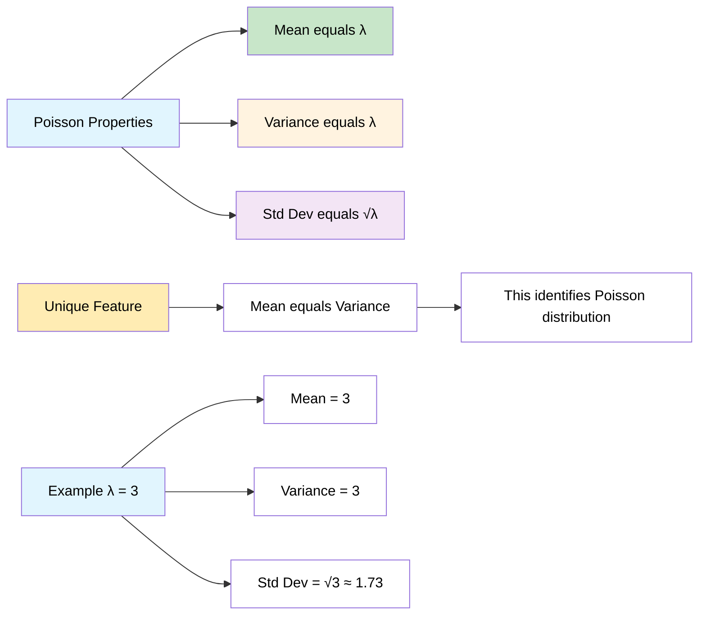

### Conditions for Poisson Distribution
1. **Events occur independently**
2. **Average rate (λ) remains constant**
3. **Two events cannot occur simultaneously**
4. **Events are rare relative to observation period**

### PMF Visualization Characteristics
- **Shape**: Right-skewed for small λ, approaches normal for large λ
- **Support**: Discrete values {0, 1, 2, 3, ...}
- **Peak**: Typically at or near λ
- **Tail**: Long right tail for rare events

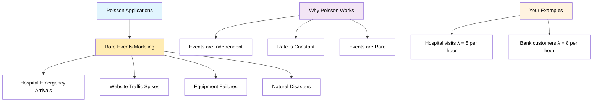

---
### Relationship Summary: Bernoulli → Binomial

| Distribution | Trials | Outcomes | PMF | Example |
|-------------|--------|-----------|-----|---------|
| Bernoulli | n = 1 | k ∈ {0,1} | p^k(1-p)^(1-k) | Single coin toss |
| Binomial | n ≥ 1 | k ∈ {0,1,...,n} | C(n,k)p^k(1-p)^(n-k) | 10 coin tosses |

**Key Insight:** Bernoulli is the special case of Binomial when n = 1

---

---

## Programming Implementation

### Python Visualization Code

```python
import numpy as np
import matplotlib.pyplot as plt
from scipy.stats import norm, uniform, bernoulli

# Recreating your lecture examples
def create_lecture_visualizations():
    fig, ((ax1, ax2), (ax3, ax4), (ax5, ax6)) = plt.subplots(3, 2, figsize=(15, 15))
    
    # 1. PDF Example (Image 1 recreation)
    x_height = np.linspace(140, 190, 1000)
    pdf_height = norm.pdf(x_height, 165, 10)
    
    ax1.plot(x_height, pdf_height, 'orange', linewidth=2, label='PDF')
    ax1.fill_between(x_height[x_height <= 155], 
                     pdf_height[x_height <= 155], 
                     alpha=0.3, color='yellow', label='P(X ≤ 155)')
    ax1.set_title('PDF: Height Distribution (Your Image 1)')
    ax1.set_xlabel('Height')
    ax1.set_ylabel('Probability Density')
    ax1.grid(True, alpha=0.3)
    ax1.legend()
    
    # 2. PMF Example (Images 2, 4, 5 recreation)
    dice_outcomes = np.array([1, 2, 3, 4, 5, 6])
    dice_pmf = np.ones(6) / 6
    
    bars = ax2.bar(dice_outcomes, dice_pmf, color='lightblue', 
                   edgecolor='black', alpha=0.7)
    ax2.set_title('PMF: Dice Roll (Your Images 2,4,5)')
    ax2.set_xlabel('Outcome')
    ax2.set_ylabel('Probability')
    ax2.set_ylim(0, 0.2)
    ax2.grid(True, alpha=0.3)
    
    # Highlight P(X ≤ 4) as in your calculation
    for i in range(4):
        bars[i].set_color('orange')
    
    # 3. CDF for continuous (Image 6 recreation)
    cdf_height = norm.cdf(x_height, 165, 10)
    
    ax3.plot(x_height, cdf_height, 'white', linewidth=2)
    ax3.axhline(y=0.25, color='red', linestyle='--', alpha=0.7, label='F(155) ≈ 0.25')
    ax3.axhline(y=0.5, color='green', linestyle='--', alpha=0.7, label='F(165) ≈ 0.5')
    ax3.axvline(x=155, color='red', linestyle='--', alpha=0.7)
    ax3.axvline(x=165, color='green', linestyle='--', alpha=0.7)
    ax3.set_title('CDF: Height Distribution (Your Image 6)')
    ax3.set_xlabel('Height')
    ax3.set_ylabel('Cumulative Probability')
    ax3.grid(True, alpha=0.3)
    ax3.legend()
    
    # 4. CDF for discrete (Images 4,5 recreation)
    dice_cdf = np.cumsum(dice_pmf)
    
    ax4.step(dice_outcomes, dice_cdf, where='post', color='orange', linewidth=2)
    ax4.scatter(dice_outcomes, dice_cdf, color='red', s=50, zorder=5)
    ax4.set_title('CDF: Dice Roll (Your Images 4,5)')
    ax4.set_xlabel('Outcome')
    ax4.set_ylabel('Cumulative Probability')
    ax4.set_ylim(0, 1.1)
    ax4.grid(True, alpha=0.3)
    
    # Add your calculation annotation
    ax4.annotate('P(X ≤ 4) = 4/6 = 2/3', 
                xy=(4, 4/6), xytext=(4.5, 0.8),
                arrowprops=dict(arrowstyle='->', color='red'),
                fontsize=10, color='red')
    
    # 5. Bernoulli PMF (New from Images 1-6)
    outcomes = [0, 1]
    
    # Three scenarios from your lecture
    p_values = [0.3, 0.5, 0.7]
    colors = ['red', 'blue', 'green']
    
    width = 0.25
    for i, (p, color) in enumerate(zip(p_values, colors)):
        probs = [1-p, p]
        x_pos = [x + i*width for x in outcomes]
        ax5.bar(x_pos, probs, width, alpha=0.7, color=color, 
                label=f'p = {p}')
    
    ax5.set_title('Bernoulli PMF: Different p values (Your Images)')
    ax5.set_xlabel('Outcome (0=Failure, 1=Success)')
    ax5.set_ylabel('Probability')
    ax5.set_xticks([x + width for x in outcomes])
    ax5.set_xticklabels(['0', '1'])
    ax5.legend()
    ax5.grid(True, alpha=0.3)
    
    # 6. Bernoulli Statistics Visualization
    p_range = np.linspace(0.01, 0.99, 100)
    means = p_range
    variances = p_range * (1 - p_range)
    std_devs = np.sqrt(variances)
    
    ax6.plot(p_range, means, 'blue', linewidth=2, label='Mean = p')
    ax6.plot(p_range, variances, 'red', linewidth=2, label='Variance = p(1-p)')
    ax6.plot(p_range, std_devs, 'green', linewidth=2, label='Std Dev = √[p(1-p)]')
    ax6.set_title('Bernoulli Distribution Statistics')
    ax6.set_xlabel('Parameter p')
    ax6.set_ylabel('Value')
    ax6.legend()
    ax6.grid(True, alpha=0.3)
    
    plt.tight_layout()
    plt.show()

# Verification of your lecture calculations
def verify_lecture_calculations():
    print("=== Verification of Your Lecture Calculations ===\n")
    
    # Dice calculations from Images 2, 4, 5
    print("1. DICE PMF CALCULATIONS (Images 2, 4, 5)")
    outcomes = [1, 2, 3, 4, 5, 6]
    for outcome in outcomes:
        print(f"   P({outcome}) = 1/6 = {1/6:.3f}")
    
    print(f"\n   P(X ≤ 4) = P(1) + P(2) + P(3) + P(4)")
    print(f"            = 1/6 + 1/6 + 1/6 + 1/6")
    print(f"            = 4/6 = {4/6:.3f}")
    
    print(f"\n   P(X ≤ 2) = P(1) + P(2) = 2/6 = {2/6:.3f}")
    print(f"   P(X ≤ 6) = 1 (certainty)")
    
    # Height calculations from Images 1, 3, 6
    print(f"\n2. HEIGHT PDF/CDF CALCULATIONS (Images 1, 3, 6)")
    print(f"   Assuming Normal Distribution μ=165, σ=10")
    
    prob_155 = norm.cdf(155, 165, 10)
    prob_165 = norm.cdf(165, 165, 10)
    
    print(f"   P(Height ≤ 155) = {prob_155:.3f} (matches your ~0.25)")
    print(f"   P(Height ≤ 165) = {prob_165:.3f} (matches your ~0.50)")
    
    # PDF to CDF relationship verification
    print(f"\n3. PDF-CDF RELATIONSHIP VERIFICATION")
    print(f"   At x=155: PDF = {norm.pdf(155, 165, 10):.4f}")
    print(f"   At x=165: PDF = {norm.pdf(165, 165, 10):.4f} (peak)")
    print(f"   At x=175: PDF = {norm.pdf(175, 165, 10):.4f}")
    print(f"   → PDF is highest at 165, where CDF is steepest")
    
    # Bernoulli calculations from new images
    print(f"\n4. BERNOULLI DISTRIBUTION CALCULATIONS")
    
    # Coin toss example (p = 0.5)
    p = 0.5
    print(f"   FAIR COIN (p = {p}):")
    print(f"   P(H) = P(k=1) = p = {p}")
    print(f"   P(T) = P(k=0) = 1-p = {1-p}")
    print(f"   Mean = p = {p}")
    print(f"   Variance = p(1-p) = {p*(1-p)}")
    print(f"   Std Dev = √[p(1-p)] = {np.sqrt(p*(1-p)):.3f}")
    
    # Different p values from your examples
    print(f"\n   BIASED SCENARIOS:")
    p_values = [0.3, 0.6, 0.7]
    for p in p_values:
        print(f"   p = {p}: P(0) = {1-p}, P(1) = {p}, Mean = {p}, Var = {p*(1-p):.3f}")
    
    # Median calculation
    print(f"\n   MEDIAN CALCULATION:")
    test_p = [0.3, 0.5, 0.8]
    for p in test_p:
        if p < 0.5:
            median = 0
        elif p == 0.5:
            median = "[0,1]"
        else:
            median = 1
        print(f"   p = {p}: Median = {median}")

# Run the functions
if __name__ == "__main__":
    create_lecture_visualizations()
    verify_lecture_calculations()
```
