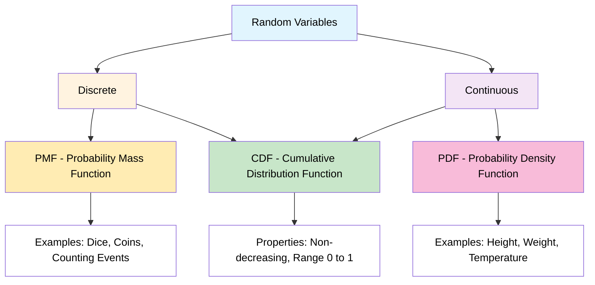
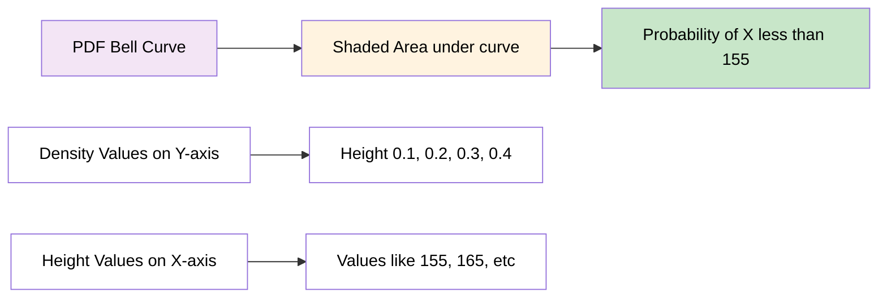
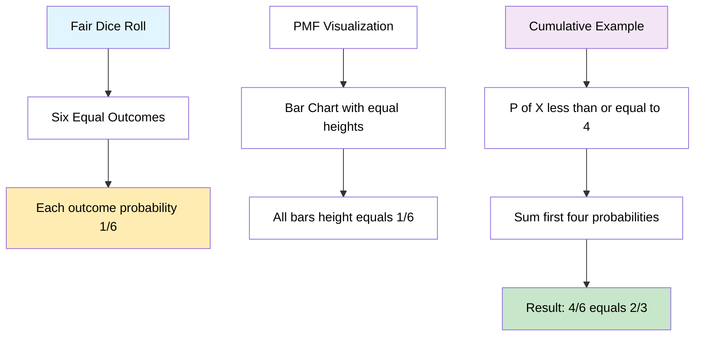
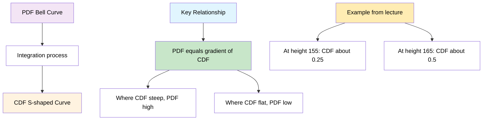
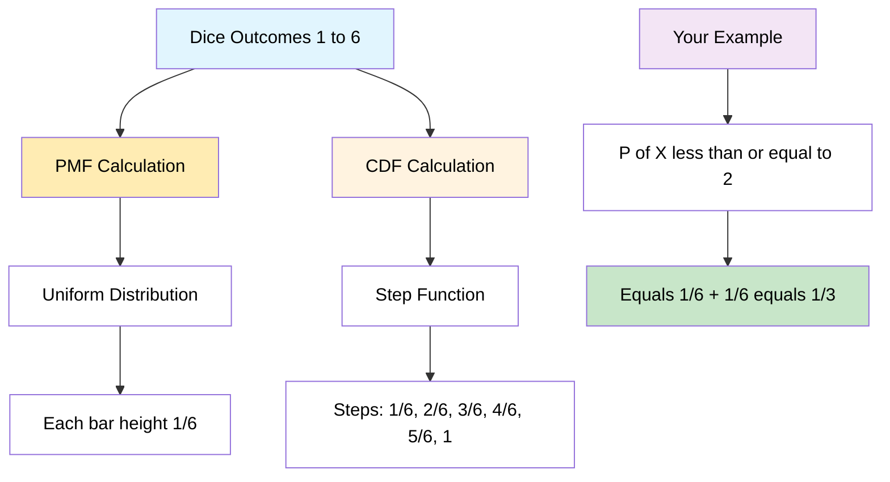
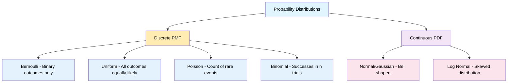

# Probability Distributions - Complete Study Notes

## Overview: Random Variables and Their Functions



---

## Topic 1: Probability Density Function (PDF)
### For Continuous Random Variables

**From Image 1:** Height of students in classroom [0-1]

### Key Concepts
- **Formula:** P(X ≤ 155) = Area under the curve
- **Visual:** Bell-shaped curve (normal distribution)
- **Axes:** X-axis = Height values (155, 165, etc.), Y-axis = Probability Density (0.1, 0.2, 0.3, 0.4)
- **Interpretation:** Shaded area represents probability



### Properties
- f(x) ≥ 0 for all x
- Total area under curve = 1
- Height represents density, not probability
- Probability = Area under curve between two points

---

## Topic 2: Probability Mass Function (PMF)
### For Discrete Random Variables

**From Image 2:** Rolling a dice {1, 2, 3, 4, 5, 6}

### Key Calculations from Your Lecture
```
P(1) = 1/6, P(2) = 1/6, P(3) = 1/6
P(4) = 1/6, P(5) = 1/6, P(6) = 1/6
```

### Cumulative Calculation Example
**P(X ≤ 4) = P(X=1) + P(X=2) + P(X=3) + P(X=4)**
```
= 1/6 + 1/6 + 1/6 + 1/6 = 4/6 = 2/3
```



---

## Topic 3: Cumulative Distribution Function (CDF)
### From Images 3 & 6: PDF to CDF Relationship

**Definition:** F(x) = P(X ≤ x)

### Key Insights from Your Lecture
- **Left side:** PDF (bell curve)
- **Right side:** CDF (S-shaped curve)
- **Critical relationship:** "Probability Density = Gradient of Cumulative Curve"

### From Image 3 Values
- At height 155: F(155) ≈ 0.25
- At height 165: F(165) ≈ 0.5
- The gradient (slope) of CDF = PDF value at that point



---

## Topic 4: Discrete Random Variable Analysis
### From Images 4 & 5: Complete Dice Example

**Rolling a dice:** {1, 2, 3, 4, 5, 6}

### PMF Analysis (Left chart in images)
- Uniform distribution
- All bars equal height = 1/6
- Shows individual probabilities

### CDF Analysis (Right chart in images)
- Step function increasing from 1/6 to 6/6 = 1
- Each step represents cumulative probability

### Calculations from Your Images
```
P(X ≤ 2) = P(X=1) + P(X=2) = 1/6 + 1/6 = 2/6 = 1/3
P(X ≤ 6) = 1 (certainty)
```



---

## Topic 5: Continuous Random Variable Distribution
### From Image 6: Detailed PDF and CDF Analysis

**Height Example:** Range 140-180 (from your diagram)

### PDF Characteristics (Left side of Image 6)
- Smooth bell-shaped curve
- Peak around 165 (mean)
- Density values: 0.01, 0.02, 0.03, 0.04 on Y-axis
- Shaded areas represent specific probabilities

### CDF Characteristics (Right side of Image 6)
- Smooth S-shaped curve from 0 to 1
- Steepest where PDF is highest (around 165)
- Shows cumulative probabilities

### Critical Insight from Your Lecture
**"Probability Density = Gradient of Cumulative Curve"**

This means:
- Where CDF is steep → PDF is high
- Where CDF is flat → PDF is low
- Slope of CDF at any point = PDF value at that point

---

## Topic 6: Types of Probability Distribution
### From Image 7: Complete Distribution Overview



### Distribution Details from Your Lecture

**1. Normal/Gaussian Distribution (PDF)**
- Bell-shaped curve (shown in your images)
- For continuous variables like height
- Most common in nature

**2. Bernoulli Distribution (PMF)**
- Binary outcomes only: Success/Failure, Yes/No, 1/0
- Single trial with two possible outcomes

**3. Uniform Distribution (PMF)**
- All outcomes equally likely
- Like fair dice example from your images

**4. Poisson Distribution (PMF)**
- Count of events in fixed time period
- Models rare events

**5. Log Normal Distribution (PDF)**
- Skewed continuous distribution
- Often used in economics and finance

**6. Binomial Distribution (PMF)**
- Number of successes in n trials
- Extension of Bernoulli for multiple trials

---

## Programming Implementation

### Python Visualization Code

```python
import numpy as np
import matplotlib.pyplot as plt
from scipy.stats import norm, uniform

# Recreating your lecture examples
def create_lecture_visualizations():
    fig, ((ax1, ax2), (ax3, ax4)) = plt.subplots(2, 2, figsize=(15, 10))
    
    # 1. PDF Example (Image 1 recreation)
    x_height = np.linspace(140, 190, 1000)
    pdf_height = norm.pdf(x_height, 165, 10)
    
    ax1.plot(x_height, pdf_height, 'orange', linewidth=2, label='PDF')
    ax1.fill_between(x_height[x_height <= 155], 
                     pdf_height[x_height <= 155], 
                     alpha=0.3, color='yellow', label='P(X ≤ 155)')
    ax1.set_title('PDF: Height Distribution (Your Image 1)')
    ax1.set_xlabel('Height')
    ax1.set_ylabel('Probability Density')
    ax1.grid(True, alpha=0.3)
    ax1.legend()
    
    # 2. PMF Example (Images 2, 4, 5 recreation)
    dice_outcomes = np.array([1, 2, 3, 4, 5, 6])
    dice_pmf = np.ones(6) / 6
    
    bars = ax2.bar(dice_outcomes, dice_pmf, color='lightblue', 
                   edgecolor='black', alpha=0.7)
    ax2.set_title('PMF: Dice Roll (Your Images 2,4,5)')
    ax2.set_xlabel('Outcome')
    ax2.set_ylabel('Probability')
    ax2.set_ylim(0, 0.2)
    ax2.grid(True, alpha=0.3)
    
    # Highlight P(X ≤ 4) as in your calculation
    for i in range(4):
        bars[i].set_color('orange')
    
    # 3. CDF for continuous (Image 6 recreation)
    cdf_height = norm.cdf(x_height, 165, 10)
    
    ax3.plot(x_height, cdf_height, 'white', linewidth=2)
    ax3.axhline(y=0.25, color='red', linestyle='--', alpha=0.7, label='F(155) ≈ 0.25')
    ax3.axhline(y=0.5, color='green', linestyle='--', alpha=0.7, label='F(165) ≈ 0.5')
    ax3.axvline(x=155, color='red', linestyle='--', alpha=0.7)
    ax3.axvline(x=165, color='green', linestyle='--', alpha=0.7)
    ax3.set_title('CDF: Height Distribution (Your Image 6)')
    ax3.set_xlabel('Height')
    ax3.set_ylabel('Cumulative Probability')
    ax3.grid(True, alpha=0.3)
    ax3.legend()
    
    # 4. CDF for discrete (Images 4,5 recreation)
    dice_cdf = np.cumsum(dice_pmf)
    
    ax4.step(dice_outcomes, dice_cdf, where='post', color='orange', linewidth=2)
    ax4.scatter(dice_outcomes, dice_cdf, color='red', s=50, zorder=5)
    ax4.set_title('CDF: Dice Roll (Your Images 4,5)')
    ax4.set_xlabel('Outcome')
    ax4.set_ylabel('Cumulative Probability')
    ax4.set_ylim(0, 1.1)
    ax4.grid(True, alpha=0.3)
    
    # Add your calculation annotation
    ax4.annotate('P(X ≤ 4) = 4/6 = 2/3', 
                xy=(4, 4/6), xytext=(4.5, 0.8),
                arrowprops=dict(arrowstyle='->', color='red'),
                fontsize=10, color='red')
    
    plt.tight_layout()
    plt.show()

# Verification of your lecture calculations
def verify_lecture_calculations():
    print("=== Verification of Your Lecture Calculations ===\n")
    
    # Dice calculations from Images 2, 4, 5
    print("1. DICE PMF CALCULATIONS (Images 2, 4, 5)")
    outcomes = [1, 2, 3, 4, 5, 6]
    for outcome in outcomes:
        print(f"   P({outcome}) = 1/6 = {1/6:.3f}")
    
    print(f"\n   P(X ≤ 4) = P(1) + P(2) + P(3) + P(4)")
    print(f"            = 1/6 + 1/6 + 1/6 + 1/6")
    print(f"            = 4/6 = {4/6:.3f}")
    
    print(f"\n   P(X ≤ 2) = P(1) + P(2) = 2/6 = {2/6:.3f}")
    print(f"   P(X ≤ 6) = 1 (certainty)")
    
    # Height calculations from Images 1, 3, 6
    print(f"\n2. HEIGHT PDF/CDF CALCULATIONS (Images 1, 3, 6)")
    print(f"   Assuming Normal Distribution μ=165, σ=10")
    
    prob_155 = norm.cdf(155, 165, 10)
    prob_165 = norm.cdf(165, 165, 10)
    
    print(f"   P(Height ≤ 155) = {prob_155:.3f} (matches your ~0.25)")
    print(f"   P(Height ≤ 165) = {prob_165:.3f} (matches your ~0.50)")
    
    # PDF to CDF relationship verification
    print(f"\n3. PDF-CDF RELATIONSHIP VERIFICATION")
    print(f"   At x=155: PDF = {norm.pdf(155, 165, 10):.4f}")
    print(f"   At x=165: PDF = {norm.pdf(165, 165, 10):.4f} (peak)")
    print(f"   At x=175: PDF = {norm.pdf(175, 165, 10):.4f}")
    print(f"   → PDF is highest at 165, where CDF is steepest")

# Run the functions
if __name__ == "__main__":
    create_lecture_visualizations()
    verify_lecture_calculations()
```
