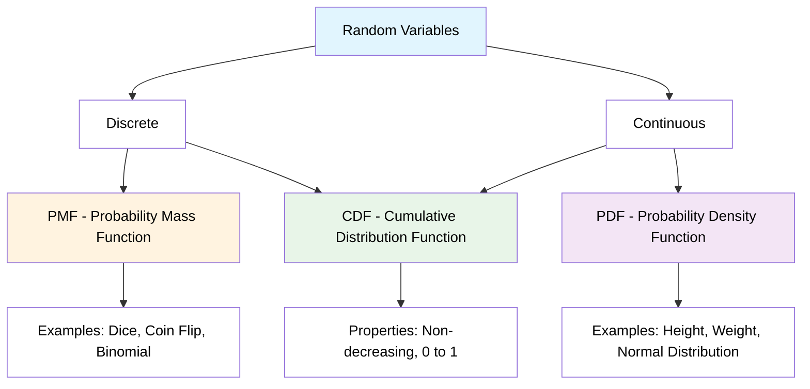
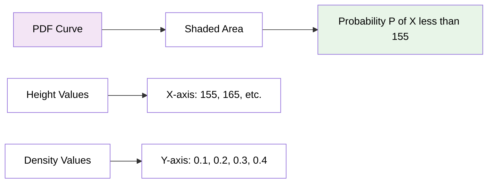
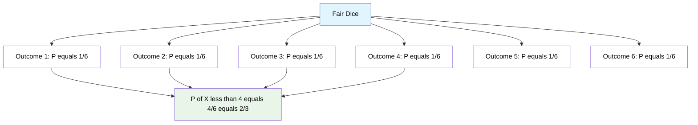
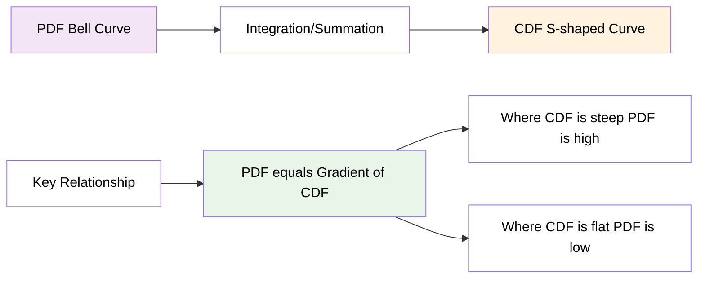
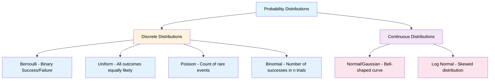
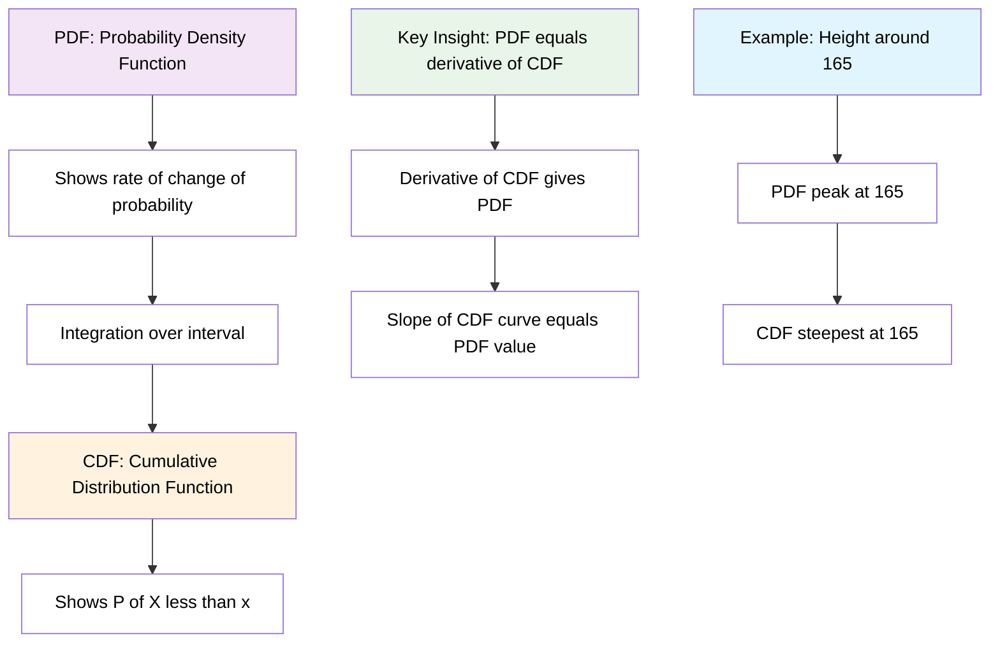
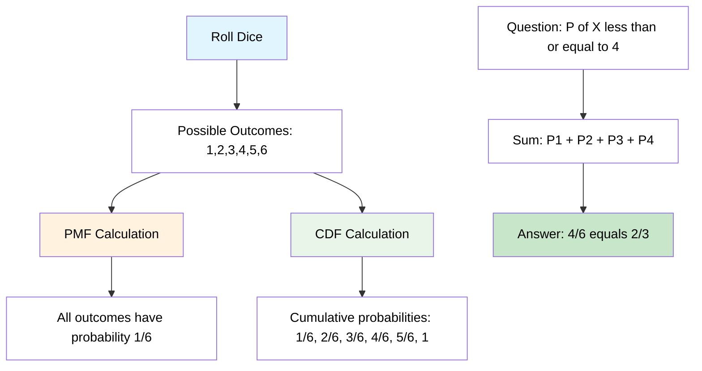
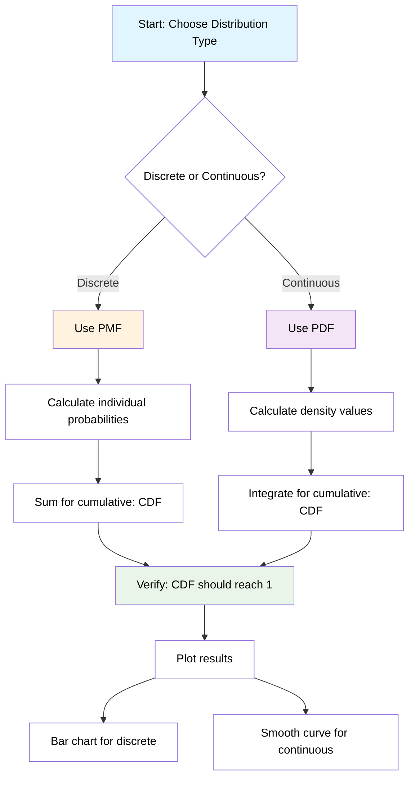
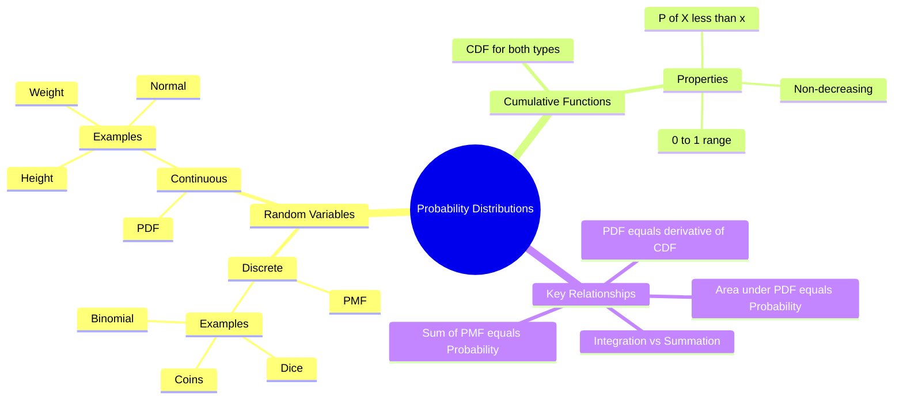
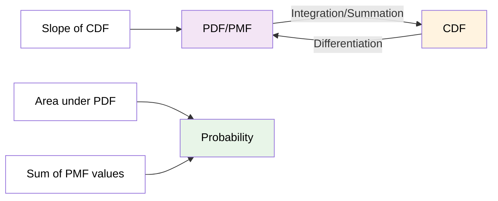

# Probability Distributions - Core Concepts

## Overview: Types of Random Variables and Their Functions



---

## Topic 1: Probability Density Function (PDF)
### For Continuous Random Variables

**Example from your lecture:** Height of students in classroom [0-1]

### Key Formula
**P(X ≤ 155) = Area under the curve**



### Important Properties
- f(x) ≥ 0 for all x
- Total area under curve = 1
- Height represents density, not probability
- Probability = Area under curve between two points

---

## Topic 2: Probability Mass Function (PMF)  
### For Discrete Random Variables

**Example from your lecture:** Rolling a dice {1, 2, 3, 4, 5, 6}

### Key Calculations from your image:



### Cumulative Calculation:
**P(X ≤ 4) = P(X=1) + P(X=2) + P(X=3) + P(X=4)**
```
= 1/6 + 1/6 + 1/6 + 1/6 = 4/6 = 2/3
```

---

## Topic 3: Cumulative Distribution Function (CDF)
### Cumulative Probability

**Definition:** F(x) = P(X ≤ x)



### Properties
- F(x) is non-decreasing
- F(x) starts at 0 and approaches 1
- Slope of CDF = PDF value at that point

---

## Topic 4: Distribution Types Overview



---

## Topic 5: PDF to CDF Relationship



---

## Topic 6: Discrete Random Variable - Complete Analysis

### Rolling a Dice - Step by Step



---

## Programming Implementation Flow



---

## Key Relationships Summary



---

## Programming Examples

### Python Implementation

```python
import numpy as np
import matplotlib.pyplot as plt
from scipy.stats import norm, uniform

# Example 1: Dice PMF and CDF (from your images)
dice_outcomes = np.array([1, 2, 3, 4, 5, 6])
dice_pmf = np.ones(6) / 6  # Each outcome has probability 1/6

# Calculate CDF
dice_cdf = np.cumsum(dice_pmf)

print("Dice PMF:", dice_pmf)
print("Dice CDF:", dice_cdf)

# Verify your calculation: P(X ≤ 4)
prob_leq_4 = dice_cdf[3]  # Index 3 corresponds to outcome 4
print(f"P(X ≤ 4) = {prob_leq_4:.3f} = {4/6:.3f}")

# Example 2: Height PDF and CDF (from your images)
# Assuming normal distribution with mean=165, std=10
mu, sigma = 165, 10
x_values = np.linspace(140, 190, 1000)

# Calculate PDF and CDF
pdf_values = norm.pdf(x_values, mu, sigma)
cdf_values = norm.cdf(x_values, mu, sigma)

# Verify: P(X ≤ 155)
prob_155 = norm.cdf(155, mu, sigma)
print(f"P(Height ≤ 155) = {prob_155:.3f}")

# Create plots similar to your lecture
fig, (ax1, ax2) = plt.subplots(1, 2, figsize=(12, 5))

# PMF for dice
ax1.bar(dice_outcomes, dice_pmf, alpha=0.7, color='lightblue')
ax1.set_title('Dice PMF (from your lecture)')
ax1.set_xlabel('Outcome')
ax1.set_ylabel('Probability')
ax1.set_ylim(0, 0.2)

# PDF for height
ax2.plot(x_values, pdf_values, 'b-', linewidth=2)
ax2.fill_between(x_values[x_values <= 155], pdf_values[x_values <= 155], alpha=0.3)
ax2.set_title('Height PDF (from your lecture)')
ax2.set_xlabel('Height')
ax2.set_ylabel('Density')

plt.tight_layout()
plt.show()
```

### Verification of Your Calculations

```python
# Dice example verification
print("=== Dice Calculations (from your images) ===")
outcomes = [1, 2, 3, 4, 5, 6]
prob_each = 1/6

# Individual probabilities
for outcome in outcomes:
    print(f"P({outcome}) = {prob_each:.3f}")

# Cumulative probability P(X ≤ 4)
prob_leq_4 = sum([1/6 for i in range(1, 5)])  # 1,2,3,4
print(f"\nP(X ≤ 4) = P(1) + P(2) + P(3) + P(4)")
print(f"         = 1/6 + 1/6 + 1/6 + 1/6")  
print(f"         = 4/6 = {4/6:.3f}")

# Height example (approximate values from your graph)
print("\n=== Height Calculations (from your images) ===")
print("Assuming Normal Distribution with μ=165, σ=10")

prob_155 = norm.cdf(155, 165, 10)
prob_165 = norm.cdf(165, 165, 10)

print(f"P(Height ≤ 155) ≈ {prob_155:.2f} (matches your ~0.25)")
print(f"P(Height ≤ 165) ≈ {prob_165:.2f} (matches your ~0.50)")
```

---

## Summary

**PDF (Continuous):**
- Used for continuous random variables
- Shows probability density
- Area under curve = probability
- Example: Height of students

**PMF (Discrete):**  
- Used for discrete random variables
- Shows exact probabilities
- Sum of probabilities = 1
- Example: Rolling dice

**CDF (Both):**
- Shows cumulative probability P(X ≤ x)
- Always non-decreasing from 0 to 1
- Slope of CDF = PDF/PMF value

**Key Relationship:**
Probability Density = Gradient of Cumulative Curve


