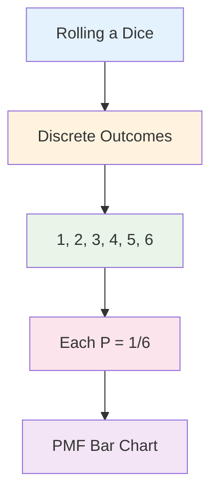
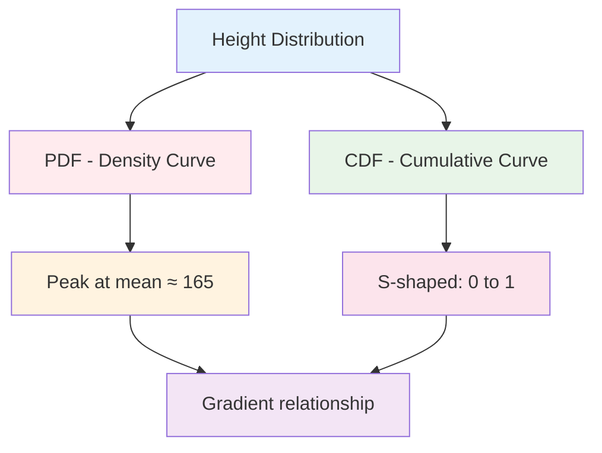
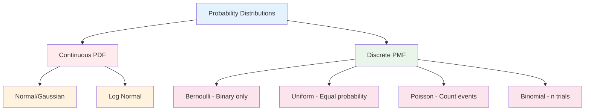
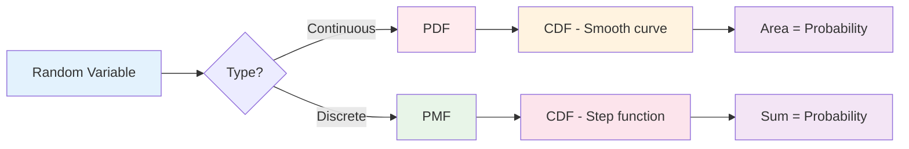

# Probability Distribution Functions
---

## 1. Probability Density Function (PDF) - Continuous Random Variable

### Example: Height of students in classroom [0-1]

```mermaid
graph LR
    A[Continuous Random Variable] --> B[Height of Students]
    B --> C[PDF - Bell Curve]
    C --> D[P(X ≤ 155) = Area under curve]
    
    style A fill:#e3f2fd
    style B fill:#fff3e0
    style C fill:#e8f5e8
    style D fill:#fce4ec
```

**Key Formula from image:**
```
P(X ≤ 155) = Area under the curve
```

**Visual Elements:**
- X-axis: Height (155, 165, etc.)
- Y-axis: Probability Density (0.1, 0.2, 0.3, 0.4)
- Bell-shaped curve
- Shaded area represents probability

---

## 2. Probability Mass Function (PMF) - Discrete Random Variable

### Example: Rolling a dice {1, 2, 3, 4, 5, 6}



**Calculations from image:**
```
P(1) = 1/6
P(2) = 1/6
...
P(6) = 1/6

P(X ≤ 4) = P(X=1) + P(X=2) + P(X=3) + P(X=4)
         = 1/6 + 1/6 + 1/6 + 1/6 = 4/6 = 2/3
```

**Visual:** Uniform distribution with equal height bars

---

## 3. Cumulative Distribution Function (CDF)

Shows cumulative probability


**Key relationship from image:**
```
Probability Density = Gradient of Cumulative Curve
```

**Properties:**
- Starts at 0, approaches 1
- Non-decreasing
- At height 165: F(165) ≈ 0.5

---

## 4. Discrete Random Variable - Complete Example

### Dice analysis with PMF and CDF

```mermaid
graph TB
    A[Dice Roll {1,2,3,4,5,6}] --> B[PMF Chart]
    A --> C[CDF Chart]
    B --> D[Uniform bars - height 1/6]
    C --> E[Step function 0 to 1]
    
    style A fill:#e3f2fd
    style B fill:#fff3e0
    style C fill:#e8f5e8
    style D fill:#fce4ec
    style E fill:#f3e5f5
```

```
P(X ≤ 2) = P(X=1) + P(X=2) = 1/6 + 1/6 = 2/6

P(X ≤ 6) = 1
```

---

## 5. Distribution of Continuous Random Variable

### PDF to CDF relationship



**Key insight from image:**
- Where PDF is high → CDF is steep
- Where PDF is low → CDF is flat
- Slope of CDF = PDF value

---

## 6. Types of Probability Distribution

### Classification from lecture slide



1. **Normal/Gaussian Distribution (PDF)** - Bell curve
2. **Bernoulli Distribution (PMF)** - Binary outcomes only  
3. **Uniform Distribution (PMF)** - All outcomes equally likely
4. **Poisson Distribution (PMF)** - Count of rare events
5. **Log Normal Distribution (PDF)** - Skewed continuous
6. **Binomial Distribution (PMF)** - Multiple trial successes
---

## Summary Relationships



**Key formulas from images:**
- **PDF:** P(a ≤ X ≤ b) = Area under curve
- **PMF:** P(X ≤ k) = Sum of individual probabilities  
- **CDF:** F(x) = P(X ≤ x)
- **Relationship:** PDF/PMF = Slope of CDF
