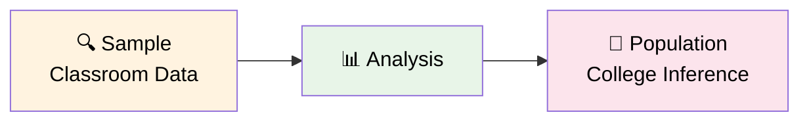
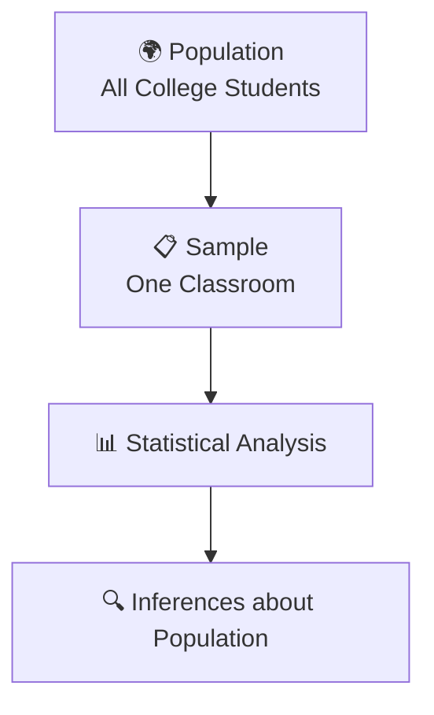
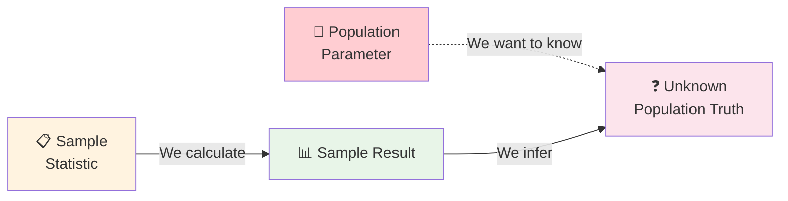
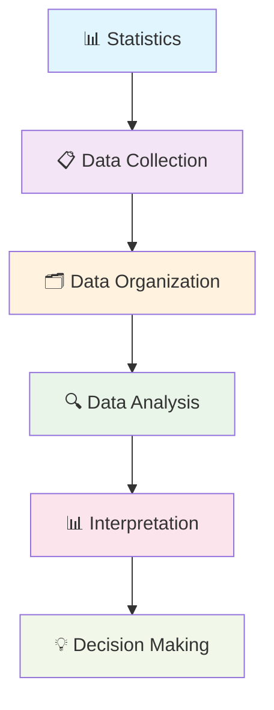
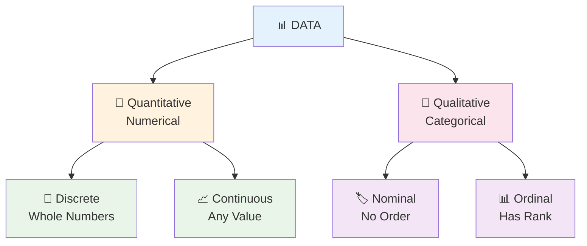

# Introduction to Statistics
> *"Statistics is the grammar of science."* - Karl Pearson

## 📊 What is Statistics?
**Statistics** is the science of collecting, organizing, and analyzing data to make informed decisions and draw meaningful conclusions from information.

## 🔍 Types of Statistics
Statistics is divided into two main branches:

### 1️⃣ Descriptive Statistics
**Definition:** It consists of organizing and summarizing data

**Components:**
- **📊 Measures of Central Tendency:** Mean, Median, Mode
- **📈 Measures of Dispersion:** Variance, Standard Deviation
- **📋 Different types of Distribution of data**
  - Examples: Histogram, PDF, PMF

**Example:** Let's say there are 20 statistics classes at your college, and you have collected the heights of students in the class.

Heights recorded: `[175cm, 180cm, 140cm, 140cm, 135cm, 160cm, 185cm, 190cm]`

**Descriptive Question:** *"What is the average height of the entire classroom?"*
```
Calculation: (175+180+140+140+135+160+185+190) / 8 = Average Height
```

### 2️⃣ Inferential Statistics  
**Definition:** It consists of using data you have measured to form conclusions

**Components:**
- **🧪 Hypothesis Testing**
  - Z-test, t-test
  - H₀, H₁, p-value, significance value
- **📊 Chi Square tests**

**Inferential Question:** *"Are the heights of the students in classroom similar to what you expect in the entire college?"*

This involves using your **sample data** (classroom) to make inferences about the **population data** (entire college).



## 🎯 Population vs Sample
Understanding the relationship between population and sample is fundamental to statistics:

### 🌍 Population
**Definition:** The group you are interested in studying
- Represents the **entire** group of interest
- Usually large and difficult to study completely
- Example: All students in the college

### 📋 Sample  
**Definition:** A subset of population
- A **smaller, manageable** portion of the population
- Used to make inferences about the population
- Example: Students in one statistics classroom



### 🔄 The Statistical Inference Process


**Key Point:** We use sample statistics to estimate population parameters!

## 📈 Key Concepts

### Data
**Definition:** Facts or pieces of information that can be collected, measured, and analyzed.

**Example:** Heights of students in a classroom
```
{135 cm, 180 cm, 190 cm, 160 cm, 145 cm, 175 cm, 168 cm, 172 cm}
```

## 🔄 The Statistical Process


## 📋 Types of Data
Data can be broadly categorized into two main types:



### 🔢 Quantitative Data (Numerical)
**Definition:** Data that represents numbers and amounts, can perform mathematical operations (+, -, %, *)

#### 🎯 Discrete Data
- **Definition:** Whole numbers, countable values
- **Characteristics:** Cannot be broken down into smaller meaningful units
- **Examples:**
  - Number of bank accounts: 1, 2, 3, 5
  - Number of children in a family: 0, 1, 2, 4
  - Number of students in a class: 25, 30, 45

#### 📈 Continuous Data  
- **Definition:** Can take any numerical value within a range
- **Characteristics:** Can be measured with infinite precision
- **Examples:**
  - Weight: 65.5 kg, 72.3 kg, 80.125 kg
  - Height: 165.2 cm, 175.8 cm, 180.25 cm
  - Temperature: 25.7C, 32.4C, 18.9C
  - Speed: 60.5 km/h, 85.3 km/h

### 📝 Qualitative Data (Categorical)
**Definition:** Data that represents categories, qualities, or characteristics

#### 🏷️ Nominal Data
- **Definition:** Categories with no intrinsic order or ranking
- **Characteristics:** Just labels or names, no mathematical operations possible
- **Examples:**
  - Gender: Male (M), Female (F)
  - Blood Group: A, B, AB, O
  - Pincode: 110001, 400001, 600001
  - Colors: Red, Blue, Green, Yellow

#### 📊 Ordinal Data
- **Definition:** Categories with a natural order or ranking
- **Characteristics:** Has meaningful sequence but intervals aren't necessarily equal
- **Examples:**
  - Customer Feedback: Good, Bad, Better, Best
  - Education Level: High School, Bachelor's, Master's, PhD
  - Star Ratings: ⭐, ⭐⭐, ⭐⭐⭐, ⭐⭐⭐⭐, ⭐⭐⭐⭐⭐

### 📊 Data Types Summary Table

| **Data Type** | **Subtype** | **Description** | **Examples** | **Operations** |
|---------------|-------------|-----------------|--------------|----------------|
| **Quantitative** | Discrete | Countable whole numbers | Bank accounts, Children, Students | +, -, ×, ÷, Statistics |
| **Quantitative** | Continuous | Any numerical value | Weight, Height, Temperature | +, -, ×, ÷, Statistics |
| **Qualitative** | Nominal | Categories, no order | Gender, Blood group, Colors | Count, Mode |
| **Qualitative** | Ordinal | Categories with order | Ratings, Education level | Count, Mode, Median |

## 📊 Data Visualization Examples

### Sample Dataset: Student Heights
```
Student A: 135 cm
Student B: 180 cm  
Student C: 190 cm
Student D: 160 cm
Student E: 145 cm
Student F: 175 cm
Student G: 168 cm
Student H: 172 cm
```

### Basic Statistics from Our Example:
- **Count**: 8 students
- **Range**: 135 cm - 190 cm (55 cm difference)
- **Average**: ~165.6 cm

## 🎯 Why Statistics Matters
Statistics helps us:
- ✅ Make data-driven decisions
- ✅ Identify patterns and trends  
- ✅ Predict future outcomes
- ✅ Test hypotheses
- ✅ Reduce uncertainty

## 📚 Common Statistical Applications

| Field | Application |
|-------|-------------|
| 🏥 **Healthcare** | Clinical trials, disease tracking |
| 💰 **Business** | Market research, sales forecasting |
| 🏫 **Education** | Student performance analysis |
| 🌡️ **Weather** | Climate modeling, predictions |
| 🏃 **Sports** | Player statistics, performance metrics |

## 🔍 Statistical Workflow


## 📖 Next Steps
1. **Learn about measures of central tendency** (mean, median, mode)
2. **Explore data visualization techniques** (charts, graphs)
3. **Understand probability concepts**
4. **Practice with real datasets**

---

### 📝 Quick Reference
```
📊 Statistics = Science of Data
📋 Data = Facts/Information  
📈 Analysis = Finding Patterns
💡 Goal = Better Decisions
🌍 Population = Entire group of interest
📋 Sample = Subset of population
🔍 Descriptive = Organizing & summarizing data
🎯 Inferential = Making conclusions from data

🔢 Quantitative = Numerical data (Discrete + Continuous)
📝 Qualitative = Categorical data (Nominal + Ordinal)
🎯 Discrete = Countable numbers (1, 2, 3...)
📈 Continuous = Any value (1.5, 2.7, 3.14...)
🏷️ Nominal = No order (Gender, Colors)
📊 Ordinal = Has order (Ratings, Grades)
```

---

*Remember: Good statistics start with good data! Always ensure your data is accurate, relevant, and properly collected.*
