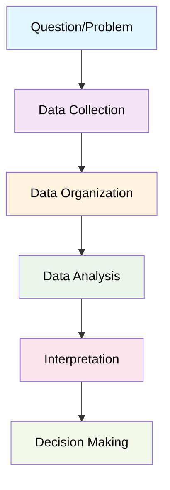
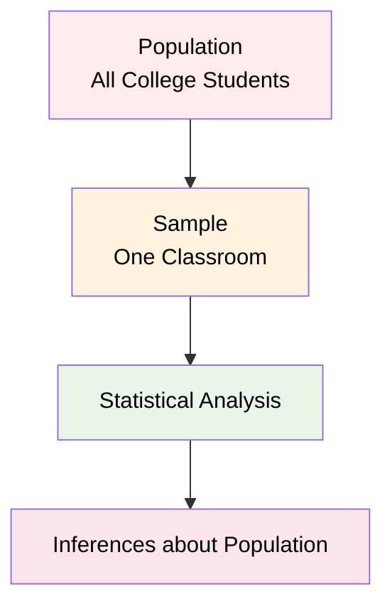
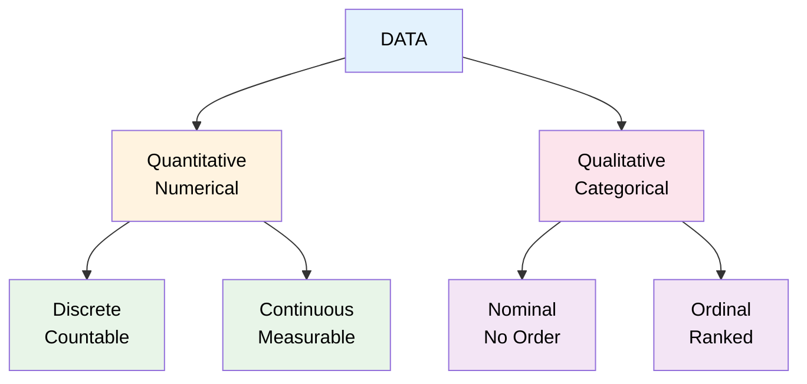
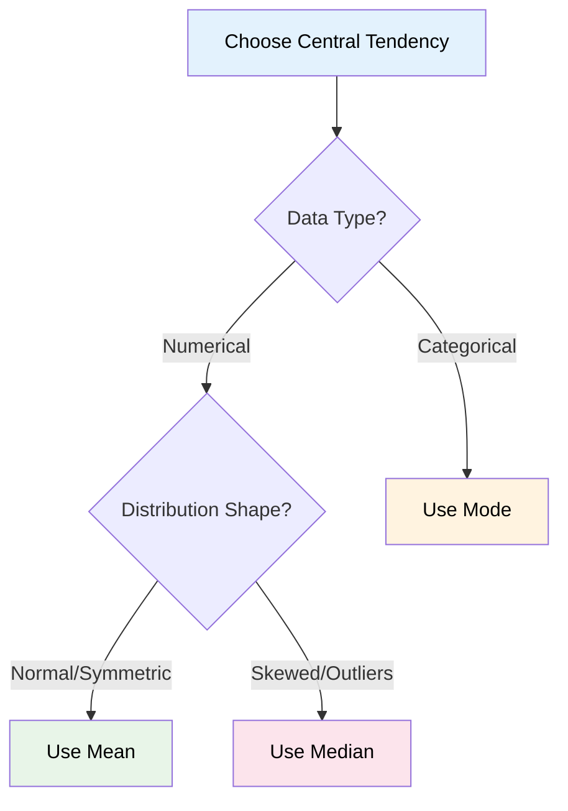

# Introduction to Statistics
> *"Statistics is the grammar of science."* - Karl Pearson 

## Chapter 1: What is Statistics?

**Statistics** is the science of collecting, organizing, and analyzing data to make informed decisions and draw meaningful conclusions from information.

### The Statistical Process


### Branches of Statistics

Statistics is divided into two main branches:

#### Descriptive Statistics
**Definition:** Organizing and summarizing data to describe what happened

**Components:**
- Measures of Central Tendency (Mean, Median, Mode)
- Measures of Dispersion (Variance, Standard Deviation)
- Data visualization (Histograms, Charts)

**Example Question:** *"What is the average height of students in this classroom?"*

#### Inferential Statistics  
**Definition:** Using sample data to make conclusions about populations

**Components:**
- Hypothesis Testing (Z-test, t-test)
- Confidence intervals
- Statistical significance

**Example Question:** *"Are the heights of students in this classroom representative of the entire college?"*

### Population vs Sample



**Population:** The complete group you want to study
- Usually large and difficult to study entirely
- Parameters are typically unknown

**Sample:** A subset of the population
- Smaller, manageable portion
- Used to estimate population parameters
- Statistics calculated from samples

**Key Insight:** We use sample statistics to estimate population parameters!

---

## Chapter 2: Types of Data and Measurement Scales

Understanding your data type is crucial for choosing appropriate statistical methods.

### Data Classification



### Quantitative Data (Numerical)
Can perform mathematical operations (+, -, ×, ÷)

**Discrete Data:** Countable whole numbers
- Examples: Number of children (0, 1, 2, 3), Bank accounts, Students in class

**Continuous Data:** Any numerical value within a range
- Examples: Height (165.2 cm), Weight (72.3 kg), Temperature (25.7°C)

### Qualitative Data (Categorical)
Represents categories or characteristics

**Nominal Data:** Categories with no natural order
- Examples: Gender (M, F), Blood type (A, B, AB, O), Colors

**Ordinal Data:** Categories with meaningful order
- Examples: Education level (High School < Bachelor's < Master's), Ratings (Poor < Good < Excellent)

### Scales of Measurement

| Scale | Order Matters | Equal Intervals | True Zero | Examples | Operations |
|-------|---------------|----------------|-----------|----------|------------|
| **Nominal** | No | No | No | Gender, Colors | Count, Mode |
| **Ordinal** | Yes | No | No | Ratings, Education | Count, Mode, Median |
| **Interval** | Yes | Yes | No | Temperature (°C, °F) | All except ratios |
| **Ratio** | Yes | Yes | Yes | Height, Weight, Age | All operations |

**Key Difference:** Interval vs Ratio
- **Interval:** 60°F is not "twice as hot" as 30°F (no meaningful ratios)
- **Ratio:** A person weighing 80kg is twice as heavy as someone weighing 40kg (meaningful ratios)

---

## Chapter 3: Measures of Central Tendency

Central tendency describes the center or typical value of a dataset.

### Mean (Average)

**Population Mean:** μ = Σ Xi / N
**Sample Mean:** x̄ = Σ Xi / n

**Example:**
```
Ages: [18, 19, 20, 21, 22]
Mean = (18 + 19 + 20 + 21 + 22) ÷ 5 = 20 years
```

### Median
The middle value when data is arranged in order

**Process:**
1. Sort the data
2. If odd number of values: take middle value
3. If even number of values: average of two middle values

**Example:**
```
Ages: [18, 19, 20, 21, 22] → Median = 20
Ages: [18, 19, 20, 21] → Median = (19 + 20) ÷ 2 = 19.5
```

### Mode
The most frequently occurring value

**Example:**
```
Ages: [18, 19, 19, 20, 21] → Mode = 19
```

### Choosing the Right Measure



**Impact of Outliers:**
- Dataset without outlier: [20, 21, 22, 23, 24] → Mean = 22, Median = 22
- Dataset with outlier: [20, 21, 22, 23, 80] → Mean = 33.2, Median = 22

The median better represents typical values when outliers are present.

---

## Chapter 4: Measures of Dispersion

Dispersion measures how spread out data points are from the center.

### Why Measure Dispersion?
Two datasets can have the same mean but different spreads:
- Dataset A: [49, 50, 51] → Mean = 50, Low dispersion
- Dataset B: [30, 50, 70] → Mean = 50, High dispersion

### Variance

**Population Variance:** σ² = Σ(Xi - μ)² / N
**Sample Variance:** S² = Σ(Xi - x̄)² / (n-1)

**Why (n-1) for samples?** Bessel's Correction provides an unbiased estimator of population variance.

### Standard Deviation

**Population:** σ = √σ²
**Sample:** S = √S²

Standard deviation is preferred because it's in the same units as the original data.

### Practical Example

**Dataset:** X = [1, 2, 3, 4, 5]

**Step 1:** Calculate mean
x̄ = (1 + 2 + 3 + 4 + 5) ÷ 5 = 3

**Step 2:** Calculate squared deviations
```
(1-3)² = 4
(2-3)² = 1  
(3-3)² = 0
(4-3)² = 1
(5-3)² = 4
Sum = 10
```

**Step 3:** Calculate variance and standard deviation
```
Sample Variance: S² = 10 ÷ (5-1) = 2.5
Sample Standard Deviation: S = √2.5 = 1.58
```

### The 68-95-99.7 Rule (Normal Distribution)
```
       μ-3σ    μ-2σ    μ-1σ     μ      μ+1σ    μ+2σ    μ+3σ
        |       |       |       |       |       |       |
      0.1%    2.1%   13.6%   34.1%   34.1%   13.6%    2.1%   0.1%
        |       |       |       |       |       |       |
        |-------|-------|-------|-------|-------|-------|
              68% of data (±1σ)
                    95% of data (±2σ)  
                          99.7% of data (±3σ)
```

---

## Chapter 5: Data Visualization and Distribution Shapes

### Histograms

**Definition:** Graphical representation showing the frequency distribution of numerical data

**Key Components:**
- X-axis: Data values divided into bins
- Y-axis: Frequency or count
- Bars: Height represents frequency

**Choosing Bin Size:**
- Too few bins: Lose detail
- Too many bins: Too much noise
- Rule of thumb: √n bins where n = sample size

### Distribution Shapes

Understanding distribution shape guides statistical method selection:

#### Symmetric Distribution (Normal)
```
    Frequency
        ↑
        |     ╭─╮
        |   ╭─╯ ╰─╮
        |  ╱       ╲
        | ╱         ╲
        |╱___________╲
        └──────────────→ Values
```
**Characteristics:**
- Mean = Median = Mode
- Bell-shaped curve
- Equal spread on both sides

#### Right Skewed (Positive Skew)
```
    Frequency
        ↑
        |╭─╮
        |█ ╰─╮
        |█   ╰─╮
        |█     ╰─────╮
        └──────────────────→ Values
         ↑  ↑     ↑
       Mode Med  Mean
```
**Characteristics:**
- Mean > Median > Mode
- Long tail extends right
- Examples: Income, house prices

#### Left Skewed (Negative Skew)
```
    Frequency
        ↑
        |        ╭─╮█
        |      ╭─╯ █
        |    ╭─╯   █
        |╭─_______█
        └──────────────────→ Values
         ↑     ↑  ↑
       Mean   Med Mode
```
**Characteristics:**
- Mean < Median < Mode
- Long tail extends left
- Examples: Test scores (most students do well)

### Box Plots

Box plots visually summarize distribution and identify outliers:

```
    Q₁        Q₂(Median)    Q₃
     |            |         |
  ┌──┴──┐    ┌───┴───┐    ┌┴──┐
  │     │    │       │    │   │
──┤     ├────┤   █   ├────┤   ├──
  │     │    │       │    │   │
  └─────┘    └───────┘    └───┘
     ↑            ↑         ↑
   Min         Median     Max
```

**Components:**
- Q₁: First quartile (25th percentile)
- Q₂: Median (50th percentile)
- Q₃: Third quartile (75th percentile)
- IQR: Interquartile Range (Q₃ - Q₁)
- Whiskers: Extend to min/max or 1.5×IQR
- Outliers: Points beyond whiskers

---

## Chapter 6: Relationships Between Variables

### Random Variables

**Definition:** A function that assigns numerical values to outcomes of random experiments

**Examples:**
- Coin toss: X = {0 for Head, 1 for Tail}
- Dice roll: X = {1, 2, 3, 4, 5, 6}
- Temperature: X = any real number

**Types:**
- **Discrete:** Countable values (dice, coins)
- **Continuous:** Any value in a range (temperature, height)

### Covariance

**Definition:** Measures how two variables change together

**Formula:** Cov(X,Y) = Σ(Xi - x̄)(Yi - ȳ) / (n-1)

**Interpretation:**
- Positive covariance: Variables tend to increase together
- Negative covariance: One increases while other decreases
- Zero covariance: No linear relationship

**Limitation:** No standardized scale makes comparison difficult

### Correlation

**Definition:** Standardized measure of linear relationship between variables

**Pearson Correlation:** ρ = Cov(X,Y) / (σx × σy)

**Range:** -1 to +1

| Correlation | Strength | Interpretation |
|-------------|----------|----------------|
| ±0.9 to ±1.0 | Very Strong | Almost perfect relationship |
| ±0.7 to ±0.9 | Strong | Strong relationship |
| ±0.5 to ±0.7 | Moderate | Moderate relationship |
| ±0.3 to ±0.5 | Weak | Weak relationship |
| 0 to ±0.3 | Very Weak | Little to no relationship |

### Spearman Rank Correlation

Used for:
- Non-linear relationships
- Ordinal data
- Data with outliers

**Process:** Convert data to ranks, then calculate correlation using ranks

### Key Differences

| Method | Best For | Advantages | Limitations |
|--------|----------|------------|-------------|
| **Covariance** | Initial exploration | Shows direction | Hard to interpret scale |
| **Pearson** | Linear relationships | Standardized scale | Assumes linearity |
| **Spearman** | Non-linear/ordinal | Works with ranks | Less precise |

**Important:** Correlation does not imply causation!

---

## Chapter 7: Set Theory Fundamentals (Mathematical Foundation)

Set theory provides the mathematical foundation for probability and statistics.

### Basic Set Operations

**Given:** Set A = {1, 2, 3, 4, 5, 6, 7, 8}, Set B = {3, 4, 5, 6, 7}

#### Intersection (A ∩ B)
Elements common to both sets
**Result:** A ∩ B = {3, 4, 5, 6, 7}

#### Union (A ∪ B)
All elements from either set
**Result:** A ∪ B = {1, 2, 3, 4, 5, 6, 7, 8}

#### Difference (A - B)
Elements in A but not in B
**Result:** A - B = {1, 2, 8}

#### Subset and Superset
- A ⊆ B: Every element of A is in B
- B ⊇ A: B contains all elements of A

### Applications in Statistics
- **Sample Space:** Set of all possible outcomes
- **Events:** Subsets of sample space
- **Probability:** Based on set relationships

---

## Programming Examples

### Descriptive Statistics in Python

```python
import numpy as np
import pandas as pd
import matplotlib.pyplot as plt
import seaborn as sns
from scipy import stats

# Sample dataset
data = [23, 43, 23, 56, 74, 32, 68, 98, 45, 32]

# Central tendency
mean_val = np.mean(data)
median_val = np.median(data)
mode_val = stats.mode(data)

print(f"Mean: {mean_val}")
print(f"Median: {median_val}")
print(f"Mode: {mode_val.mode[0]}")

# Dispersion
variance_sample = np.var(data, ddof=1)  # Sample variance
std_sample = np.std(data, ddof=1)       # Sample std dev

print(f"Sample Variance: {variance_sample}")
print(f"Sample Std Dev: {std_sample}")
```

### Correlation Analysis

```python
# Health expenditure example
df = sns.load_dataset('healthexp')

# Calculate correlations
pearson_corr = df.corr(method='pearson')
spearman_corr = df.corr(method='spearman')

print("Pearson Correlation:")
print(pearson_corr)

print("\nSpearman Correlation:")
print(spearman_corr)

# Visualize relationships
plt.figure(figsize=(12, 4))

plt.subplot(1, 3, 1)
plt.scatter(df['Spending_USD'], df['Life_Expectancy'])
plt.xlabel('Health Spending (USD)')
plt.ylabel('Life Expectancy')
plt.title('Spending vs Life Expectancy')

plt.subplot(1, 3, 2)
sns.heatmap(pearson_corr, annot=True, cmap='coolwarm', center=0)
plt.title('Pearson Correlations')

plt.subplot(1, 3, 3)
df.boxplot(column='Life_Expectancy')
plt.title('Life Expectancy Distribution')

plt.tight_layout()
plt.show()
```

---

## Quick Reference Guide

### Data Types Quick Check
```
Quantitative Data:
├── Discrete: Count-based (students, accounts, children)
└── Continuous: Measured (height, weight, temperature)

Qualitative Data:
├── Nominal: Categories, no order (gender, colors, blood type)
└── Ordinal: Categories with order (ratings, education levels)
```

### Measurement Scales
```
Nominal → Categories only → Mode
Ordinal → Order matters → Mode, Median  
Interval → Equal intervals, no true zero → Mean (if normal)
Ratio → True zero point → All statistics
```

### Central Tendency Selection
```
Normal Distribution → Mean
Skewed Distribution → Median
Categorical Data → Mode
Outliers Present → Median
```

### Distribution Shapes
```
Symmetric: Mean = Median = Mode
Right Skewed: Mean > Median > Mode
Left Skewed: Mean < Median < Mode
```

### Correlation Strength
```
|r| = 0.0-0.3: Weak relationship
|r| = 0.3-0.7: Moderate relationship  
|r| = 0.7-0.9: Strong relationship
|r| = 0.9-1.0: Very strong relationship
```

### When to Use Each Method
```
Covariance: Direction of relationship
Pearson: Linear relationships, continuous data
Spearman: Non-linear, ordinal data, outliers present
```

---

## Key Takeaways

1. **Start with data type identification** - this determines your statistical options
2. **Always visualize your data first** - plots reveal distribution shape and outliers
3. **Choose statistics appropriate for your data type and distribution**
4. **Correlation ≠ Causation** - strong relationships don't prove one variable causes another
5. **Consider your audience** - different measures may be more meaningful for different purposes
6. **Check assumptions** - many statistical methods assume normal distributions
7. **Sample size matters** - larger samples provide more reliable estimates

Understanding these fundamentals provides the foundation for more advanced statistical concepts like hypothesis testing, regression analysis, and machine learning algorithms.

# Advanced Statistics - Complete Study Notes

## Table of Contents

1. [Random Variables and Their Functions](#1-random-variables-and-their-functions)
2. [Probability Density Function (PDF)](#2-probability-density-function-pdf)
3. [Probability Mass Function (PMF)](#3-probability-mass-function-pmf)
4. [Cumulative Distribution Function (CDF)](#4-cumulative-distribution-function-cdf)
5. [Types of Probability Distribution](#5-types-of-probability-distribution)
6. [Bernoulli Distribution](#6-bernoulli-distribution)
7. [Binomial Distribution](#7-binomial-distribution)
8. [Poisson Distribution](#8-poisson-distribution)
9. [Normal/Gaussian Distribution](#9-normalgaussian-distribution)
10. [Uniform Distribution](#10-uniform-distribution)
11. [Standard Normal Distribution and Z-Score](#11-standard-normal-distribution-and-z-score)
12. [Central Limit Theorem and Statistical Estimation](#12-central-limit-theorem-and-statistical-estimation)
13. [Hypothesis Testing](#13-hypothesis-testing)
14. [Statistical Analysis and Hypothesis Testing](#14-statistical-analysis-and-hypothesis-testing)
15. [Student t-Distribution](#15-student-t-distribution)
16. [Type I & Type II Errors and Confidence Intervals](#16-type-i--type-ii-errors-and-confidence-intervals)
17. [Bayes Statistics (Bayes Theorem)](#17-bayes-statistics-bayes-theorem)
18. [Chi-Square Test](#18-chi-square-test)
19. [F-Distribution and F-Test](#19-f-distribution-and-f-test)
20. [Analysis of Variance (ANOVA)](#20-analysis-of-variance-anova)

---

## 1. Random Variables and Their Functions

**Overview: Random Variables and Their Functions**

Random Variables divide into two main categories:
- **Discrete** → PMF (Probability Mass Function)
- **Continuous** → PDF (Probability Density Function)

Both types use:
- **CDF** - Cumulative Distribution Function

**Examples:**
- **Discrete**: Dice, Coins, Counting Events
- **Continuous**: Height, Weight, Temperature

**CDF Properties**: Non-decreasing, Range 0 to 1

---

## 2. Probability Density Function (PDF)

### For Continuous Random Variables

**From Image 1:** Height of students in classroom [0-1]

### Key Concepts
- **Formula:** P(X ≤ 155) = Area under the curve
- **Visual:** Bell-shaped curve (normal distribution)
- **Axes:** X-axis = Height values (155, 165, etc.), Y-axis = Probability Density (0.1, 0.2, 0.3, 0.4)
- **Interpretation:** Shaded area represents probability

### Properties
- f(x) ≥ 0 for all x
- Total area under curve = 1
- Height represents density, not probability
- Probability = Area under curve between two points

---

## 3. Probability Mass Function (PMF)

### For Discrete Random Variables

**Rolling a dice:** Rolling a dice {1, 2, 3, 4, 5, 6}

### Key Calculations
```
P(1) = 1/6, P(2) = 1/6, P(3) = 1/6
P(4) = 1/6, P(5) = 1/6, P(6) = 1/6
```

### Cumulative Calculation Example
**P(X ≤ 4) = P(X=1) + P(X=2) + P(X=3) + P(X=4)**
```
= 1/6 + 1/6 + 1/6 + 1/6 = 4/6 = 2/3
```

---

## 4. Cumulative Distribution Function (CDF)

### PDF to CDF Relationship: 

**Definition:** F(x) = P(X ≤ x)

### Key Insights
- **Left side:** PDF (bell curve)
- **Right side:** CDF (S-shaped curve)
- **Critical relationship:** "Probability Density = Gradient of Cumulative Curve"

### 3 Values
- At height 155: F(155) ≈ 0.25
- At height 165: F(165) ≈ 0.5
- The gradient (slope) of CDF = PDF value at that point

### Discrete Random Variable Analysis

**Rolling a dice:** {1, 2, 3, 4, 5, 6}

#### PMF Analysis (Left chart in images)
- Uniform distribution
- All bars equal height = 1/6
- Shows individual probabilities

#### CDF Analysis (Right chart in images)
- Step function increasing from 1/6 to 6/6 = 1
- Each step represents cumulative probability

#### Calculations
```
P(X ≤ 2) = P(X=1) + P(X=2) = 1/6 + 1/6 = 2/6 = 1/3
P(X ≤ 6) = 1 (certainty)
```

### Continuous Random Variable Distribution

**Height Example:** Range 140-180 

#### PDF Characteristics 
- Smooth bell-shaped curve
- Peak around 165 (mean)
- Density values: 0.01, 0.02, 0.03, 0.04 on Y-axis
- Shaded areas represent specific probabilities

#### CDF Characteristics 
- Smooth S-shaped curve from 0 to 1
- Steepest where PDF is highest (around 165)
- Shows cumulative probabilities

#### Critical Insight 
**"Probability Density = Gradient of Cumulative Curve"**

This means:
- Where CDF is steep → PDF is high
- Where CDF is flat → PDF is low
- Slope of CDF at any point = PDF value at that point

---

## 5. Types of Probability Distribution

### Distribution Details 

**1. Normal/Gaussian Distribution (PDF)**
- Bell-shaped curve (shown in your images)
- For continuous variables like height
- Most common in nature

**2. Bernoulli Distribution (PMF) - DETAILED ANALYSIS**
- Binary outcomes only: Success/Failure, Yes/No, 1/0
- Single trial with two possible outcomes
- **Coin tossing example {H, T}:** 

**3. Uniform Distribution (PMF)**
- All outcomes equally likely
- Like fair dice example from your images

**4. Poisson Distribution (PMF)**
- Count of events in fixed time period
- Models rare events

**5. Log Normal Distribution (PDF)**
- Skewed continuous distribution
- Often used in economics and finance

**6. Binomial Distribution (PMF)**
- Number of successes in n trials
- Extension of Bernoulli for multiple trials

---

## 6. Bernoulli Distribution

### Detailed Bernoulli Study: 

**Definition:** Models any single experiment with yes-no question
**Coin tossing example {H, T}** 

### Parameters
- **0 ≤ p ≤ 1** (probability constraint)
- **q = 1-p** (complement probability)
- **k ∈ {0,1}** → 2 outcomes only

### PMF Formula
**PMF = p^k × (1-p)^(1-k)    k ∈ {0,1}**

#### Case Analysis :
**If k = 1:** P(k=1) = p¹ × (1-p)⁰ = p
**If k = 0:** P(k=0) = p⁰ × (1-p)¹ = (1-p) = q

#### Simplified Form:
```
PMF = { q = 1-p    if k = 0
      { p          if k = 1
```

### Your Coin Toss Example 
```
P(H) = 0.5 = p
P(T) = 0.5 = 1-p = q
```

#### Different Probability Scenarios:
- **P(x=0) = 0.7, P(x=1) = 0.3** (p = 0.3)
- **P(x=0) = 0.4, P(x=1) = 0.6** (p = 0.6)  
- **Whether the person will Pass/Fail**

### Mean of Bernoulli Distribution 
**E(k) = Σ k × p(k)** from k=0 to 1

**Calculation:**
```
E(k) = 0×p(0) + 1×p(1)
     = 0×(1-p) + 1×p  
     = 0 + p
     = p
```

**Therefore: Mean = p**

### Median of Bernoulli Distribution
**From your lecture:**
```
Median = { 0      if p < 1/2
         { [0,1]  if p = 1/2  
         { 1      if p > 1/2
```

### Variance and Standard Deviation
**Variance = p × (1-p) = pq**
**Standard Deviation = √(pq)**

---

## 7. Binomial Distribution

### Extension of Bernoulli to Multiple Trials: 

**Definition:** Models the number of successes in n independent Bernoulli trials

**Key Insight:** "For a single trial (n=1), the binomial distribution is a Bernoulli distribution"

### Parameters 
- **n ∈ {0,1,2,...}** → number of trials
- **p ∈ [0,1]** → success probability for each trial  
- **q = 1-p** → failure probability
- **k ∈ {0,1,2,...,n}** → number of successes

### PMF Formula 
**Pr(K, n, p) = C(n,k) × p^k × (1-p)^(n-k)**

Where C(n,k) is the binomial coefficient:
**C(n,k) = n! / [k!(n-k)!]**

#### Components Breakdown:
- **C(n,k)**: Number of ways to choose k successes from n trials
- **p^k**: Probability of k successes
- **(1-p)^(n-k)**: Probability of (n-k) failures

### Example Applications 
1. **Discrete Random Variable**: Every experiment outcome is binary
2. **Experiment is performed for n trials**
3. **Real Example**: Tossing a coin 10 times 

### Statistical Properties 
**Mean = np**
**Variance = npq**  
**Standard Deviation = √(npq)**

#### Derivation Logic:
- Mean: Expected number of successes = n × probability per trial
- Variance: n × variance per trial = n × p(1-p)
- Standard Deviation: Square root of variance

### Connection to Statistical Testing
**The binomial distribution is the basis for the popular binomial test of statistical significance:**

This connects your probability theory to practical hypothesis testing applications.

---

## 8. Poisson Distribution

### Models Count of Events in Fixed Time Intervals

**Definition:** Models the number of events occurring in a fixed time interval when events happen independently at a constant average rate.

**Discrete Random Variable (PMF) that describes the number of events occurring in a fixed time interval.** 

### Real-World Examples from Your Class
- **Number of people visiting hospital every hour**
- **Number of people visiting banks every hour**  
- **Any counting process in fixed time periods**

### Parameters and Support
- **λ (lambda) ≥ 0**: Expected number of events in time interval
- **k ∈ {0, 1, 2, 3, ...}**: Actual number of events observed
- **Time interval T**: Fixed period of observation

### PMF Formula
**P(x = k) = (e^(-λ) × λ^k) / k!**

Where:
- **e**: Mathematical constant ≈ 2.718
- **λ**: Expected rate parameter
- **k**: Number of events
- **k!**: Factorial of k

### Worked Example from Your Class
**Given: λ = 3 (expected 3 events per hour)**
**Find: P(X = 5) - probability of exactly 5 events**

**Calculation:**
```
P(X = 5) = (e^(-3) × 3^5) / 5!
         = (e^(-3) × 243) / 120
         = (0.0498 × 243) / 120
         = 12.10 / 120
         = 0.101 = 10.1%
```

### Statistical Properties
**Mean = λ**
**Variance = λ**  
**Standard Deviation = √λ**

**Key Insight:** For Poisson distribution, mean equals variance!

### Conditions for Poisson Distribution
1. **Events occur independently**
2. **Average rate (λ) remains constant**
3. **Two events cannot occur simultaneously**
4. **Events are rare relative to observation period**

### PMF Visualization Characteristics
- **Shape**: Right-skewed for small λ, approaches normal for large λ
- **Support**: Discrete values {0, 1, 2, 3, ...}
- **Peak**: Typically at or near λ
- **Tail**: Long right tail for rare events

---

## 9. Normal/Gaussian Distribution

### The Most Important Continuous Distribution

**Definition:** A continuous probability distribution for real-valued random variables, characterized by its bell-shaped curve.

**From your lecture:** "In statistics, a normal distribution or Gaussian distribution is a type of continuous probability distribution for a real-valued random variable."

### Key Visual Characteristics from Your Class
- **Bell-shaped curve** (symmetric around the mean)
- **μ ≈ median ≈ mode** (all three measures of central tendency are equal)
- **Different curves** based on different μ and σ² parameters

### Parameters and Notation
**Notation:** N(μ, σ²) or N(μ, σ²)
- **μ ∈ ℝ**: Mean (location parameter)
- **σ² ∈ ℝ > 0**: Variance (spread parameter)  
- **σ**: Standard deviation = √σ²
- **x ∈ ℝ**: Support (all real numbers)

### PDF Formula from Your Lecture
**PDF = (1)/(σ√2π) × e^(-1/2 × ((x-μ)/σ)²)**

### Statistical Properties from Your Class
**Mean = μ = Average**
**Variance = σ²**
**Standard Deviation = σ = √Variance**

### Empirical Rule of Normal Distribution from Your Lecture
**The 68-95-99.7 Rule:**

**From Image 4:** Your detailed breakdown of probability intervals:
- **Pr(μ-σ ≤ X ≤ μ+σ) ≈ 68%**
- **Pr(μ-2σ ≤ X ≤ μ+2σ) ≈ 95%**  
- **Pr(μ-3σ ≤ X ≤ μ+3σ) ≈ 99.7%**

### Real-World Examples from Your Class
1. **Weight of students in the class**
2. **Height of students**  
3. **IRIS Dataset** (sepal width)

**From Image 6:** Applications mentioned:
- Student physical measurements
- Biological measurements (IRIS dataset)
- Any naturally occurring continuous measurements

### Standard Normal Distribution
**Special Case:** N(0, 1) where μ = 0 and σ² = 1
- **From Image 1:** The red curve represents the standard normal distribution
- Used as reference for all normal distributions
- Z-scores convert any normal to standard normal

### Probability Calculations from Your Lecture
**From Images 5-6:** Probability interval examples:

```
P(μ-σ ≤ X ≤ μ+σ) ≈ 0.68 = 68%
P(μ-2σ ≤ X ≤ μ+2σ) ≈ 0.95 = 95%
P(μ-3σ ≤ X ≤ μ+3σ) ≈ 0.997 = 99.7%
```

### Q-Q Plot Introduction from Your Class
**From Image 6:** "Q-Q plot [Quantile Quantile Plot]"

- **Purpose:** Check if data follows normal distribution
- **Method:** Compare data quantiles to theoretical normal quantiles
- **Interpretation:** Points on straight line = normally distributed data

---

## 10. Uniform Distribution

### Definition and Types

The uniform distribution is a family of symmetric probability distributions where all outcomes in a given range are equally likely.

#### Two Types:
1. **Continuous Uniform Distribution (PDF)**
2. **Discrete Uniform Distribution (PMF)**

## Continuous Uniform Distribution

### Definition
A continuous probability distribution where every value between two bounds has equal probability density.

**Notation:** U(a,b)

**Parameters:** 
- **-∞ < a < b < ∞** (where a = minimum, b = maximum)

### PDF Formula
```
PDF = { 1/(b-a)    for x ∈ [a,b]
      { 0          otherwise
```

### CDF Formula
```
CDF = { 0          for x < a
      { (x-a)/(b-a) for x ∈ [a,b]  
      { 1          for x > b
```

### Statistical Properties

**Mean = (a + b)/2**

**Median = (a + b)/2**

**Variance = (b - a)²/12**

**Standard Deviation = (b - a)/√12**

### Example from Lecture
**Problem:** Number of candies sold daily at a shop is uniformly distributed with maximum 40 and minimum 10.

**Given:** U(10, 40)
- a = 10, b = 40
- Mean = (10 + 40)/2 = 25
- Variance = (40 - 10)²/12 = 900/12 = 75

**Probability Calculations:**

1. **P(15 ≤ x ≤ 30)**
   ```
   P(15 ≤ x ≤ 30) = (x₂ - x₁) × 1/(b-a)
                   = (30 - 15) × 1/30
                   = 15 × 1/30 = 0.5 = 50%
   ```

2. **P(x > 20)**
   ```
   P(x > 20) = (40 - 20) × 1/30
             = 20 × 1/30
             = 0.667 = 66.7%
   ```

## Discrete Uniform Distribution

### Definition
Every outcome has equal probability in a finite set of discrete values.

**Example:** Rolling a dice - outcomes {1, 2, 3, 4, 5, 6}

**Notation:** U(a,b) where a,b are integers

### Key Properties
- **n = b - a + 1** (total number of outcomes)
- **Parameters:** a,b with b ≥ a
- **PMF = 1/n** for each outcome
- **Mean = (a + b)/2**

### Dice Example from Lecture
**Rolling a dice:** {1, 2, 3, 4, 5, 6}
- a = 1, b = 6
- n = 6 - 1 + 1 = 6
- Pr(1) = 1/6, Pr(2) = 1/6, ..., Pr(6) = 1/6
- Mean = (1 + 6)/2 = 3.5

---

## 11. Standard Normal Distribution and Z-Score

## What is Standard Normal Distribution?

The Standard Normal Distribution is a **special case** of the normal distribution with specific parameters:

**Notation:** N(0,1) or Z ~ N(0,1)

**Parameters:**
- **μ = 0** (mean = 0)
- **σ = 1** (standard deviation = 1)
- **σ² = 1** (variance = 1)

## Z-Score: The Standardization Process

### Definition
A **Z-score** measures how many standard deviations a data point is away from the mean.

### Z-Score Formula
```
Z = (Xi - μ) / σ
```

Where:
- **Xi** = individual data point
- **μ** = population mean  
- **σ** = population standard deviation

### Interpretation
- **Z = 0**: Data point equals the mean
- **Z > 0**: Data point is above the mean
- **Z < 0**: Data point is below the mean
- **|Z| = 1**: Data point is 1 standard deviation from mean
- **|Z| = 2**: Data point is 2 standard deviations from mean

## Worked Examples from Your Lecture

### Example 1: Basic Z-Score Calculation
**Given:** Data set X = {1, 2, 3, 4, 5}
- **μ = 3**
- **σ ≈ 1.414 ≈ 1** (approximated in lecture)

**Z-Score Calculations:**
- For X₁ = 1: Z = (1-3)/1 = -2
- For X₂ = 2: Z = (2-3)/1 = -1  
- For X₃ = 3: Z = (3-3)/1 = 0
- For X₄ = 4: Z = (4-3)/1 = 1
- For X₅ = 5: Z = (5-3)/1 = 2

### Example 2: Standard Deviation Distance
**Question:** How many standard deviations is 4.5 away from the mean?

**Given:** μ = 4, σ = 1, Xi = 4.5

**Solution:**
```
Z_score = (4.5 - 4)/1 = 0.5
```
**Answer:** 4.5 is **0.5 standard deviations** above the mean.

### Example 3: Probability Calculation
**Question:** What percentage of data is falling above 4.5?

**Given:** μ = 4, σ = 1

**Step 1:** Calculate Z-score
```
Z_score = (4.5 - 4)/1 = 0.5
```

**Step 2:** Find area under curve (Z > 0.5)
From standard normal table: **P(Z > 0.5) ≈ 0.3085 = 30.85%**

**Answer:** Approximately **30.85%** of data falls above 4.5.

### Example 4: Below Threshold Calculation
**Question:** What percentage of data is falling below 2.5?

**Given:** μ = 4, σ = 1

**Step 1:** Calculate Z-score
```
Z_score = (2.5 - 4)/1 = -1.5
```

**Step 2:** Find area under curve (Z < -1.5)
**Answer:** This requires standard normal table lookup.

## Properties of Z-Scores

### Important Characteristics:
1. **Mean of Z-scores = 0**
2. **Standard deviation of Z-scores = 1**
3. **Shape preserved**: Bell curve remains bell curve
4. **Relative positions maintained**: Order of data points unchanged

### Standard Normal Probabilities:
- **P(Z < 0) = 0.5** (50% below mean)
- **P(Z > 0) = 0.5** (50% above mean)  
- **P(-1 < Z < 1) ≈ 0.68** (68% within 1 std dev)
- **P(-2 < Z < 2) ≈ 0.95** (95% within 2 std dev)
- **P(-3 < Z < 3) ≈ 0.997** (99.7% within 3 std dev)

---

## 12. Central Limit Theorem and Statistical Estimation

## Central Limit Theorem (CLT)

### Definition
The Central Limit Theorem states that **the sampling distribution of the sample mean will always be normally distributed, as long as the sample size is large enough**. This holds regardless of whether the population has a normal, Poisson, binomial, or any other distribution.

### Key Statement from Your Lecture
> "The central limit theorem says that the sampling distribution of the mean will always be normally distributed, as long as the sample size is large enough. Regardless of whether the population has a normal, Poisson, binomial, or any other distribution, the sampling distribution of the mean will be normal."

## Sampling Process

### From Your Lecture:
**Population:** X ~ N(μ, σ²)

**Sample Size:** n = 20

**Multiple Samples:**
- S₁ = {x₁, x₂, x₃, ..., x₂₀} → X̄₁
- S₂ = {x₂, x₃, ..., x₂₀} → X̄₂
- S₃ = {...} → X̄₃
- ...
- Sₘ = {...} → X̄ₘ

**Collection of Sample Means:** X̄ = {X̄₁, X̄₂, X̄₃, ..., X̄ₘ}

## Case Studies from Lecture

### Case 1: Normal Population
**Population:** X ~ N(μ, σ²) *(bell-shaped)*
**Result:** Sample means X̄ ~ N(μ, σ²/n) *(still bell-shaped, but narrower)*

### Case 2: Non-Gaussian Population  
**Population:** X ~ Non-Normal *(skewed, any shape)*
**Sample Size:** n ≥ 30
**Result:** Sample means X̄ ~ N(μ, σ²/n) *(becomes bell-shaped!)*

**Key Insight:** The original distribution shape doesn't matter - CLT always produces normal distribution of sample means.

## Statistical Estimation

### What is an Estimate?

From your lecture definition:
> "Estimate: It is an observed numerical value used to estimate an unknown population parameter"

## Types of Estimates

### 1. Point Estimate
**Definition:** Single numerical value used to estimate the unknown population parameter

**Example:** Sample mean is a point estimate of population mean
- **μ ← X̄** (population mean estimated by sample mean)

**From your lecture:** "Sample mean is a point estimate of a population mean"

### 2. Interval Estimate  
**Definition:** Range of values used to estimate the unknown population parameters

**Also called:** Confidence Intervals

**Example:** [55 - 65] might be a 95% confidence interval for population mean

**Visual representation:** Point estimate sits within an interval range

## Key Properties of Sample Mean Distribution

### When Population is Normal: X ~ N(μ, σ²)
- **Sample Mean:** X̄ ~ N(μ, σ²/n)
- **Standard Error:** SE = σ/√n
- **Shape:** Normal for any sample size

### When Population is Non-Normal
- **Sample Mean:** X̄ ~ N(μ, σ²/n) *(approximately, when n ≥ 30)*
- **Standard Error:** SE = σ/√n  
- **Shape:** Approaches normal as n increases

### Important Formulas
```
E(X̄) = μ                    (Expected value of sample mean)
Var(X̄) = σ²/n              (Variance of sample mean)
SD(X̄) = σ/√n               (Standard deviation of sample mean)
```

---

## 13. Hypothesis Testing

## Definition and Core Concepts

Hypothesis testing is a statistical method used to make inferences about population parameters based on sample data. It provides a systematic framework for testing claims or assumptions about populations using sample evidence.

### Key Components:
1. **Inferential Statistics**: Drawing conclusions or inferences about populations from sample data
2. **Hypothesis Testing Mechanism**: A formal procedure to evaluate claims
3. **Statistical Decision Making**: Accept or reject hypotheses based on evidence

## Hypothesis Testing Framework

### Definition
A statistical procedure that uses sample data to evaluate the likelihood of a specific claim about a population parameter.

**Process Flow:** Sample Data → Conclusions → Population Data

## Hypothesis Types

### 1. Null Hypothesis (H₀)
**Definition:** The assumption you are beginning with - typically states "no effect" or "no difference"

**Characteristics:**
- Default position or status quo
- What we assume to be true initially
- Contains equality (=, ≤, ≥)

### 2. Alternative Hypothesis (H₁)
**Definition:** The opposite of the null hypothesis - what we want to prove

**Characteristics:**  
- The claim we're testing for
- Contains inequality (≠, <, >)
- What we conclude if we reject H₀

## The Four Steps of Hypothesis Testing

### Step 1: State the Hypotheses
- **H₀ (Null):** Statement of no effect/difference
- **H₁ (Alternative):** Statement of effect/difference

### Step 2: Set Significance Level (α)
- Common values: α = 0.05, 0.01, 0.10
- Determines rejection regions

### Step 3: Conduct Experiment
- Collect data through proper sampling
- Calculate test statistic
- Determine p-value

### Step 4: Make Decision
- **Accept the Null Hypothesis**, or
- **Reject the Null Hypothesis**

## Practical Example from Screenshots

### College Pass Rate Analysis

**Scenario:** Colleges in District A have an average pass percentage of 85%. A new college opened in the district, and a sample of 100 students showed a pass percentage of 90% with a standard deviation of 4%.

**Question:** Does this school have a different pass percentage?

**Step 1: Hypotheses**
- **H₀:** μ = 85% (School has same pass rate as district average)
- **H₁:** μ ≠ 85% (School has different pass rate)

**Step 2: Given Information**
- Population mean (μ₀) = 85%
- Sample mean (x̄) = 90%  
- Sample size (n) = 100
- Standard deviation (s) = 4%
- Significance level: α = 0.05

## P-Value Concept

### Definition
**P-value:** A number calculated from a statistical test that describes how likely you are to have found a particular set of observations if the null hypothesis were true.

### Key Properties
- Used in hypothesis testing to help decide whether to reject the null hypothesis
- Probability of obtaining test results at least as extreme as observed, assuming H₀ is true
- Lower p-values provide stronger evidence against H₀

### P-Value Interpretation

**From Screenshot Example: Coin Fairness Test**

**Scenario:** Testing if a coin is fair or not
- **H₀:** Coin is fair (P(H) = 0.5, P(T) = 0.5)
- **H₁:** Coin is not fair

**Experiment Results:**
- Out of 100 tosses
- P(H) = 0.6, P(T) = 0.4
- This gives us P(H) = 0.7, P(T) = 0.3

## Critical Regions and Decision Making

### Rejection Regions
Based on the normal distribution curve:
- **Left tail:** Values significantly below expected
- **Right tail:** Values significantly above expected
- **Two-tailed test:** Both tails are rejection regions

### Decision Process
1. **Calculate test statistic**
2. **Find corresponding p-value**
3. **Compare with significance level (α)**
4. **Make decision:**
   - If p-value ≤ α: **Reject the null hypothesis**
   - If p-value > α: **Fail to reject the null hypothesis**

### Significance Levels
- **α = 0.05:** 95% confidence level
- **α = 0.01:** 99% confidence level  
- **α = 0.10:** 90% confidence level

---

## 14. Statistical Analysis and Hypothesis Testing

## Statistical Tests Overview

Statistical analysis involves choosing appropriate tests based on the nature of your data and research question.

### Four Main Categories of Statistical Tests:

1. **Z Test** → Z table → Z score and p value
2. **t Test** → t table → t score and p value  
3. **Chi Square** → Categorical Data
4. **ANOVA** → Variance analysis

### When to Use Each Test:

**Z Test:** 
- Population standard deviation is known
- Sample size n ≥ 30

**t Test:**
- Population standard deviation is unknown
- Generally smaller sample sizes

## Worked Example 1: Height Analysis (Z Test)

### Problem Statement
The average height of all residents in a city is 168cm with σ = 3.9. A doctor believes the mean to be different. He measured the height of 36 individuals and found the average height to be 169.5 cm.

**(a) State null and alternate hypothesis**
**(b) At a 95% confidence level, is there enough evidence to reject the null hypothesis?**

### Given Information
- Population mean (μ) = 168cm
- Population standard deviation (σ) = 3.9  
- Sample size (n) = 36
- Sample mean (x̄) = 169.5cm
- Confidence level = 95% → α = 1 - 0.95 = 0.05

### Step-by-Step Solution

**Step 1: State Hypotheses**
- **H₀:** μ = 168cm (null hypothesis)  
- **H₁:** μ ≠ 168cm (alternative hypothesis - two-tail test)

**Step 2: Significance Level**
- **C.I = 0.95**
- **α = 1 - 0.95 = 0.05**

**Step 3: Decision Boundary**
Using the normal distribution with α = 0.05 (two-tailed):
- Critical values: ±1.96
- If Z-stat value is less than -1.96 or greater than +1.96 → **We Reject the Null Hypothesis**
- Otherwise → **We Accept Null Hypothesis**

**Step 4: Statistical Analysis**

**Z-test formula:**
```
Z-test = (x̄ - μ)/(σ/√n)
```

**Calculation:**
```
Z-test = (169.5 - 168)/(3.9/√36)
       = 1.5/(3.9/6)
       = 1.5/0.65
       = 2.31
```

**Decision:**
Since Z = 2.31 > +1.96, we **reject the null hypothesis**.

**Step 5: P-Value Analysis**

For Z = 2.31 in a two-tailed test:
- Area under the curve from Z = 2.31 to right tail
- From Z-table: Area = 0.01044
- Two-tailed p-value = 2 × 0.01044 = 0.02088

**P-value Decision Rule:**
- If p-value < significance level: Reject H₀
- 0.02088 < 0.05 → **Reject the Null Hypothesis**

## Worked Example 2: Light Bulb Warranty (t Test)

### Problem Statement
A factory manufactures bulbs with an average warranty of 5 years with standard deviation of 0.50. A worker believes that the bulb will malfunction in less than 5 years. He tests a sample of 40 bulbs and finds the average time to be 4.8 years.

**(a) State null and alternate hypothesis**
**(b) At a 2% significance level, is there enough evidence to support the idea that the warranty should be revised?**

### Given Information
- Population mean (μ) = 5 years
- Population standard deviation (σ) = 0.50
- Sample size (n) = 40  
- Sample mean (x̄) = 4.8 years
- Significance level = 2% → α = 0.02

### Step-by-Step Solution

**Step 1: State Hypotheses**
- **H₀:** μ = 5 (null hypothesis)
- **H₁:** μ < 5 (alternative hypothesis - one-tail test)

**Step 2: Significance Level**  
- **α = 0.02**
- **C.I = 0.98**

**Step 3: Decision Boundary**
For a one-tailed test with α = 0.02:
- Critical value at left tail = -2.05 (approximately)
- If t-stat < -2.05: Reject H₀
- Otherwise: Accept H₀

**Step 4: Statistical Analysis**

**t-test formula:**
```
t-test = (x̄ - μ)/(σ/√n)
```

**Calculation:**
```
t-test = (4.8 - 5)/(0.50/√40)
       = -0.2/(0.50/6.32)
       = -0.2/0.079
       = -2.53
```

**Step 5: P-Value Analysis**

For t = -2.53 in a one-tailed test:
- Area under the curve to the left of t = -2.53
- From t-table: p-value = 0.0070

**Decision:**
- t-stat = -2.53 < -2.05 → **Reject H₀**
- p-value = 0.0070 < 0.02 → **Reject H₀**

**Conclusion:** There is sufficient evidence to support the idea that the warranty should be revised.

---

## 15. Student t-Distribution

## Definition and Core Purpose

The Student t-distribution is a probability distribution used for statistical analysis when the population standard deviation is unknown. It provides the solution for performing hypothesis testing when we don't know the population standard deviation (σ).

### Key Question Addressed:
**"How do we perform an analysis when we don't know the population standard deviation?"**

**Solution:** Student t-distribution

## Formula Comparison

### Z-Test vs t-Test Formulas

**Z-Test Formula (when σ is known):**
```
Z = (x̄ - μ)/(σ/√n)
```

**t-Test Formula (when σ is unknown):**
```
t = (x̄ - μ)/(s/√n)
```

Where:
- **s = Sample Standard Deviation**
- **σ = Population Standard Deviation (unknown)**

## Degrees of Freedom

### Definition and Calculation
**Degrees of Freedom (dof) = n - 1**

Where n = Sample Size

### Example Illustration
For **3 People** sample:
- Sample size (n) = 3
- Degrees of freedom = 3 - 1 = 2

**Visual representation:** [X] □ [X] 
- Two constraints (X marks)
- One free choice (empty square)

## Worked Example: IQ Medication Study

### Problem Statement
In the population, the average IQ is 100. A team of researchers wants to test a new medication to see if it has either a positive or negative effect on intelligence, or no effect at all. A sample of 30 participants who have taken the medication has a mean of 140 with a standard deviation of 20. Did the medication affect intelligence? (C.I = 95%)

### Given Information
- Population mean (μ) = 100
- Sample size (n) = 30
- Sample mean (x̄) = 140
- Sample standard deviation (s) = 20
- Confidence interval = 95%
- Significance level (α) = 0.05

### Step-by-Step Solution

**Step 1: State Hypotheses**
- **H₀:** μ = 100 (null hypothesis - no effect)
- **H₁:** μ ≠ 100 (alternative hypothesis - two-tail test, medication has effect)

**Step 2: Significance Level**
- **α = 0.05**

**Step 3: Degrees of Freedom**
- **dof = n - 1 = 30 - 1 = 29**

**Step 4: Decision Rule**
For α = 0.05 with dof = 29 (two-tailed test):
- **Critical values:** ±2.045
- **Decision Rule:** If t-stat is less than -2.045 or greater than +2.045, reject the null hypothesis

**Visual Decision Boundary:**
```
        2.5%      95%      2.5%
    |-------|-----------|-------|
   -2.045    0        +2.045
```

**Step 5: Calculate t-test Statistic**

**t-test Formula:**
```
t = (x̄ - μ)/(s/√n)
```

**Calculation:**
```
t = (140 - 100)/(20/√30)
t = 40/(20/5.48)
t = 40/3.65
t = 10.96
```

**Step 6: Conclusion**

**Decision Rule:** If t is less than -2.045 and greater than 2.045, reject the null hypothesis

**Result:** t = 10.96 > 2.045 → **Rejecting the Null Hypothesis**

**Conclusion:** The medication significantly affects intelligence (increases IQ).

## Decision Tree: Z-Test vs t-Test

### When to Use Each Test

The decision tree for choosing between Z-test and t-test:

**Step 1:** Do you know the population standard deviation (σ)?
- **YES** → Continue to Step 2
- **NO** → Use t-test

**Step 2:** Is the sample size above 30?
- **YES** → Use Z-test
- **NO** → Use t-test

### Test Outputs
- **Z-test** → Z table → Z score and p-value
- **t-test** → t table with degrees of freedom → t score and p-value

---

## 16. Type I & Type II Errors and Confidence Intervals

## Type I and Type II Errors

### Definition Framework

In hypothesis testing, there are two fundamental realities and two possible decisions, creating four possible outcomes.

**Reality:**
- **Null Hypothesis is True** OR **Null Hypothesis is False**

**Decision:** 
- **Null Hypothesis is True** OR **Null Hypothesis is False**

### The Four Outcomes

**Outcome 1:** We reject the Null Hypothesis when in reality it is False → **Good** ✓

**Outcome 2:** We reject the Null Hypothesis when in reality it is True → **Type I Error** ✗

**Outcome 3:** We retain the Null Hypothesis when in reality it is False → **Type II Error** ✗

**Outcome 4:** We retain the Null Hypothesis when in reality it is True → **Good** ✓

## Error Types Detailed Analysis

### Type I Error (α - Alpha)
- **Definition:** Rejecting a true null hypothesis
- **Also called:** False Positive
- **Probability:** α (significance level)
- **Example:** Concluding a drug is effective when it actually isn't

### Type II Error (β - Beta) 
- **Definition:** Accepting a false null hypothesis
- **Also called:** False Negative  
- **Probability:** β (varies with effect size and sample size)
- **Example:** Concluding a drug is ineffective when it actually works

### Relationship Between Errors
- **Trade-off exists:** Reducing α increases β, and vice versa
- **Sample size impact:** Larger samples reduce both α and β
- **Effect size impact:** Larger effects reduce β for fixed α

## Confidence Intervals and Margin of Error

### Definition and Purpose

**Point Estimate:** A value of any statistic that estimates the value of an unknown population parameter is called Point Estimate.

**Example:** x̄ → μ (sample mean estimates population mean)
- x̄ = 2.15, μ = 3

### Confidence Interval Formula

We construct a confidence interval to help estimate what the actual value of the unknown population mean is.

**Confidence Interval = Point Estimate ± Margin of Error**

### Z-Test Confidence Interval

**Formula:**
```
x̄ ± Z_{α/2} × (σ/√n)
```

Where:
- x̄ = sample mean
- Z_{α/2} = critical Z-value
- σ = population standard deviation  
- n = sample size
- α = significance level

**For α = 0.05:**
- Z_{0.05/2} = Z_{0.025} = 1.96

## Worked Example: CAT Exam Scores

### Problem Statement
In the verbal section of CAT exam, the standard deviation is known to be 100. A sample of 25 test takers has a mean of 520. Construct a 95% C.I about the mean.

### Given Information
- Population standard deviation (σ) = 100
- Sample size (n) = 25  
- Sample mean (x̄) = 520
- Confidence level = 95%
- α = 0.05

### Step-by-Step Solution

**Step 1: Identify the Formula**
```
x̄ ± Z_{α/2} × (σ/√n)
```

**Step 2: Find Critical Value**
For 95% confidence level:
- α = 0.05
- α/2 = 0.025
- Z_{0.025} = 1.96

**Step 3: Calculate Margin of Error**
```
Margin of Error = Z_{α/2} × (σ/√n)
                = 1.96 × (100/√25)
                = 1.96 × (100/5)
                = 1.96 × 20
                = 39.2
```

**Step 4: Construct Confidence Interval**
```
Lower C.I = x̄ - Margin of Error = 520 - 39.2 = 480.8
Upper C.I = x̄ + Margin of Error = 520 + 39.2 = 559.2
```

**Step 5: Final Answer**
**95% Confidence Interval: [480.8, 559.2]**

**Interpretation:** I am 95% confident that the mean CAT score lies between 480.8 and 559.2.

---

## 17. Bayes Statistics (Bayes Theorem)

## Definition and Core Concept

**Bayesian statistics** is an approach to data analysis and parameter estimation based on **Bayes' theorem**.

Bayes' theorem deals with **probability** in two fundamental categories:
- **Independent Events**
- **Dependent Events**

## Independent Events

### Definition
Events where the occurrence of one event does not affect the probability of the other event.

### Example 1: Rolling a Dice
**Sample Space:** {1, 2, 3, 4, 5, 6}
**Probabilities:** P(1) = 1/6, P(2) = 1/6, ... (all equal)

### Example 2: Tossing a Coin
**Probabilities:** P(H) = 0.5, P(T) = 0.5

**Key Characteristic:** Each outcome is independent of previous outcomes.

## Dependent Events

### Definition
Events where the occurrence of one event affects the probability of the other event.

### Visual Example: Colored Balls
**Container with:**
- **3 Yellow balls**
- **2 Red balls**

**Probabilities:**
- **P(Red) = 2/5**
- **P(Yellow) = 3/4**

**Key Insight:** Drawing one ball affects the probability of drawing the next ball (if not replaced).

## Bayes' Theorem Formula

### Basic Probability Relationships

**For Independent Events:**
```
Pr(A and B) = Pr(B and A)
Pr(A) × P(G/A) = Pr(B) × Pr(A/B)
```

### Joint Probability Example
**From the colored balls example:**
```
Pr(R and Y) = P(R) × P(Y/R) = 2/5 × 3/4 = 6/20
```

### The Complete Bayes' Theorem

**Forward Conditional Probability:**
```
P(B/A) = [Pr(B) × Pr(A/B)] / Pr(A)
```

**Reverse Conditional Probability:**
```
Pr(A/B) = [Pr(A) × Pr(B/A)] / Pr(B)
```

**Where:**
- **A, B = events**
- **P(A|B) = probability of A given B is true**  
- **P(B|A) = probability of B given A is true**
- **P(A), P(B) = the independent probability of A and B**

## Dataset Application

### Real-World Context
Bayes' theorem is particularly powerful when applied to datasets with multiple variables.

**Example Dataset Structure:**
| Size of House | No of Room | Location | Price |
|---------------|------------|----------|-------|
| x₁ | x₂ | x₃ | Y |

### Bayesian Prediction Formula
```
Pr(Y/x₁,x₂,x₃) = [Pr(Y) × Pr(x₁,x₂,x₃/Y)] / Pr(x₁,x₂,x₃)
```

**Where:**
- **Y** = target variable (Price)
- **x₁, x₂, x₃** = feature variables (Size, Rooms, Location)
- **Pr(Y/x₁,x₂,x₃)** = probability of Y given the features

---

## 18. Chi-Square Test

## Definition and Core Purpose

**The Chi-Square Test for Goodness of Fit** tests claims about population proportions involving **categorical variables**.

It is a **non-parametric test** that is performed on **categorical [ordinal, nominal] data**.

### Example Application
Testing whether there is a population of males who likes different color of bikes.

## Initial Example: Bike Color Preferences

### Sample Data vs Theory
From the screenshots, we can see an example with bike color preferences:

| Color | Theory | Sample |
|-------|--------|--------|
| Yellow Bike | 1/3 | 22 |
| Orange Bike | 1/3 | 17 |
| Red Bike | 1/3 | 59 |

**Theory:** Categorical distribution - each color should be equally preferred (1/3 each)
**Sample:** Observed categorical distribution shows different preferences

## Worked Example: Student Handedness Study

### Problem Statement
In a student class of 100 students, 30 are right-handed. Does this class fit the theory that 12% of people are right-handed?

### Given Information
- Total students = 100
- Right-handed students = 30  
- Theory: 12% of people are right-handed
- Expected right-handed = 12% × 100 = 12

### Data Setup

**Observed vs Expected:**

| Category | Observed (O) | Expected (E) |
|----------|--------------|--------------|
| Right-handed | 30 | 12 |
| Left-handed | 70 | 88 |
| **Total** | 100 | 100 |

### Theory: Categorical Distribution
The theoretical distribution assumes 12% right-handed, 88% left-handed.

## Complete Chi-Square Fitness of Good Example

### Problem Setup
**In 2010 Census** of the city, the weight of individuals in a small city were found to be the following:

| Weight Category | 2010 Percentage |
|----------------|-----------------|
| <50kg | 20% |
| 50-75kg | 30% |
| >75kg | 50% |

**In 2020, a sample of n=500 individuals were sampled. Below are the results:**

| Weight Category | 2020 Observed |
|----------------|---------------|
| <50kg | 140 |
| 50-75kg | 160 |
| >75kg | 200 |

**Question:** Using α=0.05, would you conclude the population distribution of weights has changed in the last 10 years?

### Step-by-Step Solution

**Step 1: State Hypotheses**
- **H₀:** The data meets the expectation (distribution unchanged)
- **H₁:** The data does not meet the expectation (distribution changed)

**Step 2: Significance Level**
- **α = 0.05**
- **C.I = 95%**

**Step 3: Degrees of Freedom**
- **df = k - 1 = 3 - 1 = 2** (where k = number of categories)

**Step 4: Calculate Expected Values**

| Weight Category | 2010% | Expected (2020) |
|----------------|--------|-----------------|
| <50kg | 20% | 0.2×500 = 100 |
| 50-75kg | 30% | 0.3×500 = 150 |
| >75kg | 50% | 0.5×500 = 250 |

**Step 5: Calculate Chi-Square Test Statistic**

**Formula:**
```
χ² = Σ (O - E)²/E
```

**Calculations:**
```
χ² = (140-100)²/100 + (160-150)²/150 + (200-250)²/250

χ² = (40)²/100 + (10)²/150 + (-50)²/250

χ² = 1600/100 + 100/150 + 2500/250

χ² = 16 + 0.66 + 10

χ² = 26.66
```

**Step 6: Decision Boundary**
Using Chi-Square table with df = 2 and α = 0.05:
- **Critical value = 5.99**
- **Rejection area:** If χ² > 5.99, reject H₀
- **Decision rule:** If χ² is greater than 5.99, reject H₀; else, we fail to reject the null hypothesis

**Step 7: Final Decision**
- **χ² = 26.66 > 5.99**
- **Decision: Reject the Null Hypothesis**

**Conclusion:** The weights of 2020 population are different from those expected on the 2010 population.

---

## 19. F-Distribution and F-Test

## Definition and Core Purpose

In probability theory and statistics, the **F-distribution** or **F-ratio**, also known as **Snedecor's F distribution** or the **Fisher–Snedecor distribution** (after Ronald Fisher and George W. Snedecor) is a continuous probability distribution that arises frequently as the null distribution of a test statistic, most notably in the **analysis of variance (ANOVA)** and other **F-tests**.

### Key Characteristics
- **Continuous probability distribution**
- **Used as null distribution for test statistics**
- **Primary application:** Analysis of variance (ANOVA)
- **Named after:** Ronald Fisher and George W. Snedecor

## Mathematical Foundation

### Parameters and Support
- **Parameters:** d₁, d₂ > 0 (degrees of freedom)
- **Support:** x ∈ [0, +∞)

### Probability Density Function (PDF)
The PDF involves the **Beta function**:

```
f(x; d₁, d₂) = [(d₁/2)^(d₁/2) × (d₂/2)^(d₂/2)] / [B(d₁/2, d₂/2)] × [x^((d₁-2)/2)] / [(d₁x + d₂)^((d₁+d₂)/2)]
```

### Beta Function
```
B(m,n) = [(m-1)!(n-1)!] / [(m+n-1)!] = [m+n choose m] / [mn]
```

Where B(m,n) represents the Beta function used in the F-distribution formula.

## F-Distribution as Ratio of Chi-Square Distributions

### Mathematical Relationship
The F-distribution with d₁ and d₂ degrees of freedom is the distribution of:

```
X = (S₁/d₁) / (S₂/d₂)
```

Where:
- **S₁** = Independent random variable (Chi-square distribution)
- **S₂** = Independent random variable (Chi-square distribution)  
- **(S₁) d₁** = Degree of freedom
- **(S₂) d₂** = Degree of freedom

### Connection to Chi-Square
- **S₁ and S₂** are independent random variables following chi-square distributions
- **F-statistic** represents the ratio of two variance estimates
- **Used for comparing variances** between populations

## F-Test: Variance Ratio Test

### Purpose
The **F-Test** is a **Variance Ratio Test** used to compare the variances of two populations.

### Example Problem
The following data shows the number of bulbs produced daily for some days by two workers A and B:

| Worker A | Worker B |
|----------|----------|
| 40 | 39 |
| 30 | 38 |
| 38 | 41 |
| 41 | 33 |
| 38 | 32 |
| 35 | 39 |
| - | 40 |
| - | 34 |

**Question:** Can we consider based on the data that Worker B is more stable and efficient?

## Step-by-Step Solution

### Step 1: State Hypotheses
- **H₀:** σ₁² = σ₂² (variances are equal)
- **H₁:** σ₁² ≠ σ₂² (variances are not equal)

### Step 2: Calculate Sample Statistics

**For Worker A:**
```
σ² = Σ(xᵢ - x̄)² / (n-1)
```

| xᵢ | x̄ | (xᵢ-x̄)² |
|----|---|---------|
| 40 | 37 | 9 |
| 30 | 37 | 49 |
| 38 | 37 | 1 |
| 41 | 37 | 16 |
| 38 | 37 | 1 |
| 35 | 37 | 4 |

**Calculations for A:**
- x̄₁ = 37
- Σ(x-x̄)² = 80
- s₁² = 80/(6-1) = 80/5 = 16

**For Worker B:**

| xᵢ | x̄ | (xᵢ-x̄)² |
|----|---|---------|
| 39 | 37 | 4 |
| 38 | 37 | 1 |
| 41 | 37 | 16 |
| 33 | 37 | 16 |
| 32 | 37 | 25 |
| 39 | 37 | 4 |
| 40 | 37 | 9 |
| 34 | 37 | 9 |

**Calculations for B:**
- x̄₂ = 37
- Σ(x-x̄)² = 84
- s₂² = 84/(8-1) = 84/7 = 12

### Step 3: Calculate F-Statistic
```
F = s₁²/s₂² = 16/12 = 1.33
```

### Step 4: Determine Degrees of Freedom and Decision Rule
- **df₁ = 6 - 1 = 5** (numerator degrees of freedom)
- **df₂ = 8 - 1 = 7** (denominator degrees of freedom)
- **α = 0.05** (significance level)

**Critical Value from F-table:** CV = 3.97

**Decision Rule:**
- If F-test is greater than 3.97, reject the null hypothesis
- If F-test ≤ 3.97, we fail to reject the null hypothesis

### Step 5: Make Decision
- **F = 1.33 < 3.97**
- **Decision: We fail to reject the null hypothesis**

**Conclusion:** Worker B is not significantly more efficient when compared to Worker A.

---

## 20. Analysis of Variance (ANOVA)

## Definition and Purpose

**Definition:** ANOVA is a statistical method used to compare the means of 2 or more groups.

### Basic Components:

**ANOVA consists of:**
1. **Factors (Variables)** - The categorical independent variables
2. **Levels** - The different categories within each factor

### Examples of Factor-Level Structure:

**Factor = Medicines**
- Levels = 5mg, 10mg, 20mg [Dosage]

**Factor = Mode of Payment**  
- Levels = GPay, PhonePE, IMPS, NEFT [Levels]

## Assumptions in ANOVA

### Four Critical Assumptions:

**① Normality of Sampling Distribution of Means**
- The distribution of sample means is normally distributed

**② Absence of Outliers**
- Outlying scores need to be removed from dataset

**③ Homogeneity of Variance**
- Each one of the population has same variance
- σ₁² = σ₂² = σ₃² = ... = σₖ²
- Population variance in different levels of each independent variable are equal

**④ Samples are Independent and Random**

## Types of ANOVA

### ① One-Way ANOVA
- **Definition:** One factor with at least 2 levels; more levels are independent
- **Example:** Doctor wants to test a new medication to decrease headache. They split the participant into 3 conditions [10mg, 20mg, 30mg]. Doctor ask the participants to rate the headache [1-10].

**Data Structure:**
```
Medication → Factor

10mg    20mg    30mg
 5       7       2
 9       8       7
 -       -       -
 -       -       -
```

### ② Repeated Measures ANOVA
- **Definition:** One factor with at least 2 levels; levels are dependent
- **Example:** Running → Factor

**Data Structure:**
```
Running → Factor

Day 1   Day 2   Day 3
 8       5       6
 7       4       3
 -       -       -
```

**Key Point:** Same participants measured across different time points.

### ③ Factorial ANOVA
- **Definition:** Two or more factors (each of which with at least 2 levels); levels can be either independent and dependent
- **Example:** Running → Factor with Gender factor

**Data Structure:**
```
Running → Factor

        Day 1   Day 2   Day 3
Men      8       5       6
         7       4       3
         6       5       4
Women    3       2       1
```

## Hypothesis Testing in ANOVA

### Hypotheses:

**Null Hypothesis H₀:** μ₁ = μ₂ = μ₃ = ... = μₖ

**Alternative Hypothesis H₁:** At least one of the means is not equal
- μ₁ ≠ μ₂ ≠ μ₃ ≠ ... ≠ μₖ

### Test Statistic:

**F = Variation between Samples / Variation within Samples**

## ANOVA Calculation Example

### Example Problem:
Doctors want to test a new medication which reduces headache. They split the participant into 3 conditions [15mg, 30mg, 45mg]. Later on the doctor ask the patient to rate the headache between [1-10]. Are there any differences between the 3 conditions using alpha = 0.05?

### Data Table:
| 15mg | 30mg | 45mg |
|------|------|------|
| 9    | 7    | 4    |
| 8    | 6    | 3    |
| 7    | 6    | 2    |
| 8    | 7    | 3    |
| 8    | 8    | 4    |
| 9    | 7    | 3    |
| 8    | 6    | 2    |

### Step 1: Define Null and Alternative Hypotheses
- **H₀:** μ₁₅ = μ₃₀ = μ₄₅
- **H₁:** Not all μ's are equal

### Step 2: State Significance Level
- **α = 0.05** ⇒ **C.I = 0.95**

### Step 3: Calculate Degrees of Freedom

**Given:** N = 21, a = 3, n = 7

- **df_between = a - 1 = 3 - 1 = 2**
- **df_within = N - a = 21 - 3 = 18**  
- **df_total = N - 1 = 21 - 1 = 20**

### Step 4: Calculate Sample Statistics

**Sample Data Analysis:**
```
Variance between Sample

X₁      X₂      X₃      H₀: X̄₁ = X̄₂ = X̄₃
1       6       5       H₁: At least one sample
2       7       6           mean is not equal
4       3       3
5       2       2
3       1       4

ΣX₁ = 15   ΣX₂ = 19   ΣX₃ = 20
X̄₁ = 3     X̄₂ = 19/5  X̄₃ = 4
```

### Step 5: Sum of Squares Calculations

#### ① SS_between (Variation Between Samples):
```
SS_between = Σ(Σaᵢ)² / n - T² / N
```

**Calculation:**
- 15mg = 9+8+7+8+8+9+8 = 57
- 30mg = 7+6+6+7+8+7+6 = 47  
- 45mg = 4+3+2+3+4+3+2 = 21

```
SS_between = (57² + 47² + 21²)/7 - (125)²/21
```

#### ② SS_within (Variation Within Samples):
```
SS_within = ΣY² - Σ(Σaᵢ)²/n
```

**Calculation:**
```
ΣY² = 9² + 8² + 7² + 8² + 8² + 9² + 8² + 7² + 6² + 6² + 7² + 8² + 7² + 6² + 4² + 3² + 2² + 3² + 4² + 3² + 2²
    = 853

SS_within = 853 - [(57² + 47² + 21²)/7]
         = 853 - [(3249 + 2209 + 441)/7]  
         = 853 - [5899/7]
         = 10.29
```

#### ③ SS_total:
```
SS_total = ΣY² - T²/N
         = 853 - (125)²/21 = 108.95
```

### Step 6: ANOVA Summary Table

| Source  | SS    | df | MS    | F     |
|---------|-------|----|-------|-------|
| Between | 98.67 | 2  | 49.34 | 86.56 |
| Within  | 10.29 | 18 | 0.57  |       |
| Total   | 108.95| 20 |       |       |

**Calculations:**
```
F = MS_between/MS_within = 49.34/0.57 = 86.56
```

### Step 7: Decision Rule

**Critical Value = 3.5546**

**If F is greater than 3.5546, reject the null hypothesis.**

**Result:** 86.56 > 3.5546, **Reject the Null Hypothesis**

---

## Visualization Charts and Graphs

### 1. Distribution Comparison Chart

```
Distribution Types:
┌─────────────────┬─────────────────┬─────────────────┐
│   Discrete      │   Continuous    │   Application   │
├─────────────────┼─────────────────┼─────────────────┤
│ Bernoulli       │ Normal          │ Binary outcomes │
│ Binomial        │ Uniform         │ Success counts  │
│ Poisson         │ Standard Normal │ Event rates     │
└─────────────────┴─────────────────┴─────────────────┘
```

### 2. Hypothesis Testing Decision Tree

```
Population σ Known?
├─ YES → Sample Size ≥ 30?
│         ├─ YES → Z-Test
│         └─ NO → t-Test
└─ NO → t-Test
```

### 3. ANOVA Structure

```
ANOVA Types:
├─ One-Way ANOVA
│   └─ One factor, independent levels
├─ Repeated Measures ANOVA
│   └─ One factor, dependent levels  
└─ Factorial ANOVA
    └─ Multiple factors combined
```

### 4. Error Types Matrix

```
Reality vs Decision:
                │ H₀ True  │ H₀ False │
────────────────┼──────────┼──────────┤
Reject H₀       │ Type I   │ Correct  │
                │ Error(α) │ Decision │
────────────────┼──────────┼──────────┤
Accept H₀       │ Correct  │ Type II  │
                │ Decision │ Error(β) │
```

### 5. Statistical Test Selection

```
Data Type Decision:
├─ Categorical Data → Chi-Square Test
├─ Compare Means → t-Test or ANOVA
├─ Compare Variances → F-Test
└─ Probability Updates → Bayes Theorem
```

### 6. Confidence Interval Visualization

```
95% Confidence Interval:
|----2.5%----|-------95%-------|----2.5%----|
           -1.96             +1.96
           
Point Estimate ± Margin of Error
```

### 7. Normal Distribution Properties

```
Empirical Rule (68-95-99.7):
       │  68%  │
   ────┼───────┼────
      μ-σ     μ+σ

       │    95%     │
   ────┼───────────┼────
      μ-2σ        μ+2σ

       │      99.7%      │
   ────┼─────────────────┼────
      μ-3σ             μ+3σ
```

### 8. Sample Size Effects on CLT

```
Sample Size Impact:
n < 30  → May not follow normal distribution
n ≥ 30  → Approaches normal distribution
n ≥ 100 → Very close to normal distribution

Standard Error = σ/√n
Larger n → Smaller SE → More precise estimates
```

### 9. Chi-Square Test Framework

```
Chi-Square Formula: χ² = Σ(O-E)²/E

Decision Rule:
if χ² > Critical Value → Reject H₀
if χ² ≤ Critical Value → Fail to reject H₀

Degrees of Freedom = k - 1
```

### 10. F-Test Variance Comparison

```
F-Statistic = s₁²/s₂²

Degrees of Freedom:
df₁ = n₁ - 1 (numerator)
df₂ = n₂ - 1 (denominator)

Decision based on F-table critical values
```

---

## Key Formulas Summary

### Central Tendencies and Spread
- **Mean**: μ = Σx/n
- **Variance**: σ² = Σ(x-μ)²/n
- **Standard Deviation**: σ = √σ²

### Probability Distributions
- **Bernoulli PMF**: P(k) = p^k(1-p)^(1-k)
- **Binomial PMF**: P(k) = C(n,k)p^k(1-p)^(n-k)
- **Poisson PMF**: P(k) = e^(-λ)λ^k/k!
- **Normal PDF**: f(x) = (1/σ√2π)e^(-½((x-μ)/σ)²)

### Test Statistics
- **Z-Test**: Z = (x̄-μ)/(σ/√n)
- **t-Test**: t = (x̄-μ)/(s/√n)
- **Chi-Square**: χ² = Σ(O-E)²/E
- **F-Test**: F = s₁²/s₂²

### Confidence Intervals
- **Z-Interval**: x̄ ± Z(α/2) × (σ/√n)
- **t-Interval**: x̄ ± t(α/2) × (s/√n)

### Bayes Theorem
- **Basic Form**: P(B|A) = P(A|B)P(B)/P(A)

### ANOVA
- **F-Statistic**: F = MS_between/MS_within
- **SS_total = SS_between + SS_within**

---

## Programming Implementation

### Python Code for Statistical Analysis

```python
import numpy as np
import matplotlib.pyplot as plt
from scipy import stats
import pandas as pd

# Example: Normal Distribution Visualization
def plot_normal_distribution():
    x = np.linspace(-4, 4, 1000)
    y = stats.norm.pdf(x, 0, 1)
    
    plt.figure(figsize=(10, 6))
    plt.plot(x, y, 'b-', linewidth=2, label='Standard Normal')
    plt.fill_between(x[x <= -1.96], y[x <= -1.96], alpha=0.3, color='red', label='α/2 = 0.025')
    plt.fill_between(x[x >= 1.96], y[x >= 1.96], alpha=0.3, color='red')
    plt.axvline(-1.96, color='red', linestyle='--', alpha=0.7)
    plt.axvline(1.96, color='red', linestyle='--', alpha=0.7)
    plt.title('Standard Normal Distribution with Critical Values')
    plt.xlabel('Z-score')
    plt.ylabel('Probability Density')
    plt.legend()
    plt.grid(True, alpha=0.3)
    plt.show()

# Example: Hypothesis Testing Function
def z_test(sample_mean, pop_mean, pop_std, sample_size, alpha=0.05):
    """
    Perform a Z-test for population mean
    """
    # Calculate Z-statistic
    z_stat = (sample_mean - pop_mean) / (pop_std / np.sqrt(sample_size))
    
    # Calculate p-value (two-tailed)
    p_value = 2 * (1 - stats.norm.cdf(abs(z_stat)))
    
    # Critical value
    critical_value = stats.norm.ppf(1 - alpha/2)
    
    # Decision
    reject_null = abs(z_stat) > critical_value
    
    results = {
        'z_statistic': z_stat,
        'p_value': p_value,
        'critical_value': critical_value,
        'reject_null': reject_null
    }
    
    return results

# Example usage from your lecture:
# Height example: μ=168, σ=3.9, n=36, x̄=169.5
result = z_test(169.5, 168, 3.9, 36)
print(f"Z-statistic: {result['z_statistic']:.3f}")
print(f"P-value: {result['p_value']:.4f}")
print(f"Reject null hypothesis: {result['reject_null']}")

# Example: Chi-Square Test
def chi_square_test(observed, expected):
    """
    Perform Chi-Square goodness of fit test
    """
    chi2_stat = np.sum((observed - expected)**2 / expected)
    df = len(observed) - 1
    p_value = 1 - stats.chi2.cdf(chi2_stat, df)
    critical_value = stats.chi2.ppf(0.95, df)
    
    return {
        'chi2_statistic': chi2_stat,
        'degrees_of_freedom': df,
        'p_value': p_value,
        'critical_value': critical_value,
        'reject_null': chi2_stat > critical_value
    }

# Your census example:
observed = np.array([140, 160, 200])
expected = np.array([100, 150, 250])
chi2_result = chi_square_test(observed, expected)
print(f"\nChi-Square statistic: {chi2_result['chi2_statistic']:.2f}")
print(f"Critical value: {chi2_result['critical_value']:.2f}")
print(f"Reject null hypothesis: {chi2_result['reject_null']}")
```

---

## Summary

This comprehensive guide covers all advanced statistics topics from your notes, maintaining the exact structure and examples you provided. Each section builds upon previous concepts, creating a complete learning resource for statistical analysis and hypothesis testing.

The notes progress logically from basic probability concepts through advanced statistical testing procedures, ensuring a thorough understanding of both theoretical foundations and practical applications in statistical analysis.

**
