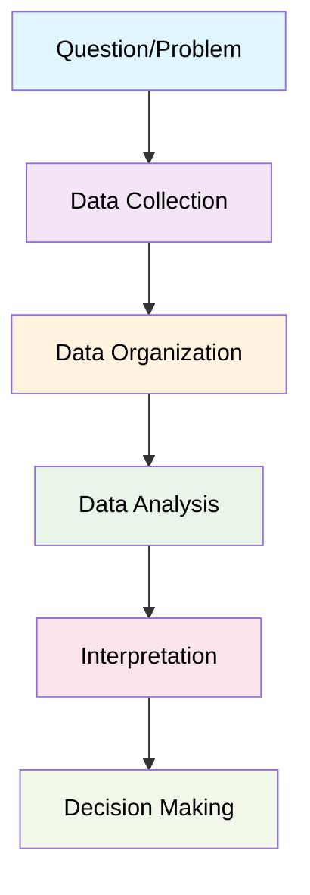
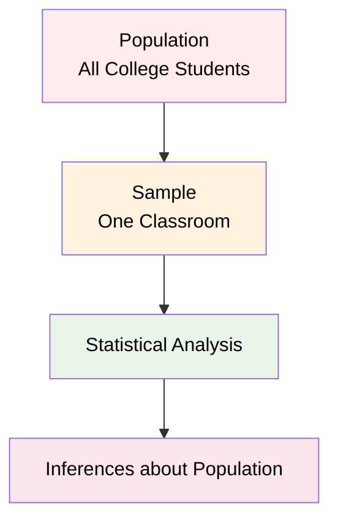
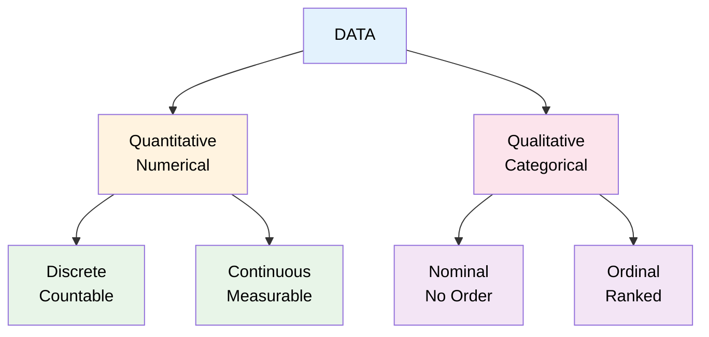
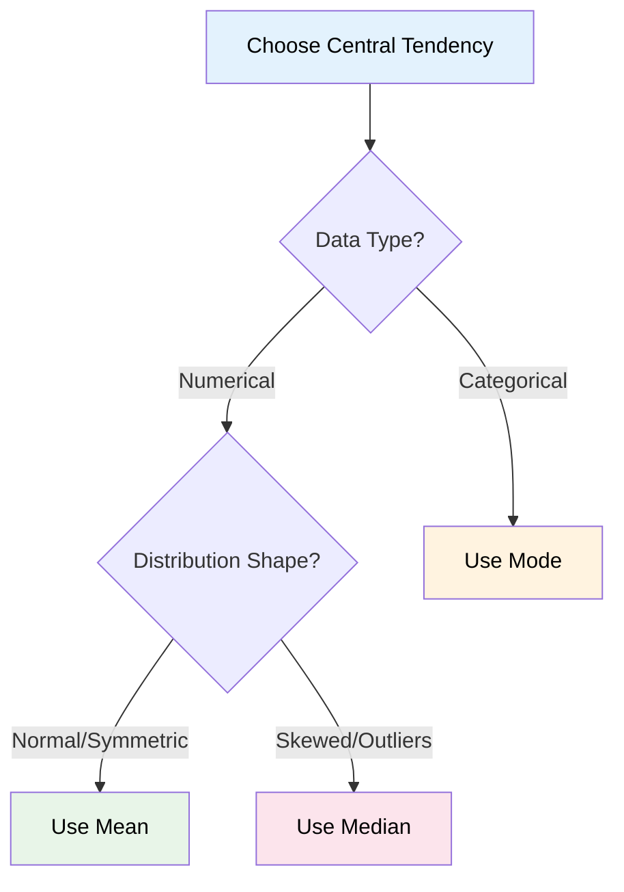

# Introduction to Statistics
> *"Statistics is the grammar of science."* - Karl Pearson 

## Chapter 1: What is Statistics?

**Statistics** is the science of collecting, organizing, and analyzing data to make informed decisions and draw meaningful conclusions from information.

### The Statistical Process


### Branches of Statistics

Statistics is divided into two main branches:

#### Descriptive Statistics
**Definition:** Organizing and summarizing data to describe what happened

**Components:**
- Measures of Central Tendency (Mean, Median, Mode)
- Measures of Dispersion (Variance, Standard Deviation)
- Data visualization (Histograms, Charts)

**Example Question:** *"What is the average height of students in this classroom?"*

#### Inferential Statistics  
**Definition:** Using sample data to make conclusions about populations

**Components:**
- Hypothesis Testing (Z-test, t-test)
- Confidence intervals
- Statistical significance

**Example Question:** *"Are the heights of students in this classroom representative of the entire college?"*

### Population vs Sample



**Population:** The complete group you want to study
- Usually large and difficult to study entirely
- Parameters are typically unknown

**Sample:** A subset of the population
- Smaller, manageable portion
- Used to estimate population parameters
- Statistics calculated from samples

**Key Insight:** We use sample statistics to estimate population parameters!

---

## Chapter 2: Types of Data and Measurement Scales

Understanding your data type is crucial for choosing appropriate statistical methods.

### Data Classification



### Quantitative Data (Numerical)
Can perform mathematical operations (+, -, ×, ÷)

**Discrete Data:** Countable whole numbers
- Examples: Number of children (0, 1, 2, 3), Bank accounts, Students in class

**Continuous Data:** Any numerical value within a range
- Examples: Height (165.2 cm), Weight (72.3 kg), Temperature (25.7°C)

### Qualitative Data (Categorical)
Represents categories or characteristics

**Nominal Data:** Categories with no natural order
- Examples: Gender (M, F), Blood type (A, B, AB, O), Colors

**Ordinal Data:** Categories with meaningful order
- Examples: Education level (High School < Bachelor's < Master's), Ratings (Poor < Good < Excellent)

### Scales of Measurement

| Scale | Order Matters | Equal Intervals | True Zero | Examples | Operations |
|-------|---------------|----------------|-----------|----------|------------|
| **Nominal** | No | No | No | Gender, Colors | Count, Mode |
| **Ordinal** | Yes | No | No | Ratings, Education | Count, Mode, Median |
| **Interval** | Yes | Yes | No | Temperature (°C, °F) | All except ratios |
| **Ratio** | Yes | Yes | Yes | Height, Weight, Age | All operations |

**Key Difference:** Interval vs Ratio
- **Interval:** 60°F is not "twice as hot" as 30°F (no meaningful ratios)
- **Ratio:** A person weighing 80kg is twice as heavy as someone weighing 40kg (meaningful ratios)

---

## Chapter 3: Measures of Central Tendency

Central tendency describes the center or typical value of a dataset.

### Mean (Average)

**Population Mean:** μ = Σ Xi / N
**Sample Mean:** x̄ = Σ Xi / n

**Example:**
```
Ages: [18, 19, 20, 21, 22]
Mean = (18 + 19 + 20 + 21 + 22) ÷ 5 = 20 years
```

### Median
The middle value when data is arranged in order

**Process:**
1. Sort the data
2. If odd number of values: take middle value
3. If even number of values: average of two middle values

**Example:**
```
Ages: [18, 19, 20, 21, 22] → Median = 20
Ages: [18, 19, 20, 21] → Median = (19 + 20) ÷ 2 = 19.5
```

### Mode
The most frequently occurring value

**Example:**
```
Ages: [18, 19, 19, 20, 21] → Mode = 19
```

### Choosing the Right Measure



**Impact of Outliers:**
- Dataset without outlier: [20, 21, 22, 23, 24] → Mean = 22, Median = 22
- Dataset with outlier: [20, 21, 22, 23, 80] → Mean = 33.2, Median = 22

The median better represents typical values when outliers are present.

---

## Chapter 4: Measures of Dispersion

Dispersion measures how spread out data points are from the center.

### Why Measure Dispersion?
Two datasets can have the same mean but different spreads:
- Dataset A: [49, 50, 51] → Mean = 50, Low dispersion
- Dataset B: [30, 50, 70] → Mean = 50, High dispersion

### Variance

**Population Variance:** σ² = Σ(Xi - μ)² / N
**Sample Variance:** S² = Σ(Xi - x̄)² / (n-1)

**Why (n-1) for samples?** Bessel's Correction provides an unbiased estimator of population variance.

### Standard Deviation

**Population:** σ = √σ²
**Sample:** S = √S²

Standard deviation is preferred because it's in the same units as the original data.

### Practical Example

**Dataset:** X = [1, 2, 3, 4, 5]

**Step 1:** Calculate mean
x̄ = (1 + 2 + 3 + 4 + 5) ÷ 5 = 3

**Step 2:** Calculate squared deviations
```
(1-3)² = 4
(2-3)² = 1  
(3-3)² = 0
(4-3)² = 1
(5-3)² = 4
Sum = 10
```

**Step 3:** Calculate variance and standard deviation
```
Sample Variance: S² = 10 ÷ (5-1) = 2.5
Sample Standard Deviation: S = √2.5 = 1.58
```

### The 68-95-99.7 Rule (Normal Distribution)
```
       μ-3σ    μ-2σ    μ-1σ     μ      μ+1σ    μ+2σ    μ+3σ
        |       |       |       |       |       |       |
      0.1%    2.1%   13.6%   34.1%   34.1%   13.6%    2.1%   0.1%
        |       |       |       |       |       |       |
        |-------|-------|-------|-------|-------|-------|
              68% of data (±1σ)
                    95% of data (±2σ)  
                          99.7% of data (±3σ)
```

---

## Chapter 5: Data Visualization and Distribution Shapes

### Histograms

**Definition:** Graphical representation showing the frequency distribution of numerical data

**Key Components:**
- X-axis: Data values divided into bins
- Y-axis: Frequency or count
- Bars: Height represents frequency

**Choosing Bin Size:**
- Too few bins: Lose detail
- Too many bins: Too much noise
- Rule of thumb: √n bins where n = sample size

### Distribution Shapes

Understanding distribution shape guides statistical method selection:

#### Symmetric Distribution (Normal)
```
    Frequency
        ↑
        |     ╭─╮
        |   ╭─╯ ╰─╮
        |  ╱       ╲
        | ╱         ╲
        |╱___________╲
        └──────────────→ Values
```
**Characteristics:**
- Mean = Median = Mode
- Bell-shaped curve
- Equal spread on both sides

#### Right Skewed (Positive Skew)
```
    Frequency
        ↑
        |╭─╮
        |█ ╰─╮
        |█   ╰─╮
        |█     ╰─────╮
        └──────────────────→ Values
         ↑  ↑     ↑
       Mode Med  Mean
```
**Characteristics:**
- Mean > Median > Mode
- Long tail extends right
- Examples: Income, house prices

#### Left Skewed (Negative Skew)
```
    Frequency
        ↑
        |        ╭─╮█
        |      ╭─╯ █
        |    ╭─╯   █
        |╭─_______█
        └──────────────────→ Values
         ↑     ↑  ↑
       Mean   Med Mode
```
**Characteristics:**
- Mean < Median < Mode
- Long tail extends left
- Examples: Test scores (most students do well)

### Box Plots

Box plots visually summarize distribution and identify outliers:

```
    Q₁        Q₂(Median)    Q₃
     |            |         |
  ┌──┴──┐    ┌───┴───┐    ┌┴──┐
  │     │    │       │    │   │
──┤     ├────┤   █   ├────┤   ├──
  │     │    │       │    │   │
  └─────┘    └───────┘    └───┘
     ↑            ↑         ↑
   Min         Median     Max
```

**Components:**
- Q₁: First quartile (25th percentile)
- Q₂: Median (50th percentile)
- Q₃: Third quartile (75th percentile)
- IQR: Interquartile Range (Q₃ - Q₁)
- Whiskers: Extend to min/max or 1.5×IQR
- Outliers: Points beyond whiskers

---

## Chapter 6: Relationships Between Variables

### Random Variables

**Definition:** A function that assigns numerical values to outcomes of random experiments

**Examples:**
- Coin toss: X = {0 for Head, 1 for Tail}
- Dice roll: X = {1, 2, 3, 4, 5, 6}
- Temperature: X = any real number

**Types:**
- **Discrete:** Countable values (dice, coins)
- **Continuous:** Any value in a range (temperature, height)

### Covariance

**Definition:** Measures how two variables change together

**Formula:** Cov(X,Y) = Σ(Xi - x̄)(Yi - ȳ) / (n-1)

**Interpretation:**
- Positive covariance: Variables tend to increase together
- Negative covariance: One increases while other decreases
- Zero covariance: No linear relationship

**Limitation:** No standardized scale makes comparison difficult

### Correlation

**Definition:** Standardized measure of linear relationship between variables

**Pearson Correlation:** ρ = Cov(X,Y) / (σx × σy)

**Range:** -1 to +1

| Correlation | Strength | Interpretation |
|-------------|----------|----------------|
| ±0.9 to ±1.0 | Very Strong | Almost perfect relationship |
| ±0.7 to ±0.9 | Strong | Strong relationship |
| ±0.5 to ±0.7 | Moderate | Moderate relationship |
| ±0.3 to ±0.5 | Weak | Weak relationship |
| 0 to ±0.3 | Very Weak | Little to no relationship |

### Spearman Rank Correlation

Used for:
- Non-linear relationships
- Ordinal data
- Data with outliers

**Process:** Convert data to ranks, then calculate correlation using ranks

### Key Differences

| Method | Best For | Advantages | Limitations |
|--------|----------|------------|-------------|
| **Covariance** | Initial exploration | Shows direction | Hard to interpret scale |
| **Pearson** | Linear relationships | Standardized scale | Assumes linearity |
| **Spearman** | Non-linear/ordinal | Works with ranks | Less precise |

**Important:** Correlation does not imply causation!

---

## Chapter 7: Set Theory Fundamentals (Mathematical Foundation)

Set theory provides the mathematical foundation for probability and statistics.

### Basic Set Operations

**Given:** Set A = {1, 2, 3, 4, 5, 6, 7, 8}, Set B = {3, 4, 5, 6, 7}

#### Intersection (A ∩ B)
Elements common to both sets
**Result:** A ∩ B = {3, 4, 5, 6, 7}

#### Union (A ∪ B)
All elements from either set
**Result:** A ∪ B = {1, 2, 3, 4, 5, 6, 7, 8}

#### Difference (A - B)
Elements in A but not in B
**Result:** A - B = {1, 2, 8}

#### Subset and Superset
- A ⊆ B: Every element of A is in B
- B ⊇ A: B contains all elements of A

### Applications in Statistics
- **Sample Space:** Set of all possible outcomes
- **Events:** Subsets of sample space
- **Probability:** Based on set relationships

---

## Programming Examples

### Descriptive Statistics in Python

```python
import numpy as np
import pandas as pd
import matplotlib.pyplot as plt
import seaborn as sns
from scipy import stats

# Sample dataset
data = [23, 43, 23, 56, 74, 32, 68, 98, 45, 32]

# Central tendency
mean_val = np.mean(data)
median_val = np.median(data)
mode_val = stats.mode(data)

print(f"Mean: {mean_val}")
print(f"Median: {median_val}")
print(f"Mode: {mode_val.mode[0]}")

# Dispersion
variance_sample = np.var(data, ddof=1)  # Sample variance
std_sample = np.std(data, ddof=1)       # Sample std dev

print(f"Sample Variance: {variance_sample}")
print(f"Sample Std Dev: {std_sample}")
```

### Correlation Analysis

```python
# Health expenditure example
df = sns.load_dataset('healthexp')

# Calculate correlations
pearson_corr = df.corr(method='pearson')
spearman_corr = df.corr(method='spearman')

print("Pearson Correlation:")
print(pearson_corr)

print("\nSpearman Correlation:")
print(spearman_corr)

# Visualize relationships
plt.figure(figsize=(12, 4))

plt.subplot(1, 3, 1)
plt.scatter(df['Spending_USD'], df['Life_Expectancy'])
plt.xlabel('Health Spending (USD)')
plt.ylabel('Life Expectancy')
plt.title('Spending vs Life Expectancy')

plt.subplot(1, 3, 2)
sns.heatmap(pearson_corr, annot=True, cmap='coolwarm', center=0)
plt.title('Pearson Correlations')

plt.subplot(1, 3, 3)
df.boxplot(column='Life_Expectancy')
plt.title('Life Expectancy Distribution')

plt.tight_layout()
plt.show()
```

---

## Quick Reference Guide

### Data Types Quick Check
```
Quantitative Data:
├── Discrete: Count-based (students, accounts, children)
└── Continuous: Measured (height, weight, temperature)

Qualitative Data:
├── Nominal: Categories, no order (gender, colors, blood type)
└── Ordinal: Categories with order (ratings, education levels)
```

### Measurement Scales
```
Nominal → Categories only → Mode
Ordinal → Order matters → Mode, Median  
Interval → Equal intervals, no true zero → Mean (if normal)
Ratio → True zero point → All statistics
```

### Central Tendency Selection
```
Normal Distribution → Mean
Skewed Distribution → Median
Categorical Data → Mode
Outliers Present → Median
```

### Distribution Shapes
```
Symmetric: Mean = Median = Mode
Right Skewed: Mean > Median > Mode
Left Skewed: Mean < Median < Mode
```

### Correlation Strength
```
|r| = 0.0-0.3: Weak relationship
|r| = 0.3-0.7: Moderate relationship  
|r| = 0.7-0.9: Strong relationship
|r| = 0.9-1.0: Very strong relationship
```

### When to Use Each Method
```
Covariance: Direction of relationship
Pearson: Linear relationships, continuous data
Spearman: Non-linear, ordinal data, outliers present
```

---

## Key Takeaways

1. **Start with data type identification** - this determines your statistical options
2. **Always visualize your data first** - plots reveal distribution shape and outliers
3. **Choose statistics appropriate for your data type and distribution**
4. **Correlation ≠ Causation** - strong relationships don't prove one variable causes another
5. **Consider your audience** - different measures may be more meaningful for different purposes
6. **Check assumptions** - many statistical methods assume normal distributions
7. **Sample size matters** - larger samples provide more reliable estimates

Understanding these fundamentals provides the foundation for more advanced statistical concepts like hypothesis testing, regression analysis, and machine learning algorithms.
