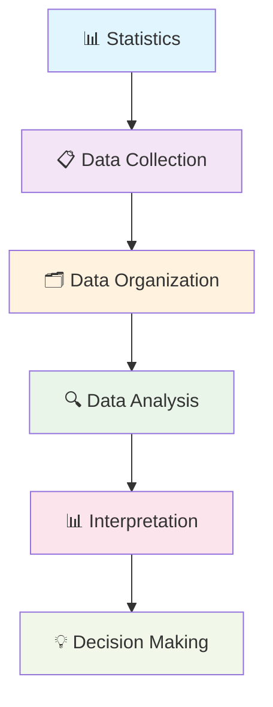

# Introduction to Statistics

> *"Statistics is the grammar of science."* - Karl Pearson

## 📊 What is Statistics?

**Statistics** is the science of collecting, organizing, and analyzing data to make informed decisions and draw meaningful conclusions from information.

## 📈 Key Concepts

### Data
**Definition:** Facts or pieces of information that can be collected, measured, and analyzed.

**Example:** Heights of students in a classroom
```
{135 cm, 180 cm, 190 cm, 160 cm, 145 cm, 175 cm, 168 cm, 172 cm}
```

## 🔄 The Statistical Process


 
## 📋 Types of Data

| Type | Description | Examples |
|------|-------------|----------|
| **Qualitative** | Descriptive, non-numerical | Colors, Names, Categories |
| **Quantitative** | Numerical, measurable | Height, Weight, Age, Score |

### Quantitative Data Subtypes

- **Discrete**: Countable values (e.g., number of students: 25, 30, 35)
- **Continuous**: Measurable values (e.g., height: 165.5 cm, 170.2 cm)

## 📊 Data Visualization Examples

### Sample Dataset: Student Heights
```
Student A: 135 cm
Student B: 180 cm  
Student C: 190 cm
Student D: 160 cm
Student E: 145 cm
Student F: 175 cm
Student G: 168 cm
Student H: 172 cm
```

### Basic Statistics from Our Example:
- **Count**: 8 students
- **Range**: 135 cm - 190 cm (55 cm difference)
- **Average**: ~165.6 cm

## 🎯 Why Statistics Matters

Statistics helps us:
- ✅ Make data-driven decisions
- ✅ Identify patterns and trends  
- ✅ Predict future outcomes
- ✅ Test hypotheses
- ✅ Reduce uncertainty

## 📚 Common Statistical Applications

| Field | Application |
|-------|-------------|
| 🏥 **Healthcare** | Clinical trials, disease tracking |
| 💰 **Business** | Market research, sales forecasting |
| 🏫 **Education** | Student performance analysis |
| 🌡️ **Weather** | Climate modeling, predictions |
| 🏃 **Sports** | Player statistics, performance metrics |

## 🔍 Statistical Workflow


## 📖 Next Steps

1. **Learn about measures of central tendency** (mean, median, mode)
2. **Explore data visualization techniques** (charts, graphs)
3. **Understand probability concepts**
4. **Practice with real datasets**

---

### 📝 Quick Reference

```
📊 Statistics = Science of Data
📋 Data = Facts/Information  
📈 Analysis = Finding Patterns
💡 Goal = Better Decisions
```

---

*Remember: Good statistics start with good data! Always ensure your data is accurate, relevant, and properly collected.*
