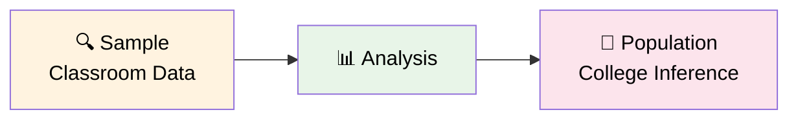
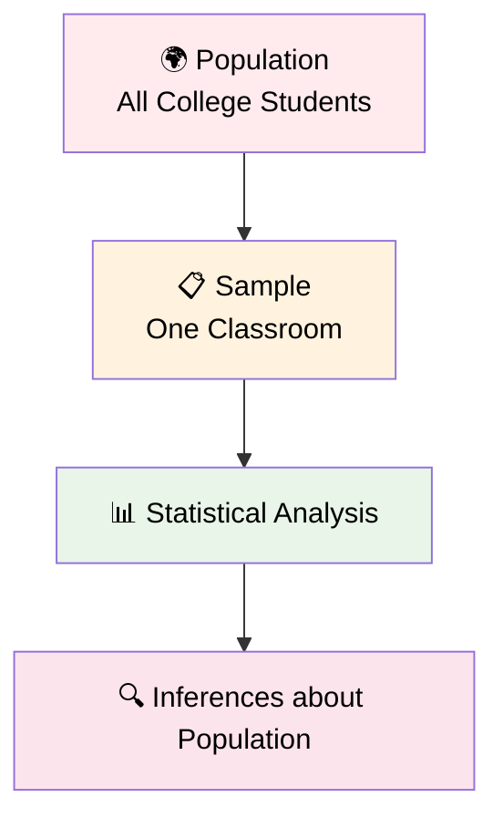
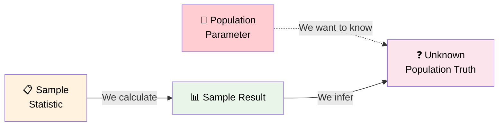
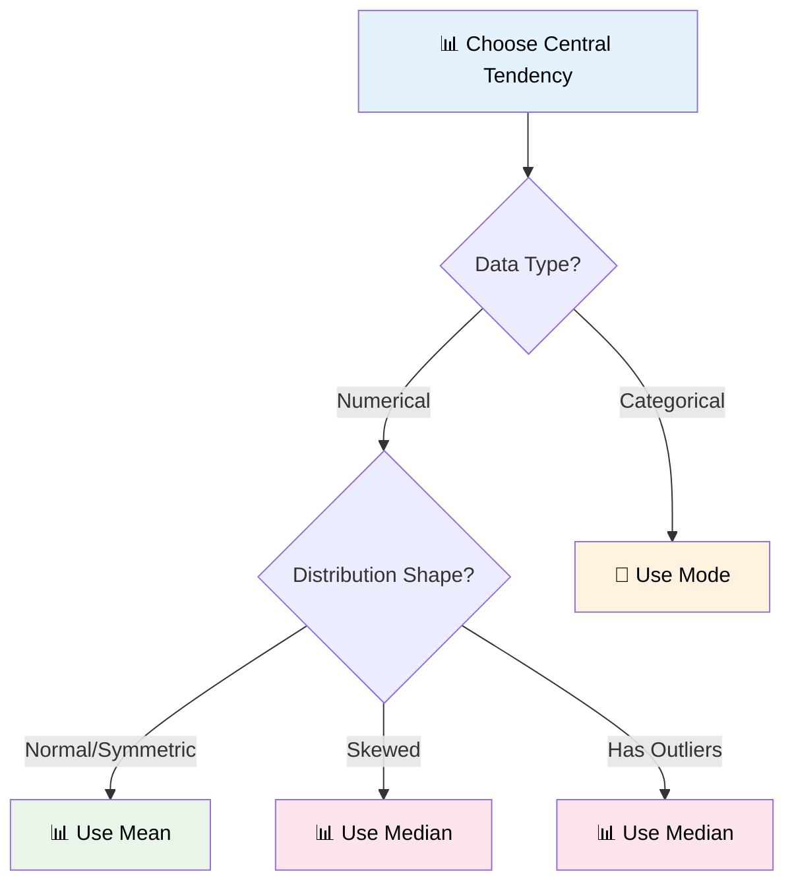
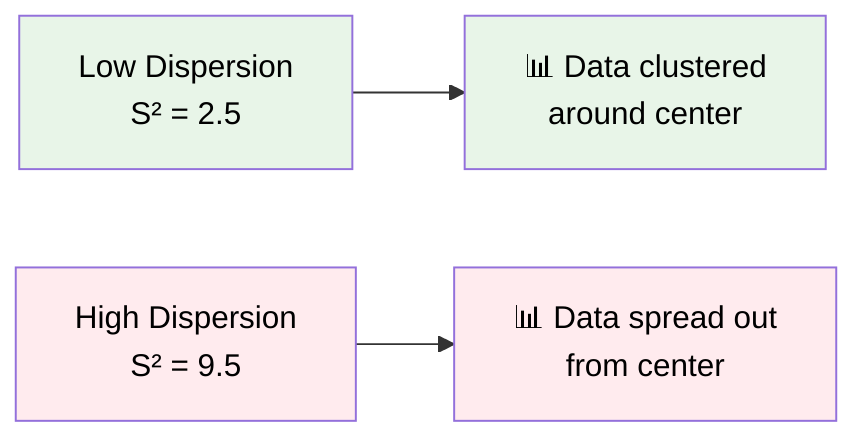
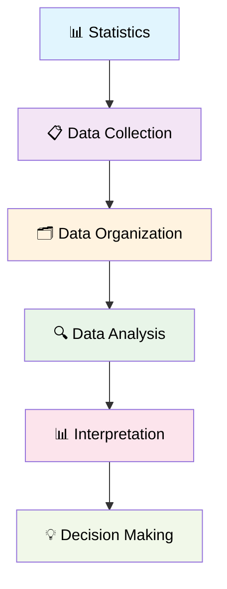
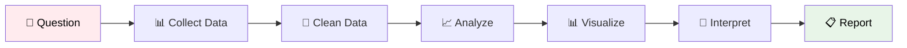

# Introduction to Statistics
> *"Statistics is the grammar of science."* - Karl Pearson 

## 📊 What is Statistics?
**Statistics** is the science of collecting, organizing, and analyzing data to make informed decisions and draw meaningful conclusions from information.

## 🔍 Types of Statistics
Statistics is divided into two main branches:

### 1️⃣ Descriptive Statistics
**Definition:** It consists of organizing and summarizing data

**Components:**
- **📊 Measures of Central Tendency:** Mean, Median, Mode
- **📈 Measures of Dispersion:** Variance, Standard Deviation
- **📋 Different types of Distribution of data**
  - Examples: Histogram, PDF, PMF

**Example:** Let's say there are 20 statistics classes at your college, and you have collected the heights of students in the class.

Heights recorded: `[175cm, 180cm, 140cm, 140cm, 135cm, 160cm, 185cm, 190cm]`

**Descriptive Question:** *"What is the average height of the entire classroom?"*
```
Calculation: (175+180+140+140+135+160+185+190) / 8 = Average Height
```

### 2️⃣ Inferential Statistics  
**Definition:** It consists of using data you have measured to form conclusions

**Components:**
- **🧪 Hypothesis Testing**
  - Z-test, t-test
  - H₀, H₁, p-value, significance value
- **📊 Chi Square tests**

**Inferential Question:** *"Are the heights of the students in classroom similar to what you expect in the entire college?"*

This involves using your **sample data** (classroom) to make inferences about the **population data** (entire college).



## 🎯 Population vs Sample
Understanding the relationship between population and sample is fundamental to statistics:

### 🌍 Population
**Definition:** The group you are interested in studying
- Represents the **entire** group of interest
- Usually large and difficult to study completely
- Example: All students in the college

### 📋 Sample  
**Definition:** A subset of population
- A **smaller, manageable** portion of the population
- Used to make inferences about the population
- Example: Students in one statistics classroom



### 🔄 The Statistical Inference Process


**Key Point:** We use sample statistics to estimate population parameters!

## 📊 Measures of Central Tendency

Central tendency describes where the center of a dataset lies. There are three primary measures:

### 1️⃣ Mean (Average)
**Definition:** The arithmetic average of all values in a dataset

#### Population Mean (μ)
For a population with N values:
```
Population Mean (μ) = Σ Xi / N
                    = (X₁ + X₂ + X₃ + ... + Xₙ) / N
```

#### Sample Mean (x̄)
For a sample with n values:
```
Sample Mean (x̄) = Σ Xi / n
                 = (X₁ + X₂ + X₃ + ... + Xₙ) / n
```

**Example:**
Population: X = {1, 1, 2, 2, 3, 3, 4, 5, 5, 6}
```
Population Mean (μ) = (1+1+2+2+3+3+4+5+5+6) / 10 = 32 / 10 = 3.2
```

**Programming Implementation:**
```python
import numpy as np

# Calculate mean using numpy
age = [12, 21, 23, 45, 65, 43, 56, 45, 32, 67, 54, 34]
mean_age = np.mean(age)
print(f"Mean age: {mean_age}")  # Output: 41.41666666666667
```

### 2️⃣ Median
**Definition:** The middle value when data is arranged in ascending or descending order

#### Steps to Find Median:
1. **Sort the data** in ascending order
2. **Count the number of elements**
3. **If count is odd:** Median = middle value
4. **If count is even:** Median = average of two middle values

**Examples:**

**Case 1: Odd number of elements**
```
X = {4, 5, 2, 3, 2, 1}
Sorted: {1, 2, 2, 3, 4, 5}
Count = 6 (even)
Median = (2 + 3) / 2 = 2.5
```

**Case 2: Even number of elements**  
```
X = {1, 2, 3, 4, 5, 100}
Count = 6 (even)
Middle positions: 3rd and 4th values = 3 and 4
Median = (3 + 4) / 2 = 3.5
```

**Why Use Median?**
Median is useful when **outliers are present** in the data because it's less affected by extreme values.

**Comparison Example:**
- Without outlier: X = {1, 2, 3, 4, 5} → Mean = 3, Median = 3
- With outlier: X = {1, 2, 3, 4, 5, 100} → Mean ≈ 19.2, Median = 3.5

The median (3.5) better represents the central tendency when outliers are present.

**Programming Implementation:**
```python
import numpy as np

# Calculate median using numpy
age = [12, 21, 23, 45, 65, 43, 56, 45, 32, 67, 54, 34, 200]
median_age = np.median(age)
print(f"Median age: {median_age}")  # Output: 45.0
```

### 3️⃣ Mode
**Definition:** The value(s) that appear most frequently in a dataset

**Characteristics:**
- **Most frequent value** in the dataset
- A dataset can have:
  - **No mode** (all values appear equally)
  - **One mode** (unimodal)
  - **Two modes** (bimodal)  
  - **Multiple modes** (multimodal)

**Example:**
```
Dataset: {2, 1, 1, 1, 4, 5, 7, 8, 9, 9, 10}

Frequency count:
1 appears 3 times
9 appears 2 times  
All others appear 1 time each

Mode = 1 (highest frequency)
```

**Programming Implementation:**
```python
from scipy import stats

# Calculate mode using scipy
age = [12, 21, 23, 45, 65, 43, 56, 45, 32, 67, 54, 34, 200]
mode_result = stats.mode(age)
print(f"Mode: {mode_result}")  # Returns mode value and count
```

### 📊 Central Tendency Comparison

| **Measure** | **Best Used When** | **Advantages** | **Disadvantages** | **Affected by Outliers?** |
|-------------|-------------------|----------------|-------------------|---------------------------|
| **Mean** | Normal distribution, no outliers | Uses all data points | Sensitive to outliers | Yes |
| **Median** | Skewed data, outliers present | Resistant to outliers | Ignores extreme values | No |
| **Mode** | Categorical data, finding most common | Shows most frequent value | May not exist or be unique | No |

### 🎯 When to Use Each Measure



### 📈 Practical Example: Complete Analysis

Let's analyze a complete dataset:

**Dataset:** Ages of students in a class
```python
ages = [18, 19, 20, 20, 21, 21, 21, 22, 23, 45]
```

**Calculations:**
```python
import numpy as np
from scipy import stats

# Mean
mean_age = np.mean(ages)
print(f"Mean: {mean_age}")  # 23.0

# Median  
median_age = np.median(ages)
print(f"Median: {median_age}")  # 21.0

# Mode
mode_age = stats.mode(ages)
print(f"Mode: {mode_age[0]}")  # 21
```

**Analysis:**
- **Mean (23.0):** Pulled up by the outlier (45)
- **Median (21.0):** Better represents the typical student age
- **Mode (21):** Most common age in the class

In this case, **median** gives the best representation of central tendency due to the outlier.

## 📏 Measures of Dispersion (Spread of Data)

While measures of central tendency tell us about the center of our data, **measures of dispersion** tell us how spread out or scattered the data points are from the center. Understanding dispersion is crucial because two datasets can have the same mean but very different spreads.

### 📊 What is Dispersion?
**Dispersion** refers to how much the data points deviate from the central value (mean). It helps us understand:
- How consistent or variable our data is
- The reliability of our central tendency measures
- The range of values we can expect in our dataset

### 📈 Visual Understanding of Dispersion



Two datasets can have the same mean but different spreads:
- **Dataset A:** {49, 50, 51} → Mean = 50, Low dispersion
- **Dataset B:** {30, 50, 70} → Mean = 50, High dispersion

### 1️⃣ Variance

**Definition:** Variance measures the average of squared differences from the mean. It tells us how much the data points deviate from the mean on average.

#### Population Variance (σ²)
For a population with N values:
```
Population Variance (σ²) = Σ(Xi - μ)² / N

Where:
• Xi = Individual data points
• μ = Population mean  
• N = Population size
```

#### Sample Variance (S²)
For a sample with n values:
```
Sample Variance (S²) = Σ(Xi - x̄)² / (n-1)

Where:
• Xi = Individual data points
• x̄ = Sample mean
• n = Sample size
```

#### 🤔 Why do we divide Sample Variance by (n-1)?
This is called **Bessel's Correction** and it helps us create an **unbiased estimator** of the population variance. When we use a sample to estimate population parameters, dividing by (n-1) instead of n gives us a more accurate estimate.

### 2️⃣ Standard Deviation

**Definition:** Standard deviation is the square root of variance. It's expressed in the same units as the original data, making it easier to interpret.

#### Population Standard Deviation (σ)
```
Population Standard Deviation (σ) = √(Variance) = √σ²
```

#### Sample Standard Deviation (S)
```
Sample Standard Deviation (S) = √(Sample Variance) = √S²
```

### 📊 Sample Variance Practical Example

Let's work through the example shown in the lecture:

**Dataset:** X = {1, 2, 3, 4, 5}

#### Step-by-Step Calculation:

**Step 1:** Calculate the mean (x̄)
```
x̄ = (1 + 2 + 3 + 4 + 5) / 5 = 15 / 5 = 3
```

**Step 2:** Calculate deviations from mean and square them
```
(1-3)² = (-2)² = 4
(2-3)² = (-1)² = 1  
(3-3)² = (0)² = 0
(4-3)² = (1)² = 1
(5-3)² = (2)² = 4

Sum of squared deviations: 4 + 1 + 0 + 1 + 4 = 10
```

**Step 3:** Apply Sample Variance Formula
```
Sample Variance (S²) = Σ(Xi - x̄)² / (n-1)
                     = 10 / (5-1)
                     = 10 / 4
                     = 2.5
```

**Step 4:** Calculate Sample Standard Deviation
```
Sample Standard Deviation (S) = √S² = √2.5 = 1.58
```

### 📊 Normal Distribution and Standard Deviation

Understanding how data spreads in a normal distribution is crucial for interpreting standard deviation:

#### 📈 The 68-95-99.7 Rule (Empirical Rule)

In a normal distribution:
- **68%** of data falls within **1 standard deviation** of the mean
- **95%** of data falls within **2 standard deviations** of the mean  
- **99.7%** of data falls within **3 standard deviations** of the mean

**Visual Representation:**
```
       μ-3σ    μ-2σ    μ-1σ     μ      μ+1σ    μ+2σ    μ+3σ
        |       |       |       |       |       |       |
    0.1%|  2.1% | 13.6% | 34.1% | 34.1% | 13.6% |  2.1% |0.1%
        |       |       |       |       |       |       |
        |-------|-------|-------|-------|-------|-------|
              68% of data (±1σ)
                    95% of data (±2σ)  
                          99.7% of data (±3σ)
```

#### Example with Normal Distribution:
If test scores follow a normal distribution with:
- **Mean (μ) = 75**  
- **Standard Deviation (σ) = 10**

Then:
- **68%** of students scored between **65-85** (75 ± 10)
- **95%** of students scored between **55-95** (75 ± 20)
- **99.7%** of students scored between **45-105** (75 ± 30)

### 📊 Practical Programming Example

```python
import numpy as np
import pandas as pd

# Dataset from the lecture example
ages = [23, 43, 23, 56, 74, 32, 68, 98, 45, 32]

# Calculate mean
mean_age = np.mean(ages)
print(f"Mean: {mean_age}")  # Output: 49.4

# Calculate Sample Variance (using n-1)
sample_variance = np.var(ages, ddof=1)  # ddof=1 uses n-1
print(f"Sample Variance: {sample_variance}")  # Output: ~601.82

# Calculate Population Variance (using n)
population_variance = np.var(ages, ddof=0)  # ddof=0 uses n
print(f"Population Variance: {population_variance}")  # Output: ~541.64

# Calculate Standard Deviations
sample_std = np.std(ages, ddof=1)
population_std = np.std(ages, ddof=0)

print(f"Sample Std Dev: {sample_std}")      # Output: ~24.53
print(f"Population Std Dev: {population_std}")  # Output: ~23.27
```

### 📊 Working with DataFrames - Variance by Rows and Columns

From the lecture, we can see how to calculate variance for different axes:

```python
import pandas as pd
import numpy as np

# Create sample DataFrame (from lecture)
data = [[10, 12, 13], 
        [34, 23, 45], 
        [32, 34, 21]]
df = pd.DataFrame(data, columns=["A", "B", "C"])

print("DataFrame:")
print(df)
#     A   B   C
# 0  10  12  13
# 1  34  23  45
# 2  32  34  21

# Calculate variance for each COLUMN (axis=0, default)
variance_by_column = df.var()
print(f"\nVariance by Column:")
print(variance_by_column)
# A    177.333333
# B    121.000000
# C    277.333333

# Calculate variance for each ROW (axis=1)  
variance_by_row = df.var(axis=1)
print(f"\nVariance by Row:")
print(variance_by_row)
# 0      2.333333
# 1    126.333333  
# 2     42.333333

# Calculate standard deviation
std_by_column = df.std()
print(f"\nStandard Deviation by Column:")
print(std_by_column)
# A    13.316624
# B    11.000000
# C    16.653332
```

**Interpretation:**
- **Column A variance (177.33):** High spread in column A values (10, 34, 32)
- **Column B variance (121.00):** Moderate spread in column B values (12, 23, 34)
- **Column C variance (277.33):** Highest spread in column C values (13, 45, 21)
- **Row variances:** Show how much values vary within each row

### 🎯 Interpreting Variance and Standard Deviation

| **Value** | **Interpretation** | **Example** |
|-----------|-------------------|-------------|
| **Low Variance/Std Dev** | Data points are close to the mean | Test scores: 85, 87, 86, 88, 84 |
| **High Variance/Std Dev** | Data points are spread out from the mean | Test scores: 60, 95, 70, 40, 85 |
| **Zero Variance** | All data points are identical | Test scores: 80, 80, 80, 80, 80 |

### 🔍 Key Differences: Population vs Sample

| **Aspect** | **Population** | **Sample** |
|------------|----------------|------------|
| **Variance Formula** | σ² = Σ(Xi-μ)²/N | S² = Σ(Xi-x̄)²/(n-1) |
| **Std Dev Formula** | σ = √σ² | S = √S² |
| **Denominator** | N (population size) | n-1 (degrees of freedom) |
| **Purpose** | Describes entire population | Estimates population parameters |
| **Symbol** | σ² (sigma squared), σ | S², S |

### 💡 Practical Applications

**1. Quality Control:**
- Manufacturing: Monitor product consistency
- Low variance = consistent quality
- High variance = quality issues

**2. Finance:**
- Investment risk assessment
- Low variance = stable returns  
- High variance = volatile returns

**3. Education:**
- Student performance analysis
- Low variance = consistent class performance
- High variance = mixed ability levels

**4. Healthcare:**
- Treatment effectiveness
- Low variance = predictable treatment outcomes
- High variance = unpredictable results

### 📚 Summary: Measures of Dispersion

```
📏 Measures of Dispersion = How spread out the data is

🔢 Variance = Average of squared differences from mean
   • Population: σ² = Σ(Xi-μ)²/N  
   • Sample: S² = Σ(Xi-x̄)²/(n-1)

📐 Standard Deviation = Square root of variance
   • Population: σ = √σ²
   • Sample: S = √S²

🎯 Why Standard Deviation?
   • Same units as original data
   • Easier to interpret than variance
   • Shows typical deviation from mean

🔄 Bessel's Correction (n-1):
   • Used in sample calculations
   • Provides unbiased estimate
   • Accounts for sampling variability

📊 Interpretation:
   • Low values = Data clustered near mean
   • High values = Data spread out from mean  
   • Zero = All data points identical
```

## 📈 Key Concepts

### Data
**Definition:** Facts or pieces of information that can be collected, measured, and analyzed.

**Example:** Heights of students in a classroom
```
{135 cm, 180 cm, 190 cm, 160 cm, 145 cm, 175 cm, 168 cm, 172 cm}
```

## 🔄 The Statistical Process


## 📏 Scales of Measurement
Understanding the scale of measurement is crucial for choosing appropriate statistical methods. There are four main scales:

### 1️⃣ Nominal Scale Data
- **Definition:** Qualitative/Categorical data
- **Characteristics:**
  - Order does not matter
  - Categories with no ranking
  - Can only count frequencies and find mode
- **Examples:**
  - Favorite Color: Red (5) → 50%, Blue (3) → 30%, Orange (2) → 20%
  - Gender: M, F
  - Blood Type: A, B, AB, O

### 2️⃣ Ordinal Scale Data  
- **Definition:** Categorical data with meaningful order
- **Characteristics:**
  - Ranking is important
  - Order matters
  - Differences cannot be measured precisely
- **Examples:**
  - Rating Scale: 1 → Best, 2 → Good, 3 → Bad
  - Education Level: High School < Bachelor's < Master's < PhD
  - Customer Satisfaction: Poor < Fair < Good < Excellent

### 3️⃣ Interval Scale Data
- **Definition:** Numerical data with equal intervals
- **Characteristics:**
  - Order matters
  - Differences can be measured
  - **No true "0" starting point**
  - Ratios cannot be calculated meaningfully
- **Examples:**
  - Temperature: -30°F, -15°F, 30°F, 60°F, 90°F, 120°F
    - Difference: 60°F - 30°F = 30°F (meaningful)
    - Ratio: 90°F ÷ 30°F = 3:1 (NOT meaningful - 90°F is not "3 times hotter")

### 4️⃣ Ratio Scale Data
- **Definition:** Numerical data with true zero point
- **Characteristics:**
  - Order matters ✓
  - Differences are measurable ✓
  - **Contains a true "0" starting point** ✓
  - Ratios can be calculated meaningfully ✓
- **Examples:**
  - Student marks in a class: 0, 90, 60, 30, 35, 40, 50
    - Mean = 30, 40, 50, 60, 35, 90
    - Differences: 40 - 30 = 10 points
    - Ratio: 90 ÷ 30 = 3:1 (90 is 3 times higher than 30)

## 📊 Scale Comparison Table

| **Scale** | **Order Matters** | **Measurable Differences** | **True Zero** | **Ratios Meaningful** | **Examples** |
|-----------|-------------------|----------------------------|---------------|---------------------|--------------|
| **Nominal** | ❌ | ❌ | ❌ | ❌ | Colors, Gender, Blood Type |
| **Ordinal** | ✅ | ❌ | ❌ | ❌ | Ratings, Education Level |
| **Interval** | ✅ | ✅ | ❌ | ❌ | Temperature (°F, °C) |
| **Ratio** | ✅ | ✅ | ✅ | ✅ | Height, Weight, Age, Income |

## 📋 Types of Data
Data can be broadly categorized into two main types:


### 🔢 Quantitative Data (Numerical)
**Definition:** Data that represents numbers and amounts, can perform mathematical operations (+, -, %, *)

#### 🎯 Discrete Data
- **Definition:** Whole numbers, countable values
- **Characteristics:** Cannot be broken down into smaller meaningful units
- **Examples:**
  - Number of bank accounts: 1, 2, 3, 5
  - Number of children in a family: 0, 1, 2, 4
  - Number of students in a class: 25, 30, 45

#### 📈 Continuous Data  
- **Definition:** Can take any numerical value within a range
- **Characteristics:** Can be measured with infinite precision
- **Examples:**
  - Weight: 65.5 kg, 72.3 kg, 80.125 kg
  - Height: 165.2 cm, 175.8 cm, 180.25 cm
  - Temperature: 25.7C, 32.4C, 18.9C
  - Speed: 60.5 km/h, 85.3 km/h

### 📝 Qualitative Data (Categorical)
**Definition:** Data that represents categories, qualities, or characteristics

#### 🏷️ Nominal Data
- **Definition:** Categories with no intrinsic order or ranking
- **Characteristics:** Just labels or names, no mathematical operations possible
- **Examples:**
  - Gender: Male (M), Female (F)
  - Blood Group: A, B, AB, O
  - Pincode: 110001, 400001, 600001
  - Colors: Red, Blue, Green, Yellow

#### 📊 Ordinal Data
- **Definition:** Categories with a natural order or ranking
- **Characteristics:** Has meaningful sequence but intervals aren't necessarily equal
- **Examples:**
  - Customer Feedback: Good, Bad, Better, Best
  - Education Level: High School, Bachelor's, Master's, PhD
  - Star Ratings: ⭐, ⭐⭐, ⭐⭐⭐, ⭐⭐⭐⭐, ⭐⭐⭐⭐⭐

### 📊 Data Types Summary Table

| **Data Type** | **Subtype** | **Description** | **Examples** | **Operations** | **Scale** |
|---------------|-------------|-----------------|--------------|----------------|-----------|
| **Quantitative** | Discrete | Countable whole numbers | Bank accounts, Children, Students | +, -, ×, ÷, Statistics | Ratio |
| **Quantitative** | Continuous | Any numerical value | Weight, Height, Temperature* | +, -, ×, ÷, Statistics | Interval/Ratio |
| **Qualitative** | Nominal | Categories, no order | Gender, Blood group, Colors | Count, Mode | Nominal |
| **Qualitative** | Ordinal | Categories with order | Ratings, Education level | Count, Mode, Median | Ordinal |

**Note:** Temperature in Celsius/Fahrenheit is Interval scale, while Kelvin is Ratio scale due to absolute zero.

## 📊 Data Visualization Examples

### Sample Dataset: Student Heights
```
Student A: 135 cm
Student B: 180 cm  
Student C: 190 cm
Student D: 160 cm
Student E: 145 cm
Student F: 175 cm
Student G: 168 cm
Student H: 172 cm
```

### Basic Statistics from Our Example:
- **Count**: 8 students
- **Range**: 135 cm - 190 cm (55 cm difference)
- **Mean**: ~165.6 cm
- **Median**: ~170 cm
- **Mode**: No mode (all values unique)

## 🎯 Why Statistics Matters
Statistics helps us:
- ✅ Make data-driven decisions
- ✅ Identify patterns and trends  
- ✅ Predict future outcomes
- ✅ Test hypotheses
- ✅ Reduce uncertainty
- ✅ Choose appropriate analysis methods based on data scale

## 📚 Common Statistical Applications

| Field | Application |
|-------|-------------|
| 🏥 **Healthcare** | Clinical trials, disease tracking |
| 💰 **Business** | Market research, sales forecasting |
| 🏫 **Education** | Student performance analysis |
| 🌡️ **Weather** | Climate modeling, predictions |
| 🏃 **Sports** | Player statistics, performance metrics |

## 🔍 Statistical Workflow


## 📖 Next Steps
1. **Learn about probability concepts**
2. **Explore data visualization techniques** (charts, graphs)
3. **Understand hypothesis testing**
4. **Practice with real datasets**

---

### 📝 Quick Reference
```
📊 Statistics = Science of Data
📋 Data = Facts/Information  
📈 Analysis = Finding Patterns
💡 Goal = Better Decisions
🌍 Population = Entire group of interest
📋 Sample = Subset of population
🔍 Descriptive = Organizing & summarizing data
🎯 Inferential = Making conclusions from data

🔢 Quantitative = Numerical data (Discrete + Continuous)
📝 Qualitative = Categorical data (Nominal + Ordinal)
🎯 Discrete = Countable numbers (1, 2, 3...)
📈 Continuous = Any value (1.5, 2.7, 3.14...)
🏷️ Nominal = No order (Gender, Colors)
📊 Ordinal = Has order (Ratings, Grades)

📏 Scales of Measurement:
🏷️ Nominal = Categories, no order (Gender, Colors)
📊 Ordinal = Categories with order (Ratings, Education)  
📏 Interval = Equal intervals, no true zero (Temperature °C/°F)
📐 Ratio = True zero point, ratios meaningful (Height, Weight, Age)

📊 Central Tendency:
📊 Mean = Arithmetic average (Σx/n)
📊 Median = Middle value when sorted
📊 Mode = Most frequent value

📏 Measures of Dispersion:
🔢 Variance = Average of squared differences from mean
   • Population: σ² = Σ(Xi-μ)²/N  
   • Sample: S² = Σ(Xi-x̄)²/(n-1)
📐 Standard Deviation = Square root of variance
   • Population: σ = √σ²
   • Sample: S = √S²
🎯 Bessel's Correction = Use (n-1) for unbiased sample estimates

📈 Normal Distribution (68-95-99.7 Rule):
• 68% of data within ±1σ of mean
• 95% of data within ±2σ of mean  
• 99.7% of data within ±3σ of mean
```

---

*Remember: Good statistics start with good data! Always ensure your data is accurate, relevant, and properly collected.*
|
