# Introduction to Statistics
> *"Statistics is the grammar of science."* - Karl Pearson 

## 📊 What is Statistics?
**Statistics** is the science of collecting, organizing, and analyzing data to make informed decisions and draw meaningful conclusions from information.

## 🔍 Types of Statistics
Statistics is divided into two main branches:

### 1️⃣ Descriptive Statistics
**Definition:** It consists of organizing and summarizing data

**Components:**
- **📊 Measures of Central Tendency:** Mean, Median, Mode
- **📈 Measures of Dispersion:** Variance, Standard Deviation
- **📋 Different types of Distribution of data**
  - Examples: Histogram, PDF, PMF

**Example:** Let's say there are 20 statistics classes at your college, and you have collected the heights of students in the class.

Heights recorded: `[175cm, 180cm, 140cm, 140cm, 135cm, 160cm, 185cm, 190cm]`

**Descriptive Question:** *"What is the average height of the entire classroom?"*
```
Calculation: (175+180+140+140+135+160+185+190) / 8 = Average Height
```

### 2️⃣ Inferential Statistics  
**Definition:** It consists of using data you have measured to form conclusions

**Components:**
- **🧪 Hypothesis Testing**
  - Z-test, t-test
  - H₀, H₁, p-value, significance value
- **📊 Chi Square tests**

**Inferential Question:** *"Are the heights of the students in classroom similar to what you expect in the entire college?"*

This involves using your **sample data** (classroom) to make inferences about the **population data** (entire college).

```mermaid
graph LR
    A[🔍 Sample<br/>Classroom Data] --> B[📊 Analysis] --> C[🎯 Population<br/>College Inference]
    style A fill:#fff3e0,color:#000
    style B fill:#e8f5e8,color:#000
    style C fill:#fce4ec,color:#000

```



## 🎯 Population vs Sample
Understanding the relationship between population and sample is fundamental to statistics:

### 🌍 Population
**Definition:** The group you are interested in studying
- Represents the **entire** group of interest
- Usually large and difficult to study completely
- Example: All students in the college

### 📋 Sample  
**Definition:** A subset of population
- A **smaller, manageable** portion of the population
- Used to make inferences about the population
- Example: Students in one statistics classroom

```mermaid
graph TD
    A[🌍 Population<br/>All College Students] --> B[📋 Sample<br/>One Classroom]
    B --> C[📊 Statistical Analysis]
    C --> D[🔍 Inferences about Population]

    style A fill:#ffebee,color:#000
    style B fill:#fff3e0,color:#000
    style C fill:#e8f5e8,color:#000
    style D fill:#fce4ec,color:#000
```



### 🔄 The Statistical Inference Process

```mermaid
flowchart LR
    A[🎯 Population<br/>Parameter] -.->|"We want to know"| B[❓ Unknown<br/>Population Truth]
    C[📋 Sample<br/>Statistic] -->|"We calculate"| D[📊 Sample Result]
    D -->|"We infer"| B

    style A fill:#ffcdd2,color:#000
    style C fill:#fff3e0,color:#000
    style D fill:#e8f5e8,color:#000
    style B fill:#fce4ec,color:#000
```


**Key Point:** We use sample statistics to estimate population parameters!

## 🎲 Random Variables

A **Random Variable** is a process of mapping the output of a random process or experiments to a number.

**Definition:** A random variable assigns numerical values to the outcomes of a random experiment or process.

### 📝 Examples of Random Variables

#### 🪙 Coin Tossing
```
X = { 0  if Head
    { 1  if Tails
```

#### 🎲 Rolling a Dice
The outcome when rolling a standard six-sided dice: X can take values {1, 2, 3, 4, 5, 6}

#### 🌡️ Temperature Measurement
Measuring the temperature of the next day - X represents the temperature value

#### 🎯 Complex Random Variables
**Y = Sum of rolling a dice 7 times**

This can be used to calculate probabilities:
- P(Y > 15) - Probability that sum is greater than 15
- P(Y < 10) - Probability that sum is less than 10

### 🔢 Types of Random Variables

Random variables can be classified as:
- **Discrete Random Variables:** Can only take specific, countable values (like dice outcomes: 1, 2, 3, 4, 5, 6)
- **Continuous Random Variables:** Can take any value within a range (like temperature: 25.3°C, 25.31°C, etc.)

## 📚 Set Theory Fundamentals

Understanding set theory is crucial for probability and statistics. Here are the key set operations:

### 🔍 Basic Set Concepts

#### 📊 Sets
**Set A:** {1, 2, 3, 4, 5, 6, 7, 8}
**Set B:** {3, 4, 5, 6, 7}

### 🔄 Set Operations

#### 1️⃣ Intersection (A ∩ B)
**Definition:** Elements that are common to both sets
**Result:** A ∩ B = {3, 4, 5, 6, 7}

**Visual Representation:** The overlapping region in a Venn diagram
```
    A     B
   ╭───╮ ╭───╮
  ╱     ╲╱     ╲
 ╱   A   ╳  B   ╲
╱        ╱╲      ╲
╲       ╱  ╲     ╱
 ╲     ╱ ∩  ╲   ╱
  ╲___╱      ╲_╱
```

#### 2️⃣ Union (A ∪ B)
**Definition:** All elements that belong to either set A or set B (or both)
**Result:** A ∪ B = {1, 2, 3, 4, 5, 6, 7, 8}

**Visual Representation:** The entire shaded area in both circles
```
    A     B
   ╭═══╮ ╭═══╮
  ║     ╲╱     ║
 ║   A   ╳  B   ║
║        ╱╲      ║
╚═══════╱  ╲═════╝
       ╱ ∪  ╲   
      ╱      ╲ 
```

#### 3️⃣ Difference (A - B)
**Definition:** Elements that are in set A but not in set B
**Result:** A - B = {1, 2, 8}

**Visual Representation:** The part of A that doesn't overlap with B
```
    A     B
   ╭═══╮ ╭───╮
  ║█████╲╱     ╲
 ║███A███╳  B   ╲
║████████╱╲      ╲
╚═══════╱  ╲     ╱
       ╱    ╲   ╱
      ╱      ╲_╱
```

### 🔗 Set Relationships

#### 4️⃣ Subset
**A → B:** "A is a subset of B" means every element of A is also in B
- **Example:** A → B = False (because 1, 2, 8 are in A but not in B)

#### 5️⃣ Superset  
**A → B:** "A is a superset of B" means A contains all elements of B
- **Example:** B → A = True (because all elements of B {3,4,5,6,7} are in A)

### 🎯 Set Theory Applications in Probability

Set theory forms the foundation for probability concepts:
- **Sample Space (S):** The set of all possible outcomes
- **Events:** Subsets of the sample space
- **Intersection:** Joint events (A AND B)
- **Union:** Combined events (A OR B)
- **Complement:** Events that don't occur

## 📊 Measures of Central Tendency

Central tendency describes where the center of a dataset lies. There are three primary measures:

### 1️⃣ Mean (Average)
**Definition:** The arithmetic average of all values in a dataset

#### Population Mean (μ)
For a population with N values:
```
Population Mean (μ) = Σ Xi / N
                    = (X₁ + X₂ + X₃ + ... + Xₙ) / N
```

#### Sample Mean (x̄)
For a sample with n values:
```
Sample Mean (x̄) = Σ Xi / n
                 = (X₁ + X₂ + X₃ + ... + Xₙ) / n
```

**Example:**
Population: X = {1, 1, 2, 2, 3, 3, 4, 5, 5, 6}
```
Population Mean (μ) = (1+1+2+2+3+3+4+5+5+6) / 10 = 32 / 10 = 3.2
```

**Programming Implementation:**
```python
import numpy as np

# Calculate mean using numpy
age = [12, 21, 23, 45, 65, 43, 56, 45, 32, 67, 54, 34]
mean_age = np.mean(age)
print(f"Mean age: {mean_age}")  # Output: 41.41666666666667
```

### 2️⃣ Median
**Definition:** The middle value when data is arranged in ascending or descending order

#### Steps to Find Median:
1. **Sort the data** in ascending order
2. **Count the number of elements**
3. **If count is odd:** Median = middle value
4. **If count is even:** Median = average of two middle values

**Examples:**

**Case 1: Odd number of elements**
```
X = {4, 5, 2, 3, 2, 1}
Sorted: {1, 2, 2, 3, 4, 5}
Count = 6 (even)
Median = (2 + 3) / 2 = 2.5
```

**Case 2: Even number of elements**  
```
X = {1, 2, 3, 4, 5, 100}
Count = 6 (even)
Middle positions: 3rd and 4th values = 3 and 4
Median = (3 + 4) / 2 = 3.5
```

**Why Use Median?**
Median is useful when **outliers are present** in the data because it's less affected by extreme values.

**Comparison Example:**
- Without outlier: X = {1, 2, 3, 4, 5} → Mean = 3, Median = 3
- With outlier: X = {1, 2, 3, 4, 5, 100} → Mean ≈ 19.2, Median = 3.5

The median (3.5) better represents the central tendency when outliers are present.

**Programming Implementation:**
```python
import numpy as np

# Calculate median using numpy
age = [12, 21, 23, 45, 65, 43, 56, 45, 32, 67, 54, 34, 200]
median_age = np.median(age)
print(f"Median age: {median_age}")  # Output: 45.0
```

### 3️⃣ Mode
**Definition:** The value(s) that appear most frequently in a dataset

**Characteristics:**
- **Most frequent value** in the dataset
- A dataset can have:
  - **No mode** (all values appear equally)
  - **One mode** (unimodal)
  - **Two modes** (bimodal)  
  - **Multiple modes** (multimodal)

**Example:**
```
Dataset: {2, 1, 1, 1, 4, 5, 7, 8, 9, 9, 10}

Frequency count:
1 appears 3 times
9 appears 2 times  
All others appear 1 time each

Mode = 1 (highest frequency)
```

**Programming Implementation:**
```python
from scipy import stats

# Calculate mode using scipy
age = [12, 21, 23, 45, 65, 43, 56, 45, 32, 67, 54, 34, 200]
mode_result = stats.mode(age)
print(f"Mode: {mode_result}")  # Returns mode value and count
```

### 📊 Central Tendency Comparison

| **Measure** | **Best Used When** | **Advantages** | **Disadvantages** | **Affected by Outliers?** |
|-------------|-------------------|----------------|-------------------|---------------------------|
| **Mean** | Normal distribution, no outliers | Uses all data points | Sensitive to outliers | Yes |
| **Median** | Skewed data, outliers present | Resistant to outliers | Ignores extreme values | No |
| **Mode** | Categorical data, finding most common | Shows most frequent value | May not exist or be unique | No |

### 🎯 When to Use Each Measure

```mermaid
flowchart TD
    A[📊 Choose Central Tendency] --> B{Data Type?}
    
    B -->|Numerical| C{Distribution Shape?}
    B -->|Categorical| D[📍 Use Mode]
    
    C -->|Normal/Symmetric| E[📊 Use Mean]
    C -->|Skewed| F[📊 Use Median]
    C -->|Has Outliers| G[📊 Use Median]
    
    style A fill:#e3f2fd,color:#000
    style D fill:#fff3e0,color:#000
    style E fill:#e8f5e8,color:#000
    style F fill:#fce4ec,color:#000
    style G fill:#fce4ec,color:#000
```



### 📈 Practical Example: Complete Analysis

Let's analyze a complete dataset:

**Dataset:** Ages of students in a class
```python
ages = [18, 19, 20, 20, 21, 21, 21, 22, 23, 45]
```

**Calculations:**
```python
import numpy as np
from scipy import stats

# Mean
mean_age = np.mean(ages)
print(f"Mean: {mean_age}")  # 23.0

# Median  
median_age = np.median(ages)
print(f"Median: {median_age}")  # 21.0

# Mode
mode_age = stats.mode(ages)
print(f"Mode: {mode_age[0]}")  # 21
```

**Analysis:**
- **Mean (23.0):** Pulled up by the outlier (45)
- **Median (21.0):** Better represents the typical student age
- **Mode (21):** Most common age in the class

In this case, **median** gives the best representation of central tendency due to the outlier.

## 📏 Measures of Dispersion (Spread of Data)

While measures of central tendency tell us about the center of our data, **measures of dispersion** tell us how spread out or scattered the data points are from the center. Understanding dispersion is crucial because two datasets can have the same mean but very different spreads.

### 📊 What is Dispersion?
**Dispersion** refers to how much the data points deviate from the central value (mean). It helps us understand:
- How consistent or variable our data is
- The reliability of our central tendency measures
- The range of values we can expect in our dataset

### 📈 Visual Understanding of Dispersion

```mermaid
graph LR
    A[Low Dispersion<br/>S² = 2.5] --> B[📊 Data clustered<br/>around center]
    C[High Dispersion<br/>S² = 9.5] --> D[📊 Data spread out<br/>from center]
    
    style A fill:#e8f5e8,color:#000
    style B fill:#e8f5e8,color:#000
    style C fill:#ffebee,color:#000
    style D fill:#ffebee,color:#000
```



Two datasets can have the same mean but different spreads:
- **Dataset A:** {49, 50, 51} → Mean = 50, Low dispersion
- **Dataset B:** {30, 50, 70} → Mean = 50, High dispersion

### 1️⃣ Variance

**Definition:** Variance measures the average of squared differences from the mean. It tells us how much the data points deviate from the mean on average.

#### Population Variance (σ²)
For a population with N values:
```
Population Variance (σ²) = Σ(Xi - μ)² / N

Where:
• Xi = Individual data points
• μ = Population mean  
• N = Population size
```

#### Sample Variance (S²)
For a sample with n values:
```
Sample Variance (S²) = Σ(Xi - x̄)² / (n-1)

Where:
• Xi = Individual data points
• x̄ = Sample mean
• n = Sample size
```

#### 🤔 Why do we divide Sample Variance by (n-1)?
This is called **Bessel's Correction** and it helps us create an **unbiased estimator** of the population variance. When we use a sample to estimate population parameters, dividing by (n-1) instead of n gives us a more accurate estimate.

### 2️⃣ Standard Deviation

**Definition:** Standard deviation is the square root of variance. It's expressed in the same units as the original data, making it easier to interpret.

#### Population Standard Deviation (σ)
```
Population Standard Deviation (σ) = √(Variance) = √σ²
```

#### Sample Standard Deviation (S)
```
Sample Standard Deviation (S) = √(Sample Variance) = √S²
```

### 📊 Sample Variance Practical Example

Let's work through the example shown in the lecture:

**Dataset:** X = {1, 2, 3, 4, 5}

#### Step-by-Step Calculation:

**Step 1:** Calculate the mean (x̄)
```
x̄ = (1 + 2 + 3 + 4 + 5) / 5 = 15 / 5 = 3
```

**Step 2:** Calculate deviations from mean and square them
```
(1-3)² = (-2)² = 4
(2-3)² = (-1)² = 1  
(3-3)² = (0)² = 0
(4-3)² = (1)² = 1
(5-3)² = (2)² = 4

Sum of squared deviations: 4 + 1 + 0 + 1 + 4 = 10
```

**Step 3:** Apply Sample Variance Formula
```
Sample Variance (S²) = Σ(Xi - x̄)² / (n-1)
                     = 10 / (5-1)
                     = 10 / 4
                     = 2.5
```

**Step 4:** Calculate Sample Standard Deviation
```
Sample Standard Deviation (S) = √S² = √2.5 = 1.58
```

### 📊 Normal Distribution and Standard Deviation

Understanding how data spreads in a normal distribution is crucial for interpreting standard deviation:

#### 📈 The 68-95-99.7 Rule (Empirical Rule)

In a normal distribution:
- **68%** of data falls within **1 standard deviation** of the mean
- **95%** of data falls within **2 standard deviations** of the mean  
- **99.7%** of data falls within **3 standard deviations** of the mean

**Visual Representation:**
```
       μ-3σ    μ-2σ    μ-1σ     μ      μ+1σ    μ+2σ    μ+3σ
        |       |       |       |       |       |       |
    0.1%|  2.1% | 13.6% | 34.1% | 34.1% | 13.6% |  2.1% |0.1%
        |       |       |       |       |       |       |
        |-------|-------|-------|-------|-------|-------|
              68% of data (±1σ)
                    95% of data (±2σ)  
                          99.7% of data (±3σ)
```

#### Example with Normal Distribution:
If test scores follow a normal distribution with:
- **Mean (μ) = 75**  
- **Standard Deviation (σ) = 10**

Then:
- **68%** of students scored between **65-85** (75 ± 10)
- **95%** of students scored between **55-95** (75 ± 20)
- **99.7%** of students scored between **45-105** (75 ± 30)

### 📊 Practical Programming Example

```python
import numpy as np
import pandas as pd

# Dataset from the lecture example
ages = [23, 43, 23, 56, 74, 32, 68, 98, 45, 32]

# Calculate mean
mean_age = np.mean(ages)
print(f"Mean: {mean_age}")  # Output: 49.4

# Calculate Sample Variance (using n-1)
sample_variance = np.var(ages, ddof=1)  # ddof=1 uses n-1
print(f"Sample Variance: {sample_variance}")  # Output: ~601.82

# Calculate Population Variance (using n)
population_variance = np.var(ages, ddof=0)  # ddof=0 uses n
print(f"Population Variance: {population_variance}")  # Output: ~541.64

# Calculate Standard Deviations
sample_std = np.std(ages, ddof=1)
population_std = np.std(ages, ddof=0)

print(f"Sample Std Dev: {sample_std}")      # Output: ~24.53
print(f"Population Std Dev: {population_std}")  # Output: ~23.27
```

### 📊 Working with DataFrames - Variance by Rows and Columns

From the lecture, we can see how to calculate variance for different axes:

```python
import pandas as pd
import numpy as np

# Create sample DataFrame (from lecture)
data = [[10, 12, 13], 
        [34, 23, 45], 
        [32, 34, 21]]
df = pd.DataFrame(data, columns=["A", "B", "C"])

print("DataFrame:")
print(df)
#     A   B   C
# 0  10  12  13
# 1  34  23  45
# 2  32  34  21

# Calculate variance for each COLUMN (axis=0, default)
variance_by_column = df.var()
print(f"\nVariance by Column:")
print(variance_by_column)
# A    177.333333
# B    121.000000
# C    277.333333

# Calculate variance for each ROW (axis=1)  
variance_by_row = df.var(axis=1)
print(f"\nVariance by Row:")
print(variance_by_row)
# 0      2.333333
# 1    126.333333  
# 2     42.333333

# Calculate standard deviation
std_by_column = df.std()
print(f"\nStandard Deviation by Column:")
print(std_by_column)
# A    13.316624
# B    11.000000
# C    16.653332
```

**Interpretation:**
- **Column A variance (177.33):** High spread in column A values (10, 34, 32)
- **Column B variance (121.00):** Moderate spread in column B values (12, 23, 34)
- **Column C variance (277.33):** Highest spread in column C values (13, 45, 21)
- **Row variances:** Show how much values vary within each row

### 🎯 Interpreting Variance and Standard Deviation

| **Value** | **Interpretation** | **Example** |
|-----------|-------------------|-------------|
| **Low Variance/Std Dev** | Data points are close to the mean | Test scores: 85, 87, 86, 88, 84 |
| **High Variance/Std Dev** | Data points are spread out from the mean | Test scores: 60, 95, 70, 40, 85 |
| **Zero Variance** | All data points are identical | Test scores: 80, 80, 80, 80, 80 |

### 🔍 Key Differences: Population vs Sample

| **Aspect** | **Population** | **Sample** |
|------------|----------------|------------|
| **Variance Formula** | σ² = Σ(Xi-μ)²/N | S² = Σ(Xi-x̄)²/(n-1) |
| **Std Dev Formula** | σ = √σ² | S = √S² |
| **Denominator** | N (population size) | n-1 (degrees of freedom) |
| **Purpose** | Describes entire population | Estimates population parameters |
| **Symbol** | σ² (sigma squared), σ | S², S |

### 💡 Practical Applications

**1. Quality Control:**
- Manufacturing: Monitor product consistency
- Low variance = consistent quality
- High variance = quality issues

**2. Finance:**
- Investment risk assessment
- Low variance = stable returns  
- High variance = volatile returns

**3. Education:**
- Student performance analysis
- Low variance = consistent class performance
- High variance = mixed ability levels

**4. Healthcare:**
- Treatment effectiveness
- Low variance = predictable treatment outcomes
- High variance = unpredictable results

### 📚 Summary: Measures of Dispersion

```
📏 Measures of Dispersion = How spread out the data is

🔢 Variance = Average of squared differences from mean
   • Population: σ² = Σ(Xi-μ)²/N  
   • Sample: S² = Σ(Xi-x̄)²/(n-1)

📐 Standard Deviation = Square root of variance
   • Population: σ = √σ²
   • Sample: S = √S²

🎯 Why Standard Deviation?
   • Same units as original data
   • Easier to interpret than variance
   • Shows typical deviation from mean

🔄 Bessel's Correction (n-1):
   • Used in sample calculations
   • Provides unbiased estimate
   • Accounts for sampling variability

📊 Interpretation:
   • Low values = Data clustered near mean
   • High values = Data spread out from mean  
   • Zero = All data points identical
```

## 📊 Histograms and Data Distribution

Histograms are one of the most fundamental tools in statistics for visualizing the distribution of data. They help us understand the shape, center, and spread of our dataset at a glance.

### 📊 What is a Histogram?

**Definition:** A histogram is a graphical representation that shows the distribution of numerical data by dividing the data into bins (intervals) and displaying the frequency of data points in each bin.

**Key Components:**
- **X-axis:** Data values divided into bins (intervals)
- **Y-axis:** Frequency (count) of data points in each bin
- **Bars:** Height represents frequency, width represents bin size

### 🔢 Creating Histograms: Bin Size Calculation

From the lecture example with age data:
```
Ages = {10, 12, 19, 18, 24, 26, 30, 35, 36, 37, 42, 41, 42, 45, 50, 51}
```

#### 📏 Determining Bin Size
There are different methods to determine optimal bin size:

**Method 1: Simple Division**
```
Bin Size = (Max - Min) / Number of desired bins
= (51 - 10) / 10 = 4.1 ≈ 5
```

**Method 2: Sturges' Rule**
```
Number of bins = ⌈log₂(n) + 1⌉
Where n = number of data points
```

**Method 3: Square Root Rule**
```
Number of bins = ⌈√n⌉
```

#### 📊 Practical Example from Lecture
For the age dataset:
- **Bin Size = 5** → Number of bins = 10
- **Bin Size = 2.5** → Number of bins = 20

### 📈 From Histogram to Probability Distribution

#### 🔄 Converting Frequency to Probability
When we have a histogram showing frequencies, we can convert it to a **probability distribution**:

```
P(x) = Frequency of bin / Total number of observations
```

**Example:**
- If bin [20-25) has frequency = 4
- Total observations = 16
- Then P(20 ≤ x < 25) = 4/16 = 0.25 = 25%

#### 📊 Probability Density Function (PDF)
- **For continuous data:** The histogram approaches a smooth curve (PDF) as sample size increases and bin width decreases
- **Area under the curve = 1** (total probability)
- **Height = Probability density** (not probability itself)

### 🔍 Distribution Shapes and Skewness

Understanding the shape of your data distribution is crucial for selecting appropriate statistical methods and interpreting results.

### 📊 Types of Distribution Shapes

#### 1️⃣ **Symmetric Distribution (Normal/Gaussian)**

**Characteristics:**
- **Perfect symmetry** around the center
- **Mean = Median = Mode** (all at the center)
- **Bell-shaped curve** when data is normally distributed
- **Equal spread** on both sides of the center

```
    Frequency
        ↑
        |     ╭─╮
        |   ╭─╯ ╰─╮
        |  ╱       ╲
        | ╱         ╲
        |╱___________╲
        └──────────────→ Values
              μ
```

**Box Plot Characteristics:**
- Q₂ (median) is **exactly in the middle** of Q₁ and Q₃
- **Q₃ - Q₂ ≈ Q₂ - Q₁** (equal distances)

**Real-World Examples:**
- Heights of people
- IQ scores
- Measurement errors
- Blood pressure readings

#### 2️⃣ **Right Skewed Distribution (Positive Skew)**

**Characteristics:**
- **Long tail extends to the right**
- **Mean > Median > Mode** 
- **Majority of data** concentrated on the left side
- **Few extreme values** pull the mean to the right

```
    Frequency
        ↑
        |╭─╮
        |█ ╰─╮
        |█   ╰─╮
        |█     ╰─╮
        |█_______╰─────╮
        └──────────────────→ Values
         ↑  ↑     ↑
       Mode Med  Mean
```

**Box Plot Characteristics:**
- **Q₃ - Q₂ > Q₂ - Q₁** (right whisker longer)
- **Median closer to Q₁** than to Q₃
- **Potential outliers** on the right side

**Real-World Examples:**
- Income distribution (few very wealthy people)
- House prices in a city
- Response times (most fast, few very slow)
- Age at death (most people live to old age)

#### 3️⃣ **Left Skewed Distribution (Negative Skew)**

**Characteristics:**
- **Long tail extends to the left**
- **Mean < Median < Mode**
- **Majority of data** concentrated on the right side
- **Few extreme values** pull the mean to the left

```
    Frequency
        ↑
        |        ╭─╮█
        |      ╭─╯ █
        |    ╭─╯   █
        |  ╭─╯     █
        |╭─_______█
        └──────────────────→ Values
         ↑     ↑  ↑
       Mean   Med Mode
```

**Box Plot Characteristics:**
- **Q₂ - Q₁ > Q₃ - Q₂** (left whisker longer)
- **Median closer to Q₃** than to Q₁
- **Potential outliers** on the left side

**Real-World Examples:**
- Test scores (most students do well, few fail)
- Age at retirement (most retire at standard age, few retire very early)
- Customer satisfaction ratings (most satisfied, few very unsatisfied)

### 📊 Skewness and Central Tendency Relationships

#### 📈 Summary of Relationships

| **Distribution Type** | **Shape** | **Central Tendency Relationship** | **Tail Direction** |
|----------------------|-----------|-------------------------------------|-------------------|
| **Symmetric (Normal)** | Bell-shaped | **Mean = Median = Mode** | No tail |
| **Right Skewed (Positive)** | Long right tail | **Mean > Median > Mode** | Right tail |
| **Left Skewed (Negative)** | Long left tail | **Mean < Median < Mode** | Left tail |

#### 🎯 Key Insight: 
**The mean always gets "pulled" toward the tail direction due to extreme values, while the median remains more stable.**

### 📦 Box Plots and Distribution Analysis

Box plots (also called box-and-whisker plots) provide a visual summary of data distribution and help identify skewness.

#### 📊 Box Plot Components

```
    Q₁        Q₂(Median)    Q₃
     |            |         |
  ┌──┴──┐    ┌───┴───┐    ┌┴──┐
  │     │    │       │    │   │
──┤     ├────┤   █   ├────┤   ├──
  │     │    │       │    │   │
  └─────┘    └───────┘    └───┘
     ↑            ↑         ↑
   Min         Median     Max
(or whisker)              (or whisker)
```

**Components:**
- **Q₁ (First Quartile):** 25% of data falls below this value
- **Q₂ (Second Quartile/Median):** 50% of data falls below this value  
- **Q₃ (Third Quartile):** 75% of data falls below this value
- **IQR (Interquartile Range):** Q₃ - Q₁
- **Whiskers:** Extend to min/max or 1.5×IQR from quartiles
- **Outliers:** Points beyond the whiskers

#### 🔍 Identifying Skewness from Box Plots

**Symmetric Distribution:**
- **Median line** in the **center** of the box
- **Equal whisker lengths:** Q₃ - Q₂ ≈ Q₂ - Q₁
- **Few or no outliers**

**Right Skewed Distribution:**
- **Median line** closer to **Q₁** (left side of box)
- **Longer right whisker:** Q₃ - Q₂ > Q₂ - Q₁
- **Outliers** more likely on the **right side**

**Left Skewed Distribution:**
- **Median line** closer to **Q₃** (right side of box)
- **Longer left whisker:** Q₂ - Q₁ > Q₃ - Q₂
- **Outliers** more likely on the **left side**

### 📊 Practical Applications and Decision Making

Understanding distribution shapes helps in:

#### 1️⃣ **Choosing Appropriate Statistics**
- **Symmetric data:** Use mean and standard deviation
- **Skewed data:** Use median and IQR (more robust)

#### 2️⃣ **Data Transformation**
- **Right skewed:** Apply log transformation
- **Left skewed:** Apply square or exponential transformation

#### 3️⃣ **Outlier Detection**
- **Box plots** help identify potential outliers
- **Outliers** may indicate data errors or special cases

#### 4️⃣ **Statistical Test Selection**
- **Normal distribution:** Use parametric tests (t-test, ANOVA)
- **Skewed distribution:** Use non-parametric tests (Mann-Whitney, Kruskal-Wallis)

### 💻 Programming Implementation

#### Creating Histograms and Analyzing Distribution:

```python
import numpy as np
import matplotlib.pyplot as plt
import seaborn as sns
from scipy import stats

# Sample age data from lecture
ages = [10, 12, 19, 18, 24, 26, 30, 35, 36, 37, 42, 41, 42, 45, 50, 51]

# Create histogram
plt.figure(figsize=(12, 8))

# Subplot 1: Histogram with different bin sizes
plt.subplot(2, 3, 1)
plt.hist(ages, bins=5, alpha=0.7, color='skyblue', edgecolor='black')
plt.title('Histogram - 5 bins')
plt.xlabel('Age')
plt.ylabel('Frequency')

plt.subplot(2, 3, 2)
plt.hist(ages, bins=10, alpha=0.7, color='lightgreen', edgecolor='black')
plt.title('Histogram - 10 bins')
plt.xlabel('Age')
plt.ylabel('Frequency')

# Subplot 3: Box plot
plt.subplot(2, 3, 3)
plt.boxplot(ages, vert=True)
plt.title('Box Plot')
plt.ylabel('Age')

# Calculate statistics
mean_age = np.mean(ages)
median_age = np.median(ages)
mode_result = stats.mode(ages)
std_age = np.std(ages)
skewness = stats.skew(ages)

# Subplot 4: Statistics summary
plt.subplot(2, 3, 4)
plt.text(0.1, 0.8, f'Mean: {mean_age:.2f}', fontsize=12, transform=plt.gca().transAxes)
plt.text(0.1, 0.7, f'Median: {median_age:.2f}', fontsize=12, transform=plt.gca().transAxes)
plt.text(0.1, 0.6, f'Mode: {mode_result.mode[0]}', fontsize=12, transform=plt.gca().transAxes)
plt.text(0.1, 0.5, f'Std Dev: {std_age:.2f}', fontsize=12, transform=plt.gca().transAxes)
plt.text(0.1, 0.4, f'Skewness: {skewness:.2f}', fontsize=12, transform=plt.gca().transAxes)
plt.text(0.1, 0.2, 'Interpretation:', fontsize=12, weight='bold', transform=plt.gca().transAxes)
if skewness > 0.5:
    plt.text(0.1, 0.1, 'Right Skewed', fontsize=12, color='red', transform=plt.gca().transAxes)
elif skewness < -0.5:
    plt.text(0.1, 0.1, 'Left Skewed', fontsize=12, color='blue', transform=plt.gca().transAxes)
else:
    plt.text(0.1, 0.1, 'Approximately Symmetric', fontsize=12, color='green', transform=plt.gca().transAxes)
plt.axis('off')
plt.title('Statistical Summary')

plt.tight_layout()
plt.show()
```

#### Creating Different Distribution Shapes:

```python
# Generate different distribution types
np.random.seed(42)

# Normal distribution
normal_data = np.random.normal(50, 10, 1000)

# Right skewed distribution  
right_skewed = np.random.exponential(2, 1000)

# Left skewed distribution
left_skewed = 10 - np.random.exponential(2, 1000)

# Create comparative plots
fig, axes = plt.subplots(3, 2, figsize=(15, 12))

# Normal distribution
axes[0, 0].hist(normal_data, bins=30, alpha=0.7, color='skyblue', density=True)
axes[0, 0].set_title('Normal Distribution\nMean ≈ Median ≈ Mode')
axes[0, 0].axvline(np.mean(normal_data), color='red', linestyle='--', label=f'Mean: {np.mean(normal_data):.1f}')
axes[0, 0].axvline(np.median(normal_data), color='green', linestyle='--', label=f'Median: {np.median(normal_data):.1f}')
axes[0, 0].legend()

axes[0, 1].boxplot(normal_data, vert=True)
axes[0, 1].set_title('Box Plot - Symmetric')

# Right skewed distribution
axes[1, 0].hist(right_skewed, bins=30, alpha=0.7, color='orange', density=True)
axes[1, 0].set_title('Right Skewed Distribution\nMean > Median > Mode')
axes[1, 0].axvline(np.mean(right_skewed), color='red', linestyle='--', label=f'Mean: {np.mean(right_skewed):.1f}')
axes[1, 0].axvline(np.median(right_skewed), color='green', linestyle='--', label=f'Median: {np.median(right_skewed):.1f}')
axes[1, 0].legend()

axes[1, 1].boxplot(right_skewed, vert=True)
axes[1, 1].set_title('Box Plot - Right Skewed')

# Left skewed distribution
axes[2, 0].hist(left_skewed, bins=30, alpha=0.7, color='lightcoral', density=True)
axes[2, 0].set_title('Left Skewed Distribution\nMean < Median < Mode')
axes[2, 0].axvline(np.mean(left_skewed), color='red', linestyle='--', label=f'Mean: {np.mean(left_skewed):.1f}')
axes[2, 0].axvline(np.median(left_skewed), color='green', linestyle='--', label=f'Median: {np.median(left_skewed):.1f}')
axes[2, 0].legend()

axes[2, 1].boxplot(left_skewed, vert=True)
axes[2, 1].set_title('Box Plot - Left Skewed')

plt.tight_layout()
plt.show()
```

### 🎯 Key Takeaways for Histogram and Distribution Analysis

```
📊 Histograms show the shape and distribution of data
📏 Bin size affects the appearance - experiment with different sizes
📈 Distribution shape determines appropriate statistical methods:

🔔 Normal/Symmetric Distribution:
   • Mean = Median = Mode
   • Use mean and standard deviation
   • Apply parametric tests

📊 Right Skewed (Positive Skew):
   • Mean > Median > Mode  
   • Use median and IQR
   • Consider log transformation
   • Apply non-parametric tests

📊 Left Skewed (Negative Skew):
   • Mean < Median < Mode
   • Use median and IQR  
   • Consider power transformation
   • Apply non-parametric tests

📦 Box plots help identify:
   • Distribution shape and skewness
   • Outliers and extreme values
   • Quartile positions and spread

🎯 Always visualize your data first before choosing statistical methods!
```

## 📋 Types of Data
Data can be broadly categorized into two main types:

```mermaid
graph TD
    A[📊 DATA] --> B[🔢 Quantitative<br/>Numerical]
    A --> C[📝 Qualitative<br/>Categorical]

    B --> D[🎯 Discrete<br/>Whole Numbers]
    B --> E[📈 Continuous<br/>Any Value]

    C --> F[🏷️ Nominal<br/>No Order]
    C --> G[📊 Ordinal<br/>Has Rank]

    style A fill:#e3f2fd,color:#000
    style B fill:#fff3e0,color:#000
    style C fill:#fce4ec,color:#000
    style D fill:#e8f5e8,color:#000
    style E fill:#e8f5e8,color:#000
    style F fill:#f3e5f5,color:#000
    style G fill:#f3e5f5,color:#000
```



### 🔢 Quantitative Data (Numerical)
**Definition:** Data that represents numbers and amounts, can perform mathematical operations (+, -, %, *)

#### 🎯 Discrete Data
- **Definition:** Whole numbers, countable values
- **Characteristics:** Cannot be broken down into smaller meaningful units
- **Examples:**
  - Number of bank accounts: 1, 2, 3, 5
  - Number of children in a family: 0, 1, 2, 4
  - Number of students in a class: 25, 30, 45

#### 📈 Continuous Data  
- **Definition:** Can take any numerical value within a range
- **Characteristics:** Can be measured with infinite precision
- **Examples:**
  - Weight: 65.5 kg, 72.3 kg, 80.125 kg
  - Height: 165.2 cm, 175.8 cm, 180.25 cm
  - Temperature: 25.7C, 32.4C, 18.9C
  - Speed: 60.5 km/h, 85.3 km/h

### 📝 Qualitative Data (Categorical)
**Definition:** Data that represents categories, qualities, or characteristics

#### 🏷️ Nominal Data
- **Definition:** Categories with no intrinsic order or ranking
- **Characteristics:** Just labels or names, no mathematical operations possible
- **Examples:**
  - Gender: Male (M), Female (F)
  - Blood Group: A, B, AB, O
  - Pincode: 110001, 400001, 600001
  - Colors: Red, Blue, Green, Yellow

#### 📊 Ordinal Data
- **Definition:** Categories with a natural order or ranking
- **Characteristics:** Has meaningful sequence but intervals aren't necessarily equal
- **Examples:**
  - Customer Feedback: Good, Bad, Better, Best
  - Education Level: High School, Bachelor's, Master's, PhD
  - Star Ratings: ⭐, ⭐⭐, ⭐⭐⭐, ⭐⭐⭐⭐, ⭐⭐⭐⭐⭐

### 📊 Data Types Summary Table

| **Data Type** | **Subtype** | **Description** | **Examples** | **Operations** | **Scale** |
|---------------|-------------|-----------------|--------------|----------------|-----------|
| **Quantitative** | Discrete | Countable whole numbers | Bank accounts, Children, Students | +, -, ×, ÷, Statistics | Ratio |
| **Quantitative** | Continuous | Any numerical value | Weight, Height, Temperature* | +, -, ×, ÷, Statistics | Interval/Ratio |
| **Qualitative** | Nominal | Categories, no order | Gender, Blood group, Colors | Count, Mode | Nominal |
| **Qualitative** | Ordinal | Categories with order | Ratings, Education level | Count, Mode, Median | Ordinal |

**Note:** Temperature in Celsius/Fahrenheit is Interval scale, while Kelvin is Ratio scale due to absolute zero.

## 📏 Scales of Measurement
Understanding the scale of measurement is crucial for choosing appropriate statistical methods. There are four main scales:

### 1️⃣ Nominal Scale Data
- **Definition:** Qualitative/Categorical data
- **Characteristics:**
  - Order does not matter
  - Categories with no ranking
  - Can only count frequencies and find mode
- **Examples:**
  - Favorite Color: Red (5) → 50%, Blue (3) → 30%, Orange (2) → 20%
  - Gender: M, F
  - Blood Type: A, B, AB, O

### 2️⃣ Ordinal Scale Data  
- **Definition:** Categorical data with meaningful order
- **Characteristics:**
  - Ranking is important
  - Order matters
  - Differences cannot be measured precisely
- **Examples:**
  - Rating Scale: 1 → Best, 2 → Good, 3 → Bad
  - Education Level: High School < Bachelor's < Master's < PhD
  - Customer Satisfaction: Poor < Fair < Good < Excellent

### 3️⃣ Interval Scale Data
- **Definition:** Numerical data with equal intervals
- **Characteristics:**
  - Order matters
  - Differences can be measured
  - **No true "0" starting point**
  - Ratios cannot be calculated meaningfully
- **Examples:**
  - Temperature: -30°F, -15°F, 30°F, 60°F, 90°F, 120°F
    - Difference: 60°F - 30°F = 30°F (meaningful)
    - Ratio: 90°F ÷ 30°F = 3:1 (NOT meaningful - 90°F is not "3 times hotter")

### 4️⃣ Ratio Scale Data
- **Definition:** Numerical data with true zero point
- **Characteristics:**
  - Order matters ✓
  - Differences are measurable ✓
  - **Contains a true "0" starting point** ✓
  - Ratios can be calculated meaningfully ✓
- **Examples:**
  - Student marks in a class: 0, 90, 60, 30, 35, 40, 50
    - Mean = 30, 40, 50, 60, 35, 90
    - Differences: 40 - 30 = 10 points
    - Ratio: 90 ÷ 30 = 3:1 (90 is 3 times higher than 30)

## 📊 Scale Comparison Table

| **Scale** | **Order Matters** | **Measurable Differences** | **True Zero** | **Ratios Meaningful** | **Examples** |
|-----------|-------------------|----------------------------|---------------|---------------------|--------------|
| **Nominal** | ❌ | ❌ | ❌ | ❌ | Colors, Gender, Blood Type |
| **Ordinal** | ✅ | ❌ | ❌ | ❌ | Ratings, Education Level |
| **Interval** | ✅ | ✅ | ❌ | ❌ | Temperature (°F, °C) |
| **Ratio** | ✅ | ✅ | ✅ | ✅ | Height, Weight, Age, Income |

## 📈 Key Concepts

### Data
**Definition:** Facts or pieces of information that can be collected, measured, and analyzed.

**Example:** Heights of students in a classroom
```
{135 cm, 180 cm, 190 cm, 160 cm, 145 cm, 175 cm, 168 cm, 172 cm}
```

## 🔄 The Statistical Process

```mermaid
flowchart TD
    A[📊 Statistics] --> B[📋 Data Collection]
    B --> C[🗂️ Data Organization]
    C --> D[🔍 Data Analysis]
    D --> E[📊 Interpretation]
    E --> F[💡 Decision Making]

    style A fill:#e1f5fe,color:#000
    style B fill:#f3e5f5,color:#000
    style C fill:#fff3e0,color:#000
    style D fill:#e8f5e8,color:#000
    style E fill:#fce4ec,color:#000
    style F fill:#f1f8e9,color:#000
```


## 📊 Data Visualization Examples

### Sample Dataset: Student Heights
```
Student A: 135 cm
Student B: 180 cm  
Student C: 190 cm
Student D: 160 cm
Student E: 145 cm
Student F: 175 cm
Student G: 168 cm
Student H: 172 cm
```

### Basic Statistics from Our Example:
- **Count**: 8 students
- **Range**: 135 cm - 190 cm (55 cm difference)
- **Mean**: ~165.6 cm
- **Median**: ~170 cm
- **Mode**: No mode (all values unique)

## 🎯 Why Statistics Matters
Statistics helps us:
- ✅ Make data-driven decisions
- ✅ Identify patterns and trends  
- ✅ Predict future outcomes
- ✅ Test hypotheses
- ✅ Reduce uncertainty
- ✅ Choose appropriate analysis methods based on data scale

## 📚 Common Statistical Applications

| Field | Application |
|-------|-------------|
| 🏥 **Healthcare** | Clinical trials, disease tracking |
| 💰 **Business** | Market research, sales forecasting |
| 🏫 **Education** | Student performance analysis |
| 🌡️ **Weather** | Climate modeling, predictions |
| 🏃 **Sports** | Player statistics, performance metrics |

## 🔍 Statistical Workflow

```mermaid
graph LR
    A[🤔 Question] --> B[📊 Collect Data]
    B --> C[🧹 Clean Data]
    C --> D[📈 Analyze]
    D --> E[📊 Visualize]
    E --> F[💭 Interpret]
    F --> G[📋 Report]

    style A fill:#ffebee,color:#000
    style G fill:#e8f5e8,color:#000
```


## 📖 Next Steps
1. **Learn about probability concepts**
2. **Explore data visualization techniques** (charts, graphs)
3. **Understand hypothesis testing**
4. **Practice with real datasets**

---

### 📝 Quick Reference
```
📊 Statistics = Science of Data
📋 Data = Facts/Information  
📈 Analysis = Finding Patterns
💡 Goal = Better Decisions
🌍 Population = Entire group of interest
📋 Sample = Subset of population
🔍 Descriptive = Organizing & summarizing data
🎯 Inferential = Making conclusions from data

🎲 Random Variable = Mapping random outcomes to numbers
🪙 Examples: Coin toss (0,1), Dice roll (1-6), Temperature
🔢 Discrete RV = Countable values (dice, coins)
📈 Continuous RV = Any value in range (temperature, height)

📚 Set Theory Basics:
🔗 A ∩ B = Intersection (common elements)
🔄 A ∪ B = Union (all elements from both sets)
➖ A - B = Difference (elements in A but not B)
⊆ A ⊆ B = Subset (A is contained in B)
⊇ B ⊇ A = Superset (B contains A)

🔢 Quantitative = Numerical data (Discrete + Continuous)
📝 Qualitative = Categorical data (Nominal + Ordinal)
🎯 Discrete = Countable numbers (1, 2, 3...)
📈 Continuous = Any value (1.5, 2.7, 3.14...)
🏷️ Nominal = No order (Gender, Colors)
📊 Ordinal = Has order (Ratings, Grades)

📏 Scales of Measurement:
🏷️ Nominal = Categories, no order (Gender, Colors)
📊 Ordinal = Categories with order (Ratings, Education)  
📏 Interval = Equal intervals, no true zero (Temperature °C/°F)
📐 Ratio = True zero point, ratios meaningful (Height, Weight, Age)

📊 Central Tendency:
📊 Mean = Arithmetic average (Σx/n)
📊 Median = Middle value when sorted
📊 Mode = Most frequent value

📏 Measures of Dispersion:
🔢 Variance = Average of squared differences from mean
   • Population: σ² = Σ(Xi-μ)²/N  
   • Sample: S² = Σ(Xi-x̄)²/(n-1)
📐 Standard Deviation = Square root of variance
   • Population: σ = √σ²
   • Sample: S = √S²
🎯 Bessel's Correction = Use (n-1) for unbiased sample estimates

📈 Normal Distribution (68-95-99.7 Rule):
• 68% of data within ±1σ of mean
• 95% of data within ±2σ of mean  
• 99.7% of data within ±3σ of mean

📊 Histograms and Distribution:
📊 Histogram = Visual representation of data distribution
📏 Bin size affects appearance and interpretation
🔔 Normal Distribution: Mean = Median = Mode
📈 Right Skewed: Mean > Median > Mode (positive skew)
📉 Left Skewed: Mean < Median < Mode (negative skew)
📦 Box plots show quartiles, outliers, and skewness
🎯 Always visualize data before choosing statistical methods
```

---

*Remember: Good statistics start with good data! Always ensure your data is accurate, relevant, and properly collected.*
